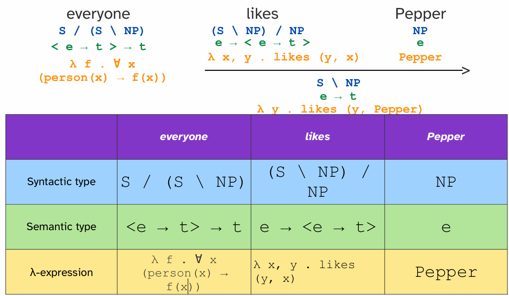

# Compositional Semantics

## Part 1: 句法为何依然重要 (Why is Syntax Still Relevant?)

 在进入语义学之前，首先强调句法研究在现代 NLP（特别是 Transformer 时代）中的价值 。

-  **人类语言的可学习性**: 研究句法有助于我们理解模型架构的形式表达能力，以及模型是否能从数据中学到类似人类的句法结构。
-  **作为归纳偏置 (Inductive Bias)**: 在数据量较少的场景下，句法知识可以作为一个很好的归纳偏置，帮助模型更快更好地学习。
    -  **实验证明**: 在形式语言上进行预训练的模型，比基线模型能用**少 33% 的 tokens** 达到相同的损失，证明了结构化知识的价值 。
-  **与缩放定律 (Scaling Laws) 的关系**: 句法结构（特别是层次化组合性）与模型的缩放定律之间存在关联。

## Part 2: 组合语义学导论

### 2.1 核心问题
-  我们如何表示一个句子的整体意义？
-  我们如何从单个单词的意义组合成整个句子的意义？
-  形式语义学在 NLP 中有哪些应用？

### 2.2 语义分析的核心挑战
**词汇语义学 (Lexical semantics):** 我们可以从中获取词语的含义

- **指称语义学 (Denotational semantics):** 词元 (token) 指代现实世界中的事物
- **本体论 (Ontologies):** 词元 (token) 指代某个知识图谱中的节点
- **词嵌入 (Word embeddings):** 词元 (token) 被表示为连续向量

**句法学 (Syntax):** 通过对潜在结构进行建模，我们可以确定一个语言中哪些词类序列是可能的，哪些是不可能的

- **成分句法 (Constituency grammar)** 又称 **短语结构语法 (phrase structure grammar)** 或 **上下文无关文法 (context-free grammar)**
- **依存句法 (Dependency grammar)**

语义分析 (Semantic Parsing) 的主要挑战在于，如何从以下两个方面得到句子意义的单一表示：

1.   **单词的意义 (meanings of its words)** 
2.   **单词的顺序和潜在结构 (their order and latent structure)** 

### 2.3 组合原则 (Principle of Compositionality)
- **定义**: 一个复杂表达式的意义，是由其组成部分的意义以及将它们组合起来的规则所决定的。
- **类比**: 这就像一个代码解释器，它首先需要**解析 (parse)** 代码的结构（句法），然后才能**求值 (evaluate)** 其最终结果（语义）。

## Part 3: λ演算与形式语义学

为了系统地组合意义，课件引入了λ演算 (Lambda Calculus) 这一形式化工具。

### 3.1 以代码解释器为类比
-  **任务**: 计算表达式 `3 + 5 * 6。
-  **步骤1: 解析 (Parse)**: 首先根据运算符优先级（`*` 高于 `+`）构建一个分析树。
-  **步骤2: 求值 (Evaluate)**: 沿着树自底向上地计算结果。
    - `5 * 6` 得到 `30`。
    - `3 + 30` 得到 `33`。
-  **函数式表达**: 每一个运算符（如 `*` 和 `+`）都可以被看作是一个接收参数并返回结果的函数。

### 3.2 λ演算 (Lambda Calculus)
- **定义**: λ演算是函数定义、函数应用和递归的一种形式化系统。
- **λ表达式**: 它提供了一种简洁的方式来表示匿名函数。
    - **Python**: `def f({args}): {body}`
    - **λ演算**: `λ {args} .  {body}` 
- **柯里化 (Currying)**: λ演算中的函数通常是柯里化的，即一个接收多个参数的函数可以被看作是一个接收单个参数并返回一个新函数的过程。
    - **示例**: `λ x, y . x * y` 可以先接收参数 `6` 变成 `(λ x, y . x * y)(6)`，其结果是一个新的函数 `λ y .  6 * y` 。
    -  这个新函数再接收参数 `5`，即 `(λ y . 6 * y)(5)`，最终得到结果 `30`。

## Part 4: 真值条件语义学 (Truth-Conditional Semantics)

这是将形式化工具应用于自然语言的核心。

-  **核心思想**: 一个陈述句的意义，在于它在特定**世界 (world)** 或上下文中为**真 (true)** 的条件。
-  **类型 (Type)**: 陈述句的语义类型是 **t** (代表真值 `truth-value`，相当于编程中的 `bool`)。
-  **目标**: 语义分析的最终产出应该是一个**函数**，这个函数可以在任何给定的世界 `w` 中被求值，从而得到一个真值（`True` 或 `False`）。
    -  **表示**: `[[the cat is on the table]]w1` 表示句子“猫在桌子上”在世界 `w1` 中的真值。

## Part 5: 使用λ演算进行语义分析

通过将λ表达式与组合范畴语法 (CCG) 结合，我们可以为句子构建形式化的语义表示。

### 5.1 增强的 CCG 词汇
在用于语义分析的 CCG 中，每个词汇项不仅有**句法类型**，还额外配有：
1.   **语义类型 (Semantic type)**
2.   **λ表达式 (λ-expression)** 

### 5.2 基本语义类型
- **`e` (entity)**: 代表一个实体，如一个个体、物体等。
- **`t` (truth-value)**: 代表一个真值。
- **`<e, t>`**: 代表一个从实体到真值的函数。这通常是一个**集合**或**属性**的类型。例如，`person(x)` 就是一个 `<e, t>` 类型的函数，它接收一个实体 `x`，如果 `x` 是人，则返回 `True`。
- **`<e, <e, t>>`**: 代表一个接收一个实体，并返回一个 `<e, t>` 型函数的函数。这通常是**及物动词 (transitive verbs)** 的类型，它需要两个实体（主语和宾语）来构成一个完整的命题。

### 5.3 示例分析："everyone likes Pepper"

课件通过一步步的推导，展示了如何为这个句子生成一个最终的λ表达式。

1.  **Pepper (名词短语 NP)**
    -  **句法类型**: `NP` 
    -  **语义类型**: `e` 
    -  **λ表达式**: `Pepper` (直接指代名为 Pepper 的那个独一无二的实体)
2.  **likes (及物动词)**
    -  **句法类型**: `(S\NP)/NP` (需要右边一个NP作宾语，左边一个NP作主语，来构成句子S) 
    -  **语义类型**: `<e, <e, t>>`
    -  **λ表达式**: `λ x, y . likes(y, x)` (接收宾语x和主语y，并调用一个底层的 `likes` 谓词) 
3.  **组合 `likes Pepper` (动词短语 VP)**
    - 句法上，`likes` 和 `Pepper` 组合成一个动词短语 `S\NP`。
    -  语义上，`λ x, y . likes(y, x)` 应用于 `Pepper`，得到一个新的λ表达式：`λ y . likes(y, Pepper)`。
    - 这个新函数的语义类型是 `<e, t>`，代表了“喜欢Pepper的那些实体”的集合。
4.  **everyone (量词)**
    -  **句法类型**: `S/(S\NP)` (需要右边一个动词短语来构成句子S) [cite: 36]
    -  **语义类型**: `<<e, t>, t>` (接收一个 `<e, t>` 类型的函数/集合，并返回一个真值) [cite: 36]
    - **λ表达式**: `λ f .  ∀x (person(x) → f(x))` (接收一个函数f，并检查是否所有的人x都满足f(x))
5.  **最终组合 `everyone likes Pepper` (句子 S)**
    - `everyone` 的λ表达式应用于 `likes Pepper` 的λ表达式：
       ` (λ f . ∀x (person(x) → f(x))) (λ y . likes(y, Pepper)) `
    - 经过β-规约 (β-reduction)，最终得到句子的形式化意义：
       `∀x (person(x) → likes(x, Pepper))`
    - **自然语言解释**: 对于所有的实体x，如果x是人，那么x喜欢Pepper。

## Part 6: 形式语义学的应用

### 6.1 验证与推理
-  **在世界中验证**: 我们可以将最终的逻辑表达式 `∀x (person(x) → likes(x, Pepper))` 与一个具体的世界模型（一个数据库，包含实体及其属性和关系）进行比对，来验证其真伪 [cite: 45]。
-  **逻辑推理 (Inference)**: 形式化的表示允许我们进行逻辑推理 [cite: 46]。
    -  **示例**: 如果我们知道 `person(Alane)` 并且 `∀x (person(x) → likes(x, Pepper))`，我们就可以推出 `likes(Alane, Pepper)`。

### 6.2 现代NLP中的应用
-  **趋势**: 如今的NLP系统很少直接将自然语言映射到λ演算表达式 。
-  **核心思想保留**: 然而，“将语言映射到某种有意义的、结构化的表示”这一核心思想依然普遍存在 。
- **具体应用领域**:
    -  **规划 (Planning)**: 将任务指令（自然语言）转换为规划领域定义语言（PDDL）
    -  **代码生成 (Coding)**: 将自然语言描述转换为可执行代码（如 Python, SQL）
    -  **推理 (Reasoning)**: 将问题和上下文转换为可供符号推理引擎处理的形式 

