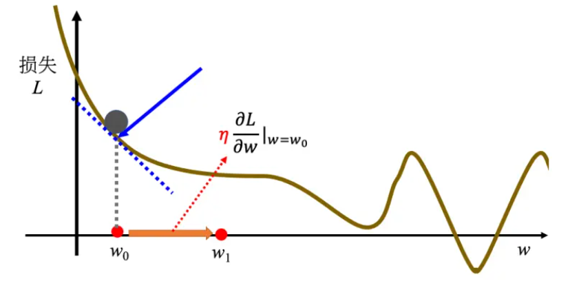

# Datawhale  X 李宏毅苹果书 AI夏令营

——机器学习初体验

## 机器学习基础

机器学习, 学习的究竟是什么东西呢? 或者说, 让机器拥有学习什么的能力呢? 简而言之, ***机器学习就是让机器具备寻找一个函数的能力***. 例如, 我们需要判断这张照片里面有没有猫, 相当于是将一张照片输入进人脑, 最后输出的就是一个数字: 1代表有, 0代表没有. 那么机器能不能通过学习获得这个本领吗? 答案是可以的. 那么这训练过程其实就是训练了一个函数, 输入的是一张照片, 输出的是一个数字, 用来判断照片里面有没有猫. 再举一个例子, AlphaGo其实也是一个函数, 输入的是目前为止双方的落子, 输出是下一步棋应该落在的位置. 或者more specifically, 应该是下一步棋在每一个空位置的获胜可能性, 然后选择可能性最大的.

当然, 函数的类型也有可能变换, 而***随着寻找函数的不同, 机器学习也分为不同的类别***. *假如说函数的输出是一个数值, 一个标量(scalar), 那么机器学习的任务就称为**回归**(regression)*. 举一个例子: 机器要预测未来一个时间的PM2.5值, 这个函数输入的是种种和PM2.5值有关的指数, 例如说今天的PM2.5值, 平均温度, 平均的臭氧浓度等, 输出的就是明天中午的PM2.5值.

另外一个常见的任务是***分类***(classification). 人类先准备好一些选项, 这些选项称为类别, 那么函数的输出就是从设定的选项中选择一个当作输出. 例如可以训练一个模型, 判断照片中存在的动物是猫, 狗, 仓鼠, 还是其他.另外, 除了回归和分类, 还有***结构化学习***(structured learning). 机器不是输出一个数字或者是选择一个选项, 而是产生一个有结构的物体, 例如机器写一篇文章.

那么机器是如何学习一个函数的呢? 

第一步: 写出一个带有位置参数的函数, 希望它能够用来实现我所有希望实现的功能, 例如:
$$
y = b + wx
$$
那么w b两个参数都是未知的, 然后x是输入的变量, 最后输出的是一个整数, 因此是一个简单的回归. 上面这个带有未知**参数(parameter)**的函数就称为**模型(model)**. 而这个x就称为**特征(feature)**, w称为**权重(weight)**, b称为**偏置(bias)**.

第二步: ***定义损失(loss)***. 这个损失其实也是一个函数, 因此常称之为损失函数, 这个损失函数的意义就是用来衡量机器目前选择的权重和偏置有多合理. 因此损失函数为: 
$$
L(b,w)
$$
很明显这是一个多变量的函数. 在实战中, 假如说训练出来一个权重一个偏置, 那么就会用**领域知识(domain knowledge)**实际的instance来带入: 例如这里就是输入真实的x, 然后比较一下输出的y和真实的y. 如何比较呢? 常见的有: 
$$
e = |y - \hat{y}|\hspace{1cm}平均绝对误差(MAE)
$$

$$
e = (\hat{y} - y)^2\hspace{1cm}均方误差(MSE)
$$

在有些任务中, y是概率分布, 那么这个时候可能会选择***交叉熵(cross entropy loss)***. 

在之前举的例子中, 不同的权重和偏置根据领域知识的输入会得到不同的输出, 我们可以画一个图来记录下w b所对应的Loss, 如下: 

在这张图中, 画出来的等高线称为**误差表面(error surface)**, 在这条等高线上, 处处的loss都是相同的. 那么有了loss来衡量目前权重和偏置的"质量如何", 那么如何更新这些参数呢? 

附: 实战中, "领域知识的输入"具体来说是在训练的时候, 输入训练集的输入, 得到对应的结果, 然后根据训练集的ground truth, 以loss的方式进行监督训练 

第三步: 解一个最优化的问题. 为了更新参数, 我们需要对偏置和权重进行加加减减, 那么依据是什么呢? 肯定需要利用上之前算出来的Loss函数. 我们经常使用**梯度下降(gradient descent)**来进行优化. 首先我们考虑首先更新权重, 而不是偏置. 如果bias视为常数, 那么损失函数将会是关于w的函数, 那么我们可以画出$L-W$的函数图像. 在目前的w下, 会有对应的斜率,  我们需要根据这个斜率来更新w的数值. 我们使用公式如下: 
$$
w^1 \leftarrow w^0 - \eta \frac{\partial L}{\partial W}\Bigg|_{w=w^0}
$$
在图中的直观表示就是: 

在上述的公式中, $\eta$是一个自己设置的参数, 叫做**学习率**(learning rate). 这不是机器自己找出来的, 因此要和被称为**超参数(hyperparameter)**. 那么一步一步, 我们希望w能够取中低点. 但是在上面这个图中, 我们看到: 有局部最小值和全局最小值. 如果先到达了局部最小值, 那么斜率几乎为零, 步长几乎为零, 这不就是意味着w的取值永远停在了局部最小值的阶段吗? 但是事实上局部最小值是一个假问题, 因为损失函数我们会故意设计成**凸函数**, 从而使得损失函数空间没有弯曲, 局部最低点就是全局最低点. 在两个参数的情况下使用梯度下降, 其实和之前一个参数没有什么不同, 因此可以推广bias参数的更新. 在Pytorch中, 梯度回传会自动帮忙计算.

## 线性模型

### 基本概念原理

对于上面这个例子来说，使用的函数是： $$y = kx + b$$用来拟合数据；那么我能不能考虑更复杂的情况，即设计更复杂的函数呢？当然是可以的，但是设计上有大学问：

假如说我设计：$y = \sum_{i=1}^{t}k_i+\sum_{i=1}^{t}b_i$, 相当于是$\overline{y}=\sum_{i=1}^{t}y_i$，那么这个函数真的能拟合到更多的信息吗？事实上是不能的，因为事实上求导公式依然是$w^1 \leftarrow w^0 - \eta \frac{\partial L}{\partial W}\Bigg|_{w=w^0}$，那么站在gradient descent的角度上，根本就是换汤不换药。这就是所谓的**“没有引入非线性性”**，而“把输入的特征x乘上一个权重，再加上一个偏置就得到预测效果”的模型称为**线性模型（linear model）**。线性模型有很大的限制，这一种来自于模型的限制称为模型的偏差，无法模拟真实的情况。

那么如何引入非线性性呢？不妨从简单的角度进行思考：能不能在线性模型上引入非线性性呢？因此我们可以考虑分段线性曲线。不妨考虑这样一种非线性函数：当 x 轴的值小于某一个阈值（某个定值）的时候，大于另外一个定值阈值的时候，中间有一个斜坡；所以它是先水平的，再斜坡，再水平的。更具体来说，这种函数叫做hard sigmoid函数，深度学习中pytorch具体定义如下：
$$
\text{Hardsigmoid}(x) = 
\begin{cases} 
0 & \text{if } x \leq -3, \\ 
1 & \text{if } x \geq +3, \\ 
\frac{x}{6} + \frac{1}{2} & \text{otherwise}
\end{cases}
$$
这其实很像***ReLU(Rectified Linear Unit)***的变体。那么通过下面这个图，可以直观的看出：为什么一堆这种非线性函数可以拟合各种各样的函数：

分段线性曲线就可以逼近这一个连续的曲线，就可以逼近有角度的、有弧度的这一条曲线。 所以可以用分段线性曲线去逼近任何的连续的曲线，而每个分段线性曲线都可以用一大堆蓝色的函数组合起来。也就是说，***只要有足够的蓝色函数把它加起来，就可以变成任何连续的曲线***。

当然，可以使用的非线性性函数不止分段线性函数。比如sigmoid：
$$
y=c\dfrac{1}{1+e^{-(b+wx_1)}}\hspace{1cm}分式版本\\
y=c\sigma(b+wx_1)\hspace{1cm}简洁版本
$$
它的图像和hard sigmoid的图像如下，能够直观看到，为什么hard sigmoid称为"hard"了：

这里利用b w c参数可以控制sigmoid函数的形状。其中，w可以控制“斜率”，b可以控制偏移量，c可以控制高度。具体效果如下： 

可想而知，把各种不一样的sigmoid函数叠加起来，就能够去逼近各种不同的分段线性函数，而分段线性函数可用来近似各种不同的连续函数。所以换而言之，不同的sigmoid函数叠加起来可以拟合各种连续的函数。

### 矩阵表示

假如说用三个hard sigmoid函数来进行拟合：

那么换一个简单的scenario：使用三个sigmoid function进行拟合。考虑三个数据喂进去： $(x_i,y_i)\hspace{0.3cm}i=1,2,3$, 那么我就希望能够找到合适的$b_i$和$w_{ij}$（代表第i个sigmoid里面乘给第j个特征的权重）。首先对数据进行权重分配（或者说，对特征分配权重，这时候都还是线性操作）
$$
r_1 = b_1 +w_{11}x_1 + w_{12}x_2 + w_{13}x_3\\
r_2 = b_2 +w_{21}x_1 + w_{22}x_2 + w_{23}x_3\\
r_3 = b_3 +w_{31}x_1 + w_{32}x_2 + w_{33}x_3\\
$$
那么这个时候矩阵就排得上用场了：
$$
\begin{bmatrix}
r_1 \\
r_2 \\
r_3
\end{bmatrix}
= 
\begin{bmatrix}
w_{11} & w_{12} & w_{13} \\
w_{21} & w_{22} & w_{23} \\
w_{31} & w_{32} & w_{33}
\end{bmatrix}
\begin{bmatrix}
x_1 \\
x_2 \\
x_3
\end{bmatrix}
+
\begin{bmatrix}
b_1 \\
b_2 \\
b_3
\end{bmatrix}
$$
在这里：$r = b + Wx$, 之后经过sigmoid函数以引入非线性性。（这一步又称为：经过激活函数），表示为：$a = \sigma(r)$

引入了非线性性，最后的三个非线性函数也应该又权重分配，因此引入线性性分配三个非线性性函数的权重，并配上偏置：$y=b+\textbf{c}^{T}\textbf{a}$

为了方便表示，我们把所有的未知参数都进行拼接，用$\theta$表示。

在上面的例子中，我们只使用了三个sigmoid函数。但是实际上，可以选择很多个sigmoid函数，它的数量其实也是超参数。一般sigmoid越多可以产生有越多段线的分段线性函数，可以逼近越复杂的函数。

### 定义损失、优化、梯度更新

接下来要定义损失。之前是 L(w, b)，因为 w 跟 b 是未知的。现在未知的参数很多了，再把它一个一个列出来太累了，所以直接用 θ 来统设所有的参数，所以损失函数就变成 L(θ)。损失函数能够判断 θ 的好坏，其计算方法跟刚才只有两个参数的时候是一样的。先给定 θ 的值，即某一组 $\textbf{W}, \textbf{b}, c^T, b$的值，再把一种特征 x 代进去，得到估测出来的 y，再计算一下跟真实的标签之间的误差 e。把所有的误差通通加起来，就得到损失。

一开始随机初始化参数，然后得到了第一个$\theta_0$，然后计算每一个未知参数对L的微分，得到向量g:

假设有 1000 个参数，这个向量的长度就是 1000，这个向量也称为梯度，$∇L$ 代表梯度。$L(θ0) $是指计算梯度的位置，是在 θ 等于 $θ_0$的地方。计算出 g 后，接下来跟新参数，$θ_0$ 代表它是一个起始的值，它是一个随机选的起始的值，代表 $θ_1$更新过一次的结果，$θ_2^0$ 减掉微分乘以，减掉 η 乘上微分的值，得到 $θ_2^1$，以此类推，就可以把 1000 个参数都更新了。

这种操作会重复更新未知参数，直到计算出梯度为零，虽然说实现上几乎不可能做到，但是应该会尽可能的逼近。

实际上使用梯度下降的时候，会把N笔数据随机分成一个一个的***批量（batch）***。每一个batch里面有B笔数据。本来是整个N笔数据用来计算一个损失，但是现在一个Batch一个损失。所以实战中，$B_1$拿出来，计算损失，更新参数，然后拿出$B_2$, 再计算一次损失，更新参数，以此类推。最终会把所有的批量都使用过，这样称为一个***回合（epoch）***。

通常，$批量大小（batch size）*批量数量=总样本（example）数量$，而batch size就是一个非常常见的超参数。

### 模型变形

介绍另一种激活函数：***修正线性单元(Rectified Linear Unit, ReLU)***。图像有一个水平的线，走到某个地方有一个转折的点，变成一个斜坡，公式为：
$$
c*max(0,b+wx_1)
$$
机器学习中，Sigmoid或ReLU称为***激活函数（activation function）***，在深度学习中，还被称为神经元（neuron），很多神经元的网络称为神经网络（neural network）。每一排称为一层，称为隐藏层（hidden layer）。

但是不是盲目加深度层数就一定有更好的表现，因为可能会有***过拟合（overfitting）***: 在训练数据和测试数据上的结果是不一致的。在层数高的网络中，未知参数的更新就要用到***反向传播（Backward Propagation, BP）***。

一张图总结机器学习框架： 

## 实践方法论

### 模型偏差问题

假设模型过于简单，例如$\theta_i, i=1,2,...$得到的$f_{\theta_i}(x)$函数集合，这个函数集合也可能太小了，可以让损失变低的函数不在模型描述范围内（或者损失足够低）。这种情况下，即使找到了$\theta^*$，损失还是不够低。这种情况就类似于想要在大海里面捞针，但是结果针根本不在海里面。这个时候，就可以考虑重新设计模型了。

### 优化问题

梯度下降进行优化可能有很多问题，比如说卡在局部最优解里面。这就像是大海捞针，针确实在海里，但是捞不起来。那么损失不够低的时候，到底是模型偏差还是优化问题呢？一个判断的方法是通过比较不同的模型来判断模型够不够大。例如残差网络中的一个实验里面，一个网络20层，一个网络56层，但是发现训练数据上面56层的loss反而更高。从下图来看，说明是56层的网络优化做的不好：

为什么能下这个判断？因为56层网络理论上笔20层更灵活，但是loss却降不下来，说明只能是优化过程的问题了。

一个建议是看到一个从来没有做过的问题，可以先跑一些比较小的、比较浅的网络，或甚至用一些非深度学习的方法，比如*线性模型*、*支持向量机（Support Vector Machine，SVM）*，SVM 可能是比较容易做优化的，它们比较不会有优化失败的问题。也就是这些模型它会竭尽全力的，在它们的能力范围之内，找出一组最好的参数，它们比较不会有失败的问题。因此可以先训练一些比较浅的模型，或者是一些比较简单的模型，先知道这些简单的模型，到底可以得到什么样的损失。

但是同时也要判断有没有可能过拟合了：如果训练数据上面损失小，但是测试数据损失大，那么可能真的过拟合了。回到残差网络的实验例子中，如果56层的网络是过拟合，那么应该训练的时候，56层网络的loss就很低，至少和20层网络差不多，但是事实上对于56层网络来说，训练损失和测试损失都很高。所以这不是过拟合，进而帮助推出结论：56层网络的优化出问题了。

### 过拟合

举一个极端的例子：机器学习到了一个很垃圾的函数：仅仅是满足了输入训练集数据x的时候，输出的是训练集对应的y，但是其他的输入x根本不怎么管结果咋样。那么这种情况下，就是对训练集数据拟合较好，但是对测试机数据拟合较差。见下图：

那么如何解决过拟合的问题呢？有两个可能的方向：

一是增加训练集，蓝色的点变多了，虽然模型灵活性很大，但是由于点数量多的原因，这个函数可以被限制住。如果训练集定死了，可以考虑**数据增强（data augmentation）**。数据增强就是根据问题的理解创造出新的数据。举个例子，在做图像识别的时候，常做的一个招式是，假设训练集里面有某一张图片，把它左右翻转，或者是把它其中一块截出来放大等等。对图片进行左右翻转，数据就变成两倍。但是数据增强不能够随便乱做。在图像识别里面，很少看到有人把图像上下颠倒当作增强。因为这些图片都是合理的图片，左右翻转图片，并不会影响到里面的内容。但把图像上下颠倒，可能不是一个训练集或真实世界里面会出现的图像。如果给机器根据奇怪的图像学习，它可能就会学到奇怪的东西。所以数据增强，要根据对数据的特性以及要处理的问题的理解，来选择合适的数据增强的方式。

第二个方向是给模型一些限制，让模型不要有过大的灵活性。限制可以有如下方法：

- 给模型比较少的参数。对于深度学习来说，就是减少神经元的数量，或者模型共用参数。例如全连接网络灵活性很高，而CNN就有一定限制，所以全连接网络找出来的函数集合其实是比较大的，而CNN找出来的函数集合就比较少。CNN在图像上反而做得更好。
- 早停（early stopping）、正则化（regularization）、丢弃（dropout）(神经元随机失活)

### 交叉验证

比较合理的是：训练的数据分为两个部分，training set and validation set。比如说90%训练集，10%验证集。在训练集上训练的模型会使用验证集来衡量它们的分数，然后根据验证集上的分数去挑选合适的模型，对testing set进行测试。

### 不匹配

有的时候某一个预测的结果和真实结果有较大的不同，如下：

这种情况下，增加数据不一定能让模型做的更好，这种问题的解决需要看匹不匹配对数据本身的理解。我们可能要对训练集和测试集的产生方式有一些理解，才能判断是不是出现了不匹配情况。或者说：判断测试机和训练集的distribution.

