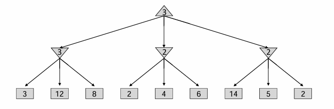

# Adversial Search

游戏有很多种，这里主要讨论的是零和游戏。如果是一个单玩家的游戏，那么single-agent tree很容易画出来。但是如果有另一个玩家进行对抗呢？

可以先通过single-agent tree来介绍一些概念：非叶子节点是non-terminal states，其value是所有孩子节点的最大的value；而叶子结点是terminal states，其value是已知而确定的。因此agent的policy应该是：choose an action leading to the state with the largest value。

但是如果为下图：现在有两个玩家，轮流执行操作。那么在agent操作回合的节点的value，就是该状态的successors states的value max；而在对手操作回合的节点的value，也是successors states max value for opponent，但是因为是零和博弈，所以也就是尽可能使得agent value最小，因此state value就是successors value min！

因此agent的执行策略应该选择一组操作，前往有着最大value的状态。因此这个问有一个形象的名字：Minimax。

对于这类对抗搜索的minimax问题：常见的有tic-tac-toe，下棋等经典问题，其特征是玩家轮流执行回合，一个玩家达到最大值，那么另一个就会达到最小值。minimax search tree中，一层max一层min。

minimax具体实现如下：可见对于一个状态点来说，如果接下来是max agent，那么会选出节点所有孩子的value的max，反之则会是min，所以下面的示意图中：第一行是min agent的可能状态，第二行是max的可能状态，第三行是min agent操作之后的可能状态。min agent总是会选择可能状态中value最小的。注意，这里的value全部都是对于Max-agent而言的！因为零和中：agent min = opponent max。

这种算法很像DFS，时间复杂度是$O(b^m)$，空间复杂度是$O(bm)$，其中b为branching factor，m为平均双方共执行的步数。这种复杂度是惊人的，例如在国际象棋中，b m约为35和100，那么exact solution is completely infeasible。那么应该如何搜索整个树呢？

一种解决方式就是：在探索一个节点的value时候，往下深度探索state successors value时，限制深度。但是这样就有问题了：假如说最大深度搜索到的全都是non-terminal state呢？何来的value？那么就可以考虑''启发式函数''来评估non-terminal state的value，aka，Evaluation Functions。这就是最核心的内容。

> In this way, the guarantee of optimal play is gone.

在以前，这个函数是人为定义的，例如象棋游戏中，函数输入是当前状态的棋盘，那么value就和棋盘上面棋子有关，例如我又王后就是加分项，对方没王后就是减分项，诸如此类。

最近的研究中，尝试了其他的启发式函数。如蒙特卡洛采样法，在一个状态是会随机采取行动，直到游戏结束，并且重复这个操作很多次，然后根据多次模拟的结果给出value。

Branching Factor是一个非常重要的参数，象棋中的branching factor相比之下还不是特别大的，但是围棋的branching factor巨大无比，高达361。可不可以限制它呢？Idea:  limit the branching factor by considering only good moves. 比如说pruning。

对于上面这个例子来说。第一行是max agent操作，而第二行是Min操作。左边看出，第二行左节点为3，那么考虑中间这个状态的时候，发现到了一个2小于3！这意味着：如果max agent考虑了这个节点，那么min agent反手一个2，那么就不如3了！因此其实这个节点的考虑在遇到2＜3的时候就已经结束了！
总结一下：这种alpha-beta pruning过程如下：

下面的这个例子中，首先从左边开始考虑。第三行的左边是10，然后看右边那个，看到100的时候，8就不用看了，因为这意味着第二行的左边一定选择的是10，因为第三行的第二个至少是100，所以g被剪掉；对于第二行右边的节点，其左孩子是2，那么此时整个I分支就不用看了，因为第二行右节点最大是2，而第二行左边是10，因此第一行一定是10，因此I被剪掉。

运用了alpha-beta pruning有一些性质：首先是孩子的顺序将会影响pruning的效率，这一点在上面的这个例子可以看出来！其次就是如果是perfect ordering，那么时间复杂度将会降到$O(b^{m/2})$，意味着可以将探索的深度翻一倍！