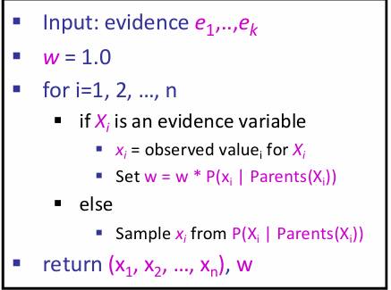

# Probabilistic Reasoning

## Uncertainty and Probability

在对一系列互相拥有因果关系的事件建模的时候，往往会遇到很多困难：第一是laziness，详细的建模需要列举所有的probable world；第二是现实中往往有很多的noisy sensors，会干扰建模的准确性。因此尝试用ontological commitments（本体论）角度出发建模是较为困难的。

但是epistemological commitments（认识论）提供了一个不同的观察角度：A probabilistic agent may have a numerical degree of belief （信念度）between 0 and 1. 用概率来描述事件以及事件之间的因果关系（条件概率）也许是一个好方法。这看似十分合理，但是细想：一个事件的发生与否为什么能用概率衡量？难道不是这个事情最终一定会是要么发生要么不发生吗？建模的目的难道不就是为了确定这件事情吗？我认为这是因为人类建模终究是有局限性的：例如ignorance: lack of relevant facts, initial conditions, etc；或者是 laziness: failure to list all exceptions, compute detailed predictions,  etc。更重要的是，人类更擅长于观察到posterior的数据，而很难推出prior distribution。

建模是为了辅助做出决策，而概率不一定是唯一的参考标准，虽然事实上建模最终得出的就是概率的分布。比如说提前多少时间去机场赶飞机，如果提前一天，那么可能就会在机场坐牢，但是能够确保你一定能上飞机（或者至少99%）；而提前两小时可能有95%的概率赶上飞机，但是不用去机场坐牢。可见，对于一个抉择来说，我们有概率之外的考量标准，而这称为***Utility***(笼统翻译为好处)。因此，在Decision Theory中，考虑的是utility and probability。因此maximize expected utility的过程可以表示为：
$$
a^* = argmax_a\sum_sP(s|a)U(s)
$$
12章剩下的部分，就和概率论重合了。

##  Bayesian Network

### Representing Knowledge in Uncertain Domain

贝叶斯网络能够表示变量之间的依赖关系。每一个节点都是一个随机变量，可以离散的也可以是随机的；两个节点之间可能有有向箭头，例如X指向Y的箭头，那么X就是Y的parent；每一个节点都有着联合概率信息$\theta(X_i|Parents(X_i))$来量化这个节点的父节点们对这个节点的effect。

Bayesian net = topology(graph) + CPT

## Semantics of BN

这个Local Conditional Probablity就是CPT条件概率表，描述了在父节点条件下，该点的概率分布。因此：
$$
P(x_1, ..., x_n)=\prod_{i=1}^n P(x_i|parents(X_i)) \\
P(x_i|parents(X_i)) = \theta(x_i|parents(X_i))
$$
上述公式的得出有点chain rule的味道。而为了方便表示这种chain rule以及依赖性顺序的关系，$x_1,...,x_n$的assignment可以是topological order（covered by CS101）。更具体地说：如果网络中节点的任命很符合precede effect（先行效应），那么网络将会十分高效而紧凑。

因此整个贝叶斯网络可以很好的表示不确定性域内的依赖关系，而且拓扑结构是一个DAG。贝叶斯网络非常的compact，这是因为充分利用了locally structured system: each subcomponent interacts directly with only a bounded number of other components, regardless of the total number of components。这一点是符合直觉的，感性上来说，如果一个事件的影响力允许被无限传递下去，那么网络会很臃肿，比如说亚马逊一只蝴蝶翅膀的煽动能造成龙卷风之类的。但是如果只是关注：在气旋紊乱发生的情况下，有高概率发生龙卷风；一只蝴蝶扇动翅膀的情况下，有极小概率造成气旋紊乱。那么这个逻辑链就很合理，因为统计蝴蝶煽动翅膀的影响在气旋紊乱这里就进行结算，而之后对龙卷风的影响是由气流紊乱来结算的。

对于有n个r.v.的BN，假设每个变量domain最大值是d，每个节点的父节点最多k个，那么贝叶斯网络的空间复杂度是$O(nd^{k+1})$。可见由于局部结构的存在，图避免称为了稠密图，因此关于n是线性的。

实践中构建BN的时候，往往把节点之间微弱的link都给省略掉；或者一些影响力很小的节点统一为miscellaneous node以便表示。还有一个问题：在局部结构中，很看重节点的顺序，但是如果我们选择了错误的顺序呢？通常来说，link数量会增加，而且有些link所表示的关系非常的脆弱，因为在一个不是正确的顺序下，也许节点之间的关系表示是diagnostic，而非causal。直觉上，也是有着causal关系节点之间的node link会较为的合理。

### Conditional Independence in BN

***Theorem 1: Each variable is conditionally independent of its non-descendants, given its parents.*** 

这一点其实更多的是因为CPT中所规定的联合概率分布表所决定的，而直觉上可能认为，影响力是能够传递的，因此可能不是条件独立；但是结算的规则在BN中是和直觉略有不同的。

这条结论能够进一步推广：

***Theorem 2:  A variable’s Markov blanket consists of parents, children, children’s other parents; Every variable is conditionally independent of all other variables given its Markov blanket.***

但是需要注意的是：如上图的例子，在已知$Y_1$的时候，X和$Z_{ij}$是条件独立的吗？不是！因为$Y_1$的发生和二者都有关系，其中一个概率的改变会影响另一个。

上述的定理还能再推广：

> Reference: kimi.moonshot.cn

D-separation（有向分离）是一种在贝叶斯网络中判断变量是否条件独立的图形化方法。它基于有向无环图（DAG）的结构来确定在给定某些变量的条件下，其他变量之间是否条件独立。以下是D-separation的几个关键点：

1. **定义**： D-separation提供了一种标准，用于根据给定的因果图，在给定第三组变量Z的情况下，确定一组变量X是否独立于另一组变量Y。如果X和Y之间的每一条路径都被Z阻塞，那么我们称X和Y被Z D-separation。
2. **路径的活性（Active/Inactive Trails）**：
   - 如果一条路径存在依赖关系，就可以说它是活性的（active）。如果没有任何路径处于活性状态，则X和Y是D-separation的。
   - 路径的活性取决于路径上的节点和给定的证据集Z。如果路径上的节点或其后代节点被包含在Z中，那么这个节点可以阻塞路径，使得路径非活性。
3. **阻塞路径的条件**：
   - 路径中存在某个节点m是head-to-tail或tail-to-tail节点，并且m在集合Z中。
   - 路径中包含collider（即形如X->m<-Y的结构），并且m不在Z中且m的子代也不在Z中。
4. **D-separation的应用**：
   - D-separation可以快速判断两个节点之间是否条件独立，这对于简化贝叶斯网络中的联合概率计算非常有帮助。
   - 在贝叶斯网络中，如果A、B、C是三个集合，为了判断A和B是否是C条件独立的，我们考虑网络中所有A和B之间的无向路径。如果这些路径都满足上述阻塞条件，则A和B是C条件独立的。
5. **结论**：
   - 如果在贝叶斯网络中，X到Y的路径不是活性的，就说明X和Y关于Z是D-separation的，这也意味着X和Y关于Z条件独立。

D-separation是理解和应用贝叶斯网络中条件独立性的一个重要工具，它帮助我们识别哪些变量在给定某些证据的情况下可以被视为独立的，从而简化概率推理和网络分析的过程。

在基本的结构单元中，可以分析条件独立问题从而帮助理解：

Causal Chains：X->Y->Z，那么X和Z显然不是独立的。但是在给定了Y的情况下，X和Z反而不是条件独立的了！
$$
\begin{align*}
\mbox{Given Y} \\
P(z|x, y) &= \frac{P(x, y, z)}{P(x, y)} \\
          &= \frac{P(x)P(y|x)P(z|y)}{P(x)P(y|x)} \\
          &= P(z|y) \\
\mbox{Not given Y} \\
P(x,z) &= P(x)\sum_{y \in Y}P(y|x)P(z|y)  \\
          &\neq P(x)P(z)
\end{align*}
$$

Common Cause：X<-Y->Z，那么X和Z是独立的吗？不是，因为直观上x的发生隐含了Y的信息，但是在给定了Y的信息下，XZ反而是条件独立了，因为Y的信息不再是隐式给出的，而是直接告诉，那么就相当于是确定的y独自对X和Z造成影响，那么x的信息也就没有传到Z了。

Common effect(v-structure)：假设Z的父节点有X Y，在这个简单的结构中，X Y是独立的，但是在给定了Z的情况下，X Y并不是条件独立的，因为其中一者信念度的变化会造成另一者信念度的变化。感性上来说，客观上来说，不管Z的情况，X Y给Z传递影响是独立的，X传递了多少和Y传递了多少是没关系的；但是如果Z的结果是确定的，那么X多传递了，那么就会怀疑Y传递的要更少一些。

用以上的三个单元能够generalize到一个图中的三个顶点之间的（条件）独立关系了：

如何快速判断两个节点之间是否是条件独立的？我总结如下：两个节点都放出信息流，按照directed graph的directed edge流动，有两种情况：第一种是其中一条流进了另一个节点，另一种是两股信息流汇入了同一节点，然后经过这一节点之后的信道里面都有这两股信息流。如果流动的过程中，出现了堵塞的情况，i.e.，causal chain and common cause的中间节点是条件，那么就是独立的；如果中间没有堵塞，而两股信息流到一起，之后经过节点中如果没有条件节点，那么就是条件独立的。这其实蕴含着一种思想：两个节点何以成为条件不独立？要么是一个节点的信息流会穿过另一个节点，要么是这两股信息流没有同时决定另外一个节点。后者比较难以理解，可以姑且理解为：这两股信息在已知条件下没有发生过任何的被发现的化学反应；如果过化学反应而且被发现了（即：这个节点是已知的），那么这个节点的结果将会***imply两股信息共同作用的效果***，因而不再独立。下图是一个例子，$\perp\perp$代表（条件）独立。

### Exact Inference in BN

Inference: calculating some  useful quantity from a  probabilistic model (joint  probability distribution)。更具体地：Compute the posterior probability distribution for a set of **query variables**, given a set of **evidence variables**。

Inference by enumeration：
$$
P(X|e) = \alpha P(X, e) = \alpha \sum_y P(X, e, y) \\
\mbox{where } \alpha \mbox{ is the normalization parameter}
$$

但是有着大量的乘积计算，而计算量是指数级别的：$O(nd^n)$。通过moving summations inwards as far as possible in expression可以使得复杂度降到$O(d^n)$。

同时有一个trick: ***Every node that is not an ancestor of a query variable or evidence variable is irrelevant to the query***。

### Variable Elimination

有一种简化计算时间的技巧叫做向量化，vectorization。因此此处infernece的式子的计算也可以使用类似的技巧。这里使用factor进行简化：

A factor is a multi-dimensional array to represent $P(Y_1 … Y_N | X_1 … X_M)$。

对于factors来说，有几种操作：第一种是pointwise products，第二种是eliminate。

因此消除变量法的流程如下：首先所有的节点都初始化CPT，然后选中一个hidden variable（not query or evidence），利用pointwise product合并所有涉及到H的factors，然后这个结果需要sum out H。下面是一个例子：

总而言之，核心是：1. 利用factor高效表示CPT，支持向量化；2. 利用factor间支持的操作，逐渐合并掉hidden node。而且事实上，消除变量的顺序也会影响时间复杂度。VE算法的时间复杂度主要取决于factor最大的形状，而消去hidden node的顺序会影响factor最大的形状。如下图所示：

> 这两个数字是如何得来的？

> Does there always exist an ordering that only results in small factors? No! The factor size is influenced by the tree-width of the graph

A polytree is a directed graph with  no undirected cycles. 对于polytree的BN，VE的时间复杂度与CPT数量成线性关系。Elimination order如下：

-  Convert to a factor graph
- Take the Query as the root
- Eliminate from the leaves to the root

### Approximate Inference

有的时候不要求概率的精确程度，而采样可以很快拟合出一个decent approximate answer。因此可以贝叶斯网络中可以通过采样来近似地inference。

#### Prior Sampling

For $ i=1, 2, …, n$ in topological order：sample $X_i$ from $P(X_i|parents(Xi))$。拿到了N个样本之后，你任何的概率，无论是不是条件的，都可以近似出来。

#### Rejection Sampling

对于刚刚的说法，如果想要计算条件概率，那么可以在产生样本的时候规定：规定条件满足的样本才允许放行，不允许的立即拒绝。换而言之，就是不用在像prior方法那样对N个样本先筛一遍符合条件的，然后再拟合条件概率。

#### Likelihood / Importance Sampling

Idea: fix evidence variables, and sample the rest.那么一个样本的权重应该是多少？如下：
$$
w(\mathbf{z}) = \alpha \prod_{i=1}^mP(e_i|parents(E_i))
$$

上面便是Likelihood采样；而它是importance sampling采样的一个instance。

#### Gibbs Sampling

流程如下：

这样做是为了让采样能够反映所有网络中的evidence。还有两种特殊的变体：

