# Chapter 14

## Time and Uncertainty (Markov Models)

### States and observations

静态场景的概率推理用贝叶斯网络能够很好处理，那么动态的呢？比如说治疗一个糖尿病患者，他的血压、血糖、食物摄入以及其他信息等都是在随着时间变化的。我们要根据一段时序内观测到的，例如，血压血糖等身体信号来判断病人是否有糖尿病。为了衡量从之前的历史状态证据来衡量当前状态，并且预测之后的治疗，必须将时序中指标的变化纳入模型。

这里考虑的是离散的事件模型，也就是说时间分成了许多份的time slices。***通常认为时间切片间隔都是一样的。***而随机变量依然按照贝叶斯网络的evidence-query思路可以分为两类：可观测和不可观测。因此，使用$X_t$来代表时间t时刻不可观测到的**状态变量(state variable)**；使用$E_t$来代表客观测到的**依据变量(evidence variable)**。对于t时刻观测到的依据变量们的具体值，用$E_t = e_t$来代表。称变量在时域内的一个个值为state（状态），那么不同时间下该变量值的改变，也就也可以感性理解为状态的转化**（transition）**。

同时，用特殊的下标来表示一个时间范围内的所有时刻的变量：$X_{a:b} = {X_i,i \in [a, b]}$。

### Transition and sensor models

***The transition model specifies the probability distribution over the latest state variables, given the previous values, that is***, $P(X_t | X_{0:t-1})$. 换而言之，transition model顾名思义建模了状态的变化，而这个变化是通过条件概率表示的。

可以注意到的是，这里的t如果无限增加，那么参考的过去的状态变量数量将会没有限制，因此为了避免这个问题有一个关键的假设：

***Markov assumption: the current state depends on only  <u>finite fixed number</u> of previous states.***

满足该假设的模型被称为马尔科夫过程或者马尔科夫链。当这个previous states规定就是current time前一个时间点状态，那么就称为***first-order Markov model***，i.e.，$P(X_t | X_{0:t-1}) = P(X_t|X_{t-1})$。类似地，如果是参考前两个时间点状态，那么就是**s*econd-order Markov Process***。那么推广得到：*A kth-order model allows dependencies on k earlier steps*。

一阶马尔可夫过程的例子：一个分子在平面上随机游走它的x轴数据应该是一阶markov，因为t时间的x数据应该仅仅和t-1时刻的x轴数据相关。

同时还有另外一个小问题：t可以取无穷大，那么状态的变化岂不是会不同时间不同（也许）联合概率分布，因此在考虑状态联合概率分布应该考虑不同时间有不同的分布？那么因此有下面关键的假设：

***Time homogeneous process (Stationarity Assumption): The process of change is governed by laws and themselves do not change over time.*** 

同时补充多个时间状态下的状态联合分布式子：$P(X_0, \dots, X_T) = P(X_0)\prod_t P(X_t|X_{t-1})$

举一个例子cover上述概念：

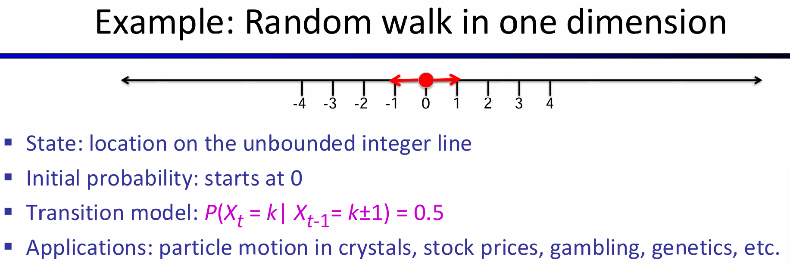

点在轴上随机游走，一次要么左走一步要么右走一步。那么状态就是轴坐标，而初始状态是0，transition model如图所示，由于明显是first order，因此Xt的值仅仅和Xt-1相关。

又一个例子：考虑观察每一天是否下雨，那么状态要么是太阳要么是下雨。那么Transition model采用一阶马尔科夫过程，所有的条件概率如图所示：

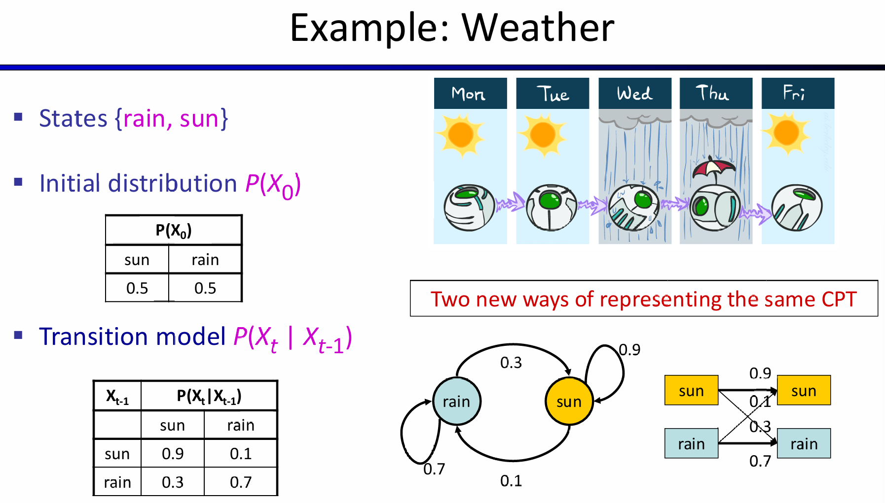

假设初始状态是下不下雨概率都是55开，那么初始状态的$P(X_0) = <0.5, 0.5>$。那么第零天的时候，利用transition model以及LOTP就能求出第一天的状态变量的概率分布：

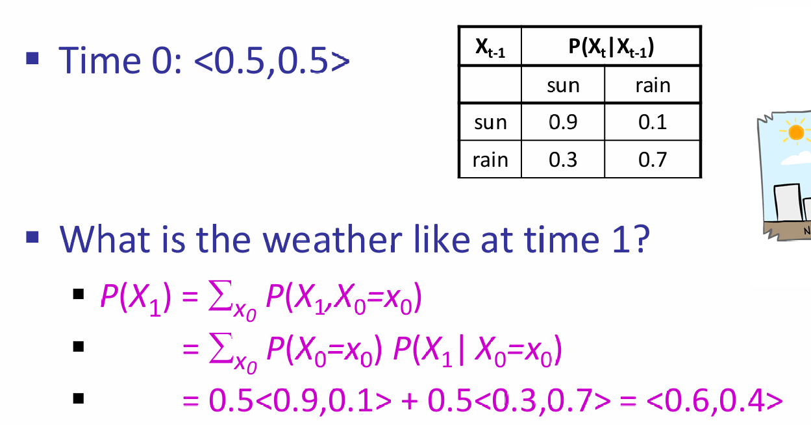

之后几天就是一直在重复这样的计算。可以发现，上述过程中的很多计算其实都是矩阵的乘法。相当于是让当前先前状态的概率向量和$P(X_t|X_{t-1})$作矩阵乘。因此，矩阵不断乘下去的结果是：<0.75, 0.25>。

在马尔科夫过程中有这样的结论：最开始的概率分布的影响会随着矩阵乘法不断下降，最终分布独立于最初的分布，达到稳定分布(Stationary Distribution)。最终稳定分布满足：
$$
P_{\infty}(X)=P_{\infty+1}(X)=\sum_xP(X|x)P_{\infty}(x)
$$
最终分布可以通过解方程和利用$'\infty + 1 = \infty'$来求出，如下图：

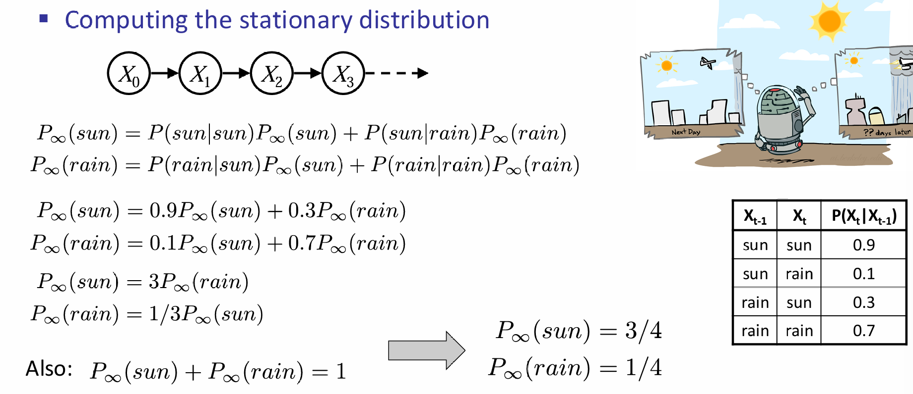

### Hidden Markov Models

有的时候，true state我们观察不到，我们观察到的是Evidence Variables。比如书中的例子：不能直接观察到天气是否下雨，但是能够通过进入屋内的人是否带伞来进行判断。因此可见，除了transition model，还应该有一种sensor model，or emission model，$P(E_t|X_t)$来联系observation与unobserved variable之间的关系。

通常来说，初始时间时刻没有evidence variable，那么有如下的联合分布式子：
$$
P(X_0, X_1, E_1, \dots, X_T, E_T)=P(X_0)\prod_{t=1:T}P(X_t|X_{t-1})P(E_t|X_t)
$$
一个时间点的观察变量会和其他时间的unobserved variable之间有关联吗？这是一个好问题，因此又有一个重要的sensor Markov assumption：
$$
P(E_t|X_{0:t}, E_{1:t-1})  = P(E_t|X_t)
$$
因此$P(E_t|X_t)$是sensor model，认定了$E_t$是仅和当前时刻的$X_t$有关。上述内容是经典的一阶隐马尔科夫过程。之前提到过，有的时候确实建模需要更为高阶的马尔科夫过程，因此总体而言为了提升模型的近似能力，有两种努力的方向：

- 增加马尔科夫过程的阶数
- 增加state variables的数量。例如对于观察是否下雨的模型来说，可以加入season,humidity等state variables

## Inference in Temporal Models

对于一个建模好的时序模型来说，有许多种类的inference任务：

- Filtering：计算$P(X_t|e_{1:t})$
- Prediction：计算$P(X_{t+k}|e_{1:t})$
- Smoothing：计算$P(X_k|e_{1:t}),k \in [0, t-1]$
- Most likely explanation：给出$argmax_{x_{1:t}}P(x_{1:t}|e_{1:t})$

Filtering的过程可以用recursive estimation：给出$e_{1:t}$，使用$e_{t+1}$预测$t+1$时刻的$X_{i+1}$。这句话可以利用函数拉来表示：
$$
P(X_{t+1}|e_{1:t+1}) = f(e_{t+1}, P(X_t|e_{1:t})) \\
P(X_t|e_{1:t}) = f(e_{t}, P(X_{t-1}|e_{1:t-1})) \\
\cdots \cdots
$$
同时，注意到下式（该式子利用了贝叶斯和sensor Markov假设）：
$$
P(X_{t+1}|e_{1:t+1}) = P(X_{t+1}|e_{1:t}, e_{t+1}) \\
=\alpha P(e_{t+1}|X_{t+1}, e_{1:t})P(X_{t+1}|e_{1:t}) \\
=\alpha P(e_{t+1}|X_{t+1})P(X_{t+1}|e_{1:t}) \\
=\alpha P(e_{t+1}|X_{t+1})\sum_{x_t}P(x_t|e_{1:t})P(X_{t+1}|x_t)
$$
上面的式子中，$\alpha$表示归一化，$\sum_{x_t}P(x_t|e_{1:t})P(X_{t+1}|x_t)$利用了LOTP来表示给定了$e_{1:t}$的情况下，不同$x_t$的取值对应的概率以及对应的对$X_{t+1}$的条件概率。

利用recursive estimation可以定义forward algorithm：$f_{1:t+1} = FORWARD(f_{1:t}, e_{t+1})$.而$f_{1:0} = P(X_0)$。每一步计算的时间复杂度是$O(|X|^2)$，$|X|$是states数量。这个时间复杂度可能是因为：$\sum_{x_t}P(x_t|e_{1:t})P(X_{t+1}|x_t)$中有$|X|$个项求和，每一项有$|X|$个条件概率更新概率向量。

下图是一个HMM向前算法的演示：

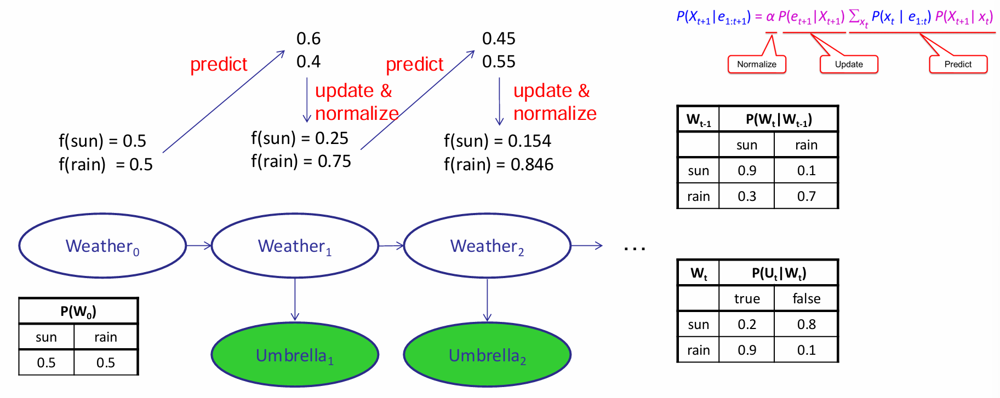

Predict是概率向量和transition matrix transpose矩阵乘的结果，**update是根据结果的$U_t=true$（for example），挑选sensor matrix对应的那一列，向量间阿达玛积，最后对这个乘积结果向量归一化**

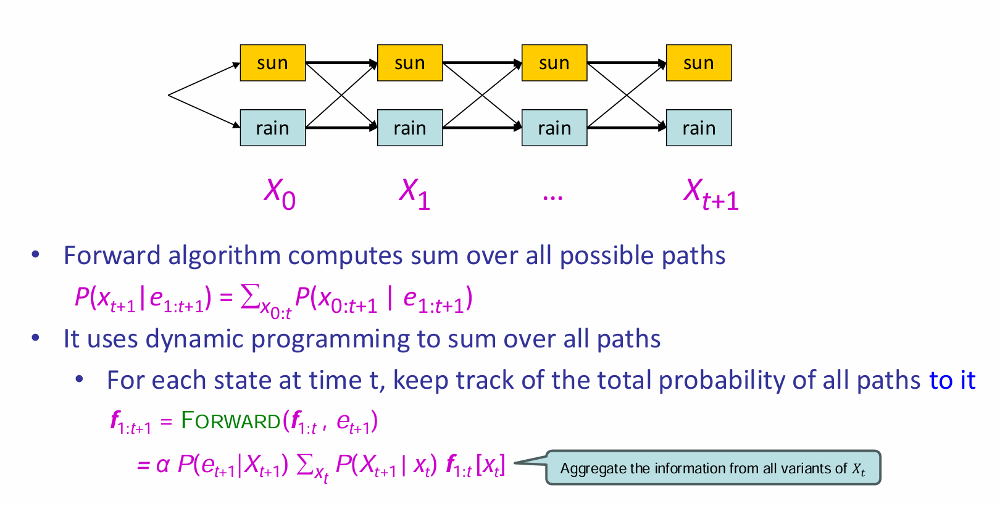

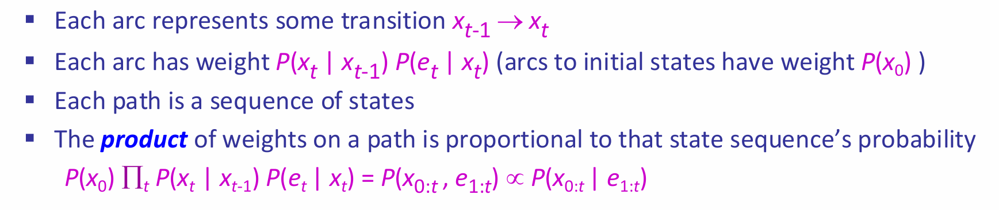

上图给出了一个新的理解算法的视角。图中将evidence and state放在了一起，因此箭头的概率权重如图所示（不仅仅是包含了transition的项，还包含了给出$e_i$的项）。因此对于向前传播来说，就是求出到达$X_{t+1}$这一层两个节点的所有路径的权重的和，两个值归一化后就能组成概率向量。而这个算法的实现是通过recursion实现的，称为Forward Algorithm。

有了这样的新理解，就好方便理解Most Likely Explanation的算法了：本质就是寻找使得权重最大的路径，其中每一层的节点可以自由选择。在向前算法中，对于每一个时间点t，都记录下权重（unnormalized）最大的路径。显然，这个算法也是recursive的，称为Viterbi Algorithm。

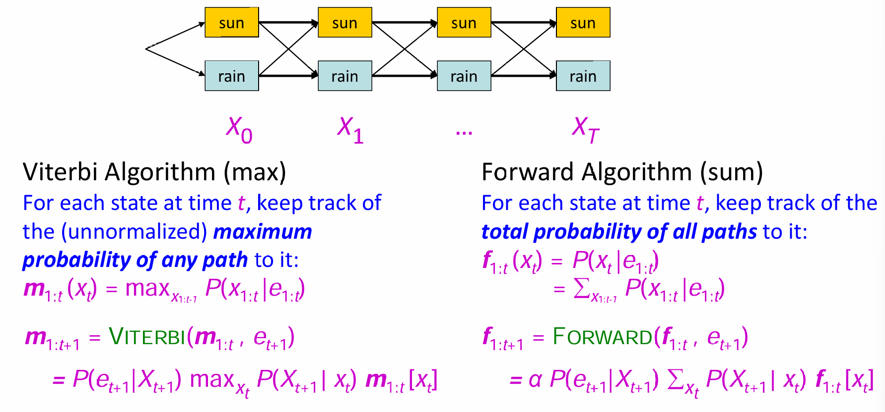

Viterbi Algorithm 推导：
$$
Define\ m_{1:t} = max_{x_{1:t-1}}P(x_{1:t-1}, X_t, e_{1:t}) \\
m_{1:t+1} = max_{x_{1:t}}P(x_{1:t}, X_{t+1}, e_{1:t+1})= max_{x_{1:t}}P(x_{1:t}, X_{t+1}, e_{1:t}, e_{t+1}) \\
= max_{x_{1:t}}P(e_{t+1}|x_{1:t}, X_{t+1}, e_{1:t})P(x_{1:t}, X_{t+1}, e_{1:t}) \\
= P(e_{t+1}|X_{t+1})max_{X_{1:t}}P(X_{t+1}|x_t)P(x_{1:t}, e_{1:t}) \\
= P(e_{t+1}|X_{t+1})max_{x_t}P(X_{t+1}|x_t)max_{x_{1:t-1}}P(x_{1:t-1}, x_t, e_{1:t})\ (m_{1:t-1})
$$
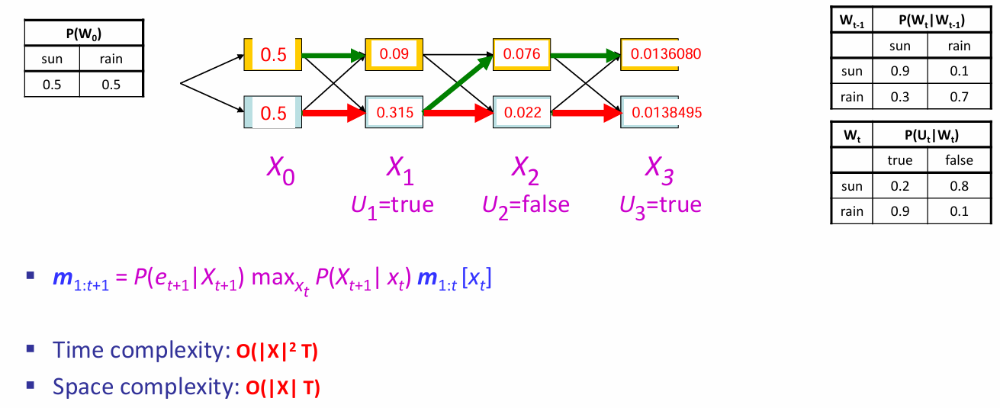

对于每一个$X_t$的两个状态，都各自有一条最大的likelihood路径；***The optimal sequence is identified by following these arrows backwards from the best final state***

## Dynamic Bayesian Network (DBN)

### Construction

如果想要让贝叶斯网络能够加入时间信息，那么idea非常的straight-forward：直接复制贝叶斯网络，然后将不同time slice之间的unobservable variable连接起来就可以了。如下图所示：

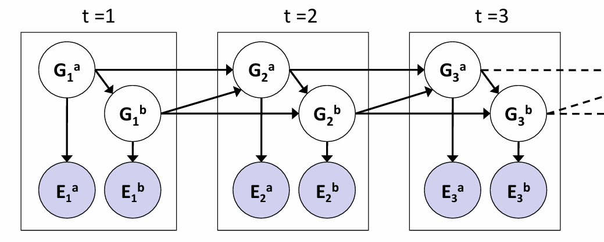

显然，every hidden Markov Model can be represented as a DBN with single state variable and a single evidence variable；同时离散DBN也可以用HMM表示。如果说在DBN中的一个time slice中有n个state variable，则转化为HMM中的state variable就等效于有$2^n$种可能事件的变量，那么可想而知的是transition model的matrix parameters将会超级的多。因此DBN的最大优势就是：充分利用sparseness，CPT们的参数量远远小于HMM中的transition model matrix。一个关于参数量大小的例子如下：

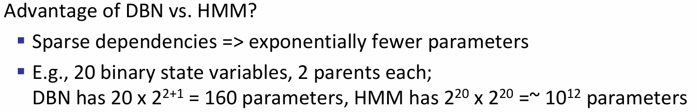

### Exact Inference

那么想要在DBN中inference，其实就是在BN中inference，而inference的公式已经给出过。给出了不同时间段下的观察，那么只需要复制多次一个BN直至能够容纳所有的观测就可以，这种技巧称为unrolling。那么既然展开后的DBN也是BN，那么也应该可以使用variable elimination，但是可惜的是由于整体网络将会非常大，因此factor的形状将会很大，因此并不高效；因此合理的是：算法过程中最多出现两个slice，从slice 0开始，那么加入slice1，就会把slice 0 sum out掉，然后加入slice 2，然后会把slice 1 sum out掉。这和forward algorithm非常的类似。

### Approximate Inference

当state space非常大的时候，那么exact inference也是十分困难的，如何近似inference？在BN中介绍过likelihood weighting等sampling方式，但是在此处中，随着时间的推移，后续的权重会掉的非常快，低权重的样本会对最终的估计结果产生较少的贡献；而很多情况下，inference所用的观测都是一些下游段观察到的数据，i.e.，后续时间段所得到的观察。

因此引入了Particle Filtering：用一系列的样本（samples/particles）来代表每一步的belief state。从最开始的$P(X_0)$开始，按照这个分布随机采样$N$次，所有的particles都有权重1。然后所有的样本都按照transition model中给出的分布进行移动，并拥有类似于likelihood weighting中的权重：
$$
x_{t+1}~P(X_{t+1}|x_t) \\
w = P(e_t|x_t)
$$
这种操作captures the passage of time：因为关键是不同时间下的$x_t$其实都是在一个domain上的，只不过是不同时间下，domain中的分布不同。因此初始化一个个样本，然后按照分布随机模拟domain中状态的转移。同时那些更能契合evidence的样本所拥有的权重更高。在此基础之上，如果不断重复这一步骤，那么这个算法就是likelihood算法了，而问题就在于$w=P(e_t|x_t)$权重会快速下落。

因此particle filtering采用的是重采样：样本按照权重重新被采样，并且赋予相同的权重1。因此t步之后，拟合的状态概率应该是：
$$
N(x_{t+1}|e_{1:t+1})/N = P(x_{t+1}|e_{1:1+t})
$$
关于重采样操作，课本原话是：The population is resampled to generate a new population of N samples. Each new sample is selected from the current population; the probability that a particle sample is selected is proportional to its weight. The new samples are unweighted.

