# Constraint Satisfaction Problems

## What is CSP?

在搜索问题中，我们有一个非常重要的假设，那就是：a single agent, deterministic actions, fully observed state, discrete state space. 搜索结果为sequences of actions，也就是planning。

但是CSP问题：

- A special subset of search problems
- State is defined by variables $X_i$ with values from a domain $D$
- Goal test is a set of constraints specifying allowable combinations of values for subsets of variables

约束满足问题的一个例子是Map Coloring：

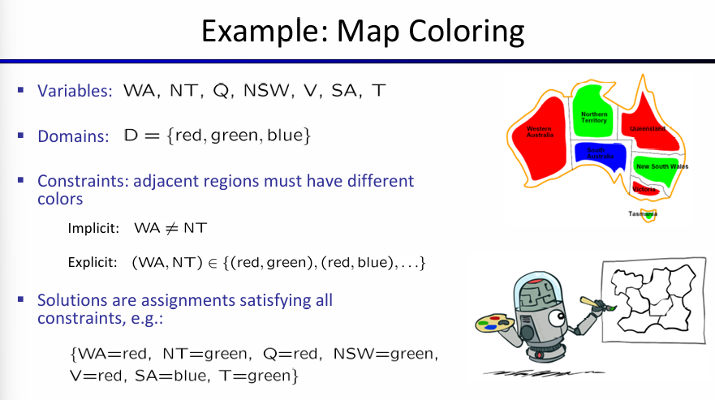

对区域进行染色，那么这些地区就是变量，而它们的值，就是颜色。需要满足的要求就是相邻的两个地区的颜色不相同。而一个solution就是满足要求的地区的染色方式。

另一个经典的CSP是N皇后问题：在一个N×N的棋盘上放置N个皇后，使得它们彼此之间互不攻击，即没有两个皇后在同一行、同一列或同一斜线上。那么关于变量的陈述就有两种：一种是所有的格子各自为一个变量，可能是1或0,1代表有皇后；另一种是每一行为变量，可能是1-N的一个数字（一行只能有一个皇后），代表皇后所位于的这一行的各自变量。

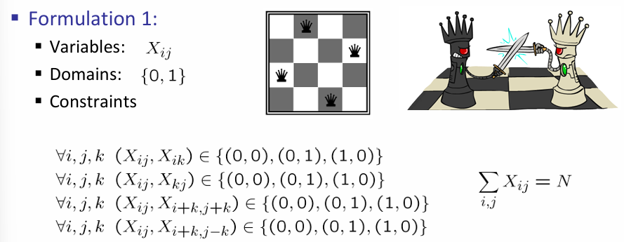

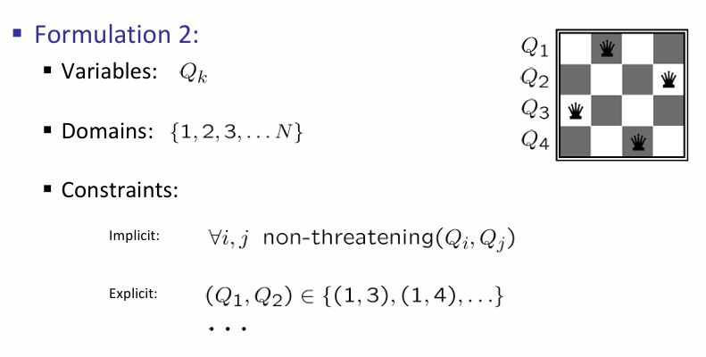

在上述的两个例子中，约束关系都是作用在两个变量上。因此利用约束关系，可以设计Binary Constraint Graph for this Binary CSP Problem. 如下图所示：

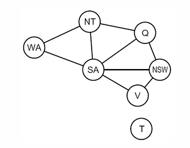

那么如果约束关系较为复杂呢？看下面这个Cryptarithmetic问题：

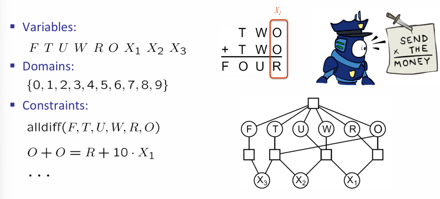

由于进位问题，我们会发现在设计到多个变量的约束关系情况下，会用一个正方形来表示这种关系。同时还值得注意的是，‘进位为0或1’ 也以变量的形式进行了表示。上图中的：
$$
O+O=R+10\cdot X_1
$$
就是通过第三行的最右边的那个正方形进行表示的。

## Varieties of CSP

关于变量是离散还是连续，CSP分为Finite and Infinite domains CSP；而变量也可以是连续变量。

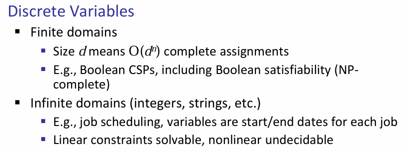

关于约束条件也可分类：

- Unary：对于单个变量的约束条件，例如澳大利亚地图上面的一小块不能涂成绿色
- Binary：涉及到两个变量，如任意的两个区域颜色不能一样
- Higher-order：涉及到三者及以上的变量

同样，约束条件也有soft and hard之分：soft constraint类似于preferences，如red is better than green，这一条不需要完全遵守，但是遵守了会更好

在真实世界中，例如安排什么老师上什么课，对于一个课程在哪个教室什么时候上，交通管理，这些都是真实世界中的CSP问题，变量有离散也有连续，而且约束条件有不同种类的、而且也分软硬。

## Solving CSPs

Standard Search Formulation是一种用于解决CSP问题的通用搜索框架，其核心思想是通过逐步赋值的方式寻找满足所有约束条件的解。首先初始化初始状态，就是任何变量都没有被赋值；然后定义后继函数，它的作用是为未赋值的变量选择一个值，并且这个值不能违反约束关系；同时设置目标测试，检查当前是否所有变量均已赋值，并且满足所有的约束条件。

搜索策略上，DFS/BFS并不是合理的，原因如下：

BFS：

- **搜索空间过大**：CSP的解空间通常是指数级的。对于有n个变量、每个变量有d个可能值的问题，完整的解空间大小为*d**n*，而BFS需要存储所有中间状态，这会导致巨大的空间复杂度。
- **效率低下**：BFS会逐层扩展所有可能的赋值，即使某些路径明显不可行，也会继续探索，导致计算资源的浪费

DFS：

- **路径冗余**：CSP中变量赋值是可交换的，即赋值顺序不影响最终解。例如，先给变量A赋值再给变量B赋值，与先给变量B赋值再给变量A赋值是等价的。这种冗余会导致DFS搜索大量重复路径。
- **缺乏早期失败检测**：普通的DFS在到达叶节点之前不会检测约束冲突，可能导致不必要的深度搜索

因此介绍常用的搜索策略：路径回溯（Backtracking Search）。核心思想有两条：第一是一次只处理一个变量，因为考虑到变量的赋值其实是具有可交换性的，所以每一步主需要考虑给一个变量进行赋值即可；第二是在行动的过程中需要检查约束关系，意味着赋值的时候只考虑不会打破约束关系的值。那么***采取了上述两个策略的DFS***就称为回溯路径算法。两个思想，前者称为variable-ordering，后者称为fail-on-violation.

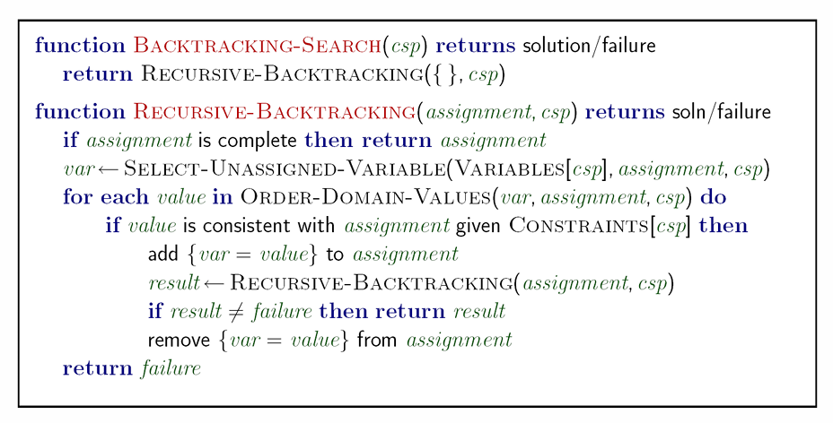

上述的伪代码中：首先是初始化；然后选择未赋值的变量，列出可以为该变量附的值，然后选一个进行赋值；程序递归地进行，直到最终所有的变量都赋值成功而且不违反约束条件，那么就结束递归，返回solution。

### Filtering and Arc Consistency

那么能不能进一步的改进？这里介绍一种方式：filtering。我们能不能提前的检测到不可避免的失败呢？过滤的核心思想是通过分析已有的约束条件和已分配的变量，来减少未分配变量的取值范围。同时搭配forward checking：在将一个赋值加入的时候，将会去除掉所有的打破规则的赋值；同时如果发现这样一来无值可赋，那么就回溯。

>  Keep track of domains for unassigned variables and cross off bad options

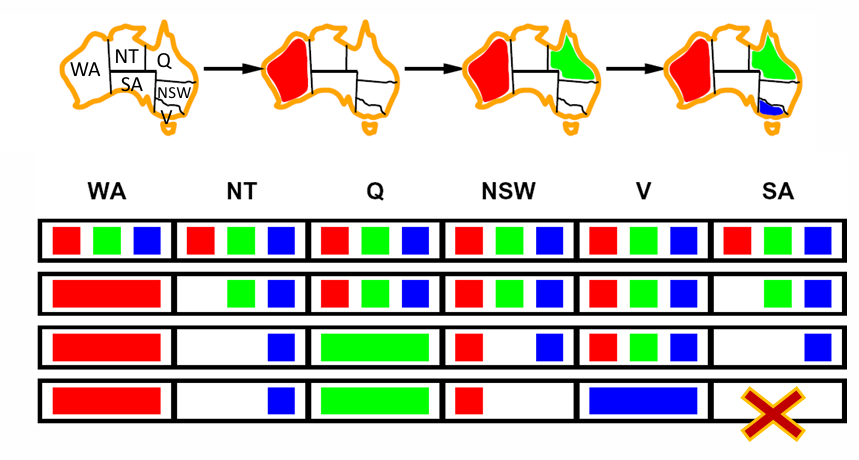

例如上面图片，在赋值SA的时候，发现任何值都会打破规则，因此将会回溯至V节点，换成绿色。

但是如果有的时候错误发生的非常早呢？那么在后期赋值变量的时候，将会回溯很久才能回溯到这个早期的一开始就是行不通的变量赋值。因此这里引入**consistency of arc**。其定义是：An arc X$\rightarrow$Y is consistent iff for every x in the tail there is some y in the head which  could be assigned without violating a constraint. 对于一个约束网络中的弧 ⟨*X*,*c*(*X*,*Y*)⟩，如果对于变量 *X* 的每一个可能值 *x*，在变量 *Y* 的取值域中都存在至少一个值 *y*，使得约束 *c*(*X*,*Y*) 成立，那么这个弧就是**弧一致的**。那么有了弧的存在，那么forward checking就是在确保所有的弧是一致的。

需要注意的是：如果Y的域失去了一个值，那么X$\rightarrow$Y的弧需要被重新检查！弧的一致性检查将会比forward checking更早地检测到失败。

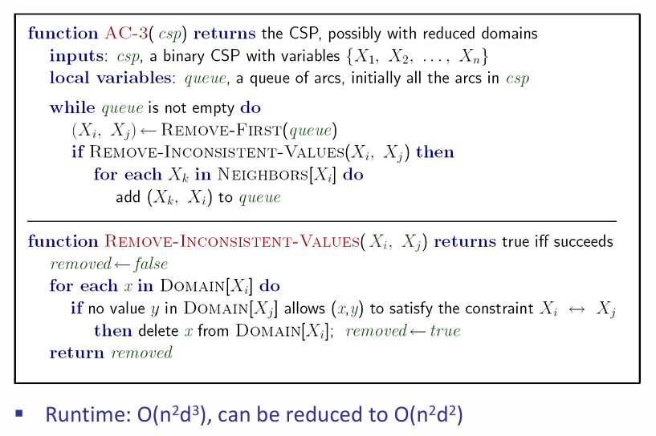

 After enforcing arc  consistency:要么没有解，要么有多组解，要么没有解。但是我们不能从弧的一致性推测出解！所以归根到底，弧一致性只是回溯算法中的滤波策略。

### Ordering：MRV

回溯算法中考虑变量赋值的顺序是DFS，但是能不能选一个更好的ordeing？因此介绍一种变量排序：MRV： Minimum remaining values。我们选择在domain中有着最少合法取值的变量！换而言之：优先考虑最受限的变量。需要注意的是：需要一定的计算资源来决定选哪一个变量！

### Problem Structure

一个变量会和身边的数个变量有限制关系，那么表示这种关系的最好数据结构就是树！比如说涂色问题，那么两个点之间如果是接壤的，那么就加一条边，表示这两个节点不能是一样的颜色。

Theorem:  if the constraint graph has no loops, the CSP can be solved in $O(nd^2)$ time。

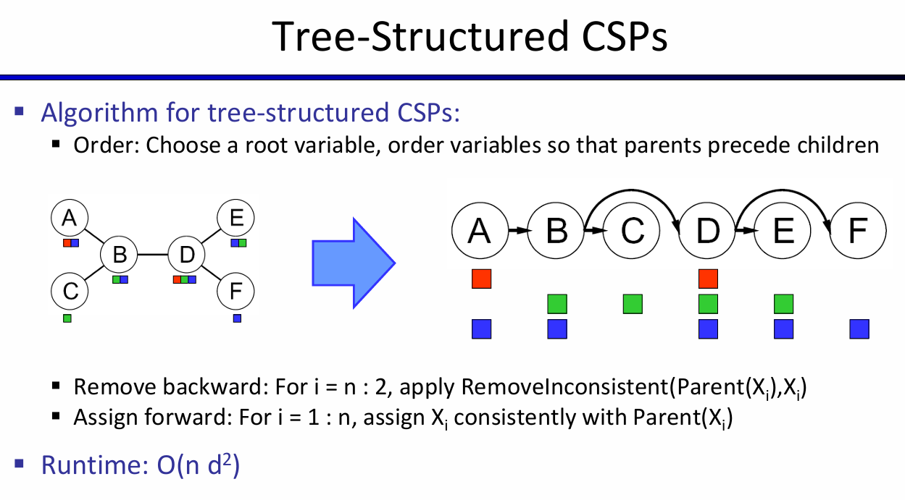

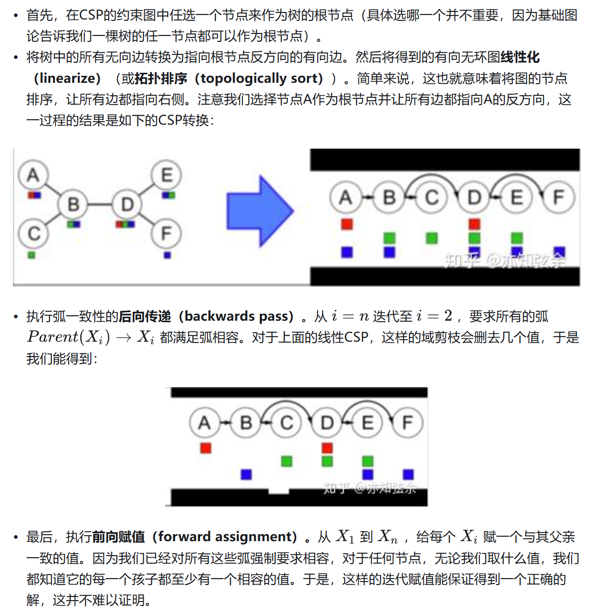

> Reference: https://zhuanlan.zhihu.com/p/64368643

同时也可以引入cutset的技巧：

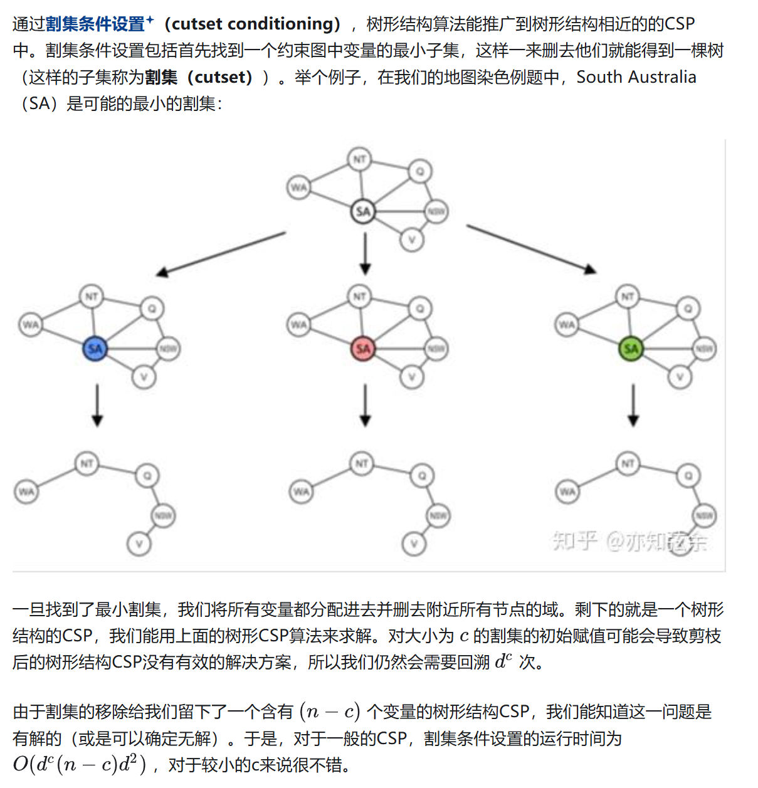

> Reference: https://zhuanlan.zhihu.com/p/64368643

## Local Search

回溯算法并不是唯一的解决办法！从一些随机的变量赋值开始，反复选择违反约束最多的变量并将其重置为违反约束最少的值，这样也能解决CSP。这一策略称为**最小冲突启发式（min-conflicts heuristic）**。

这种算法的表现很不错！

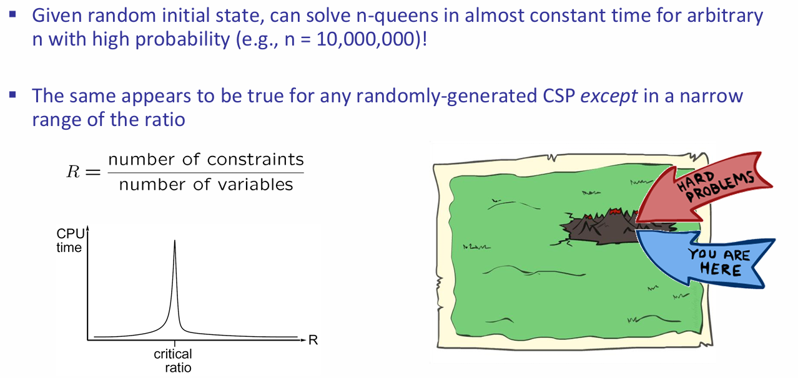
