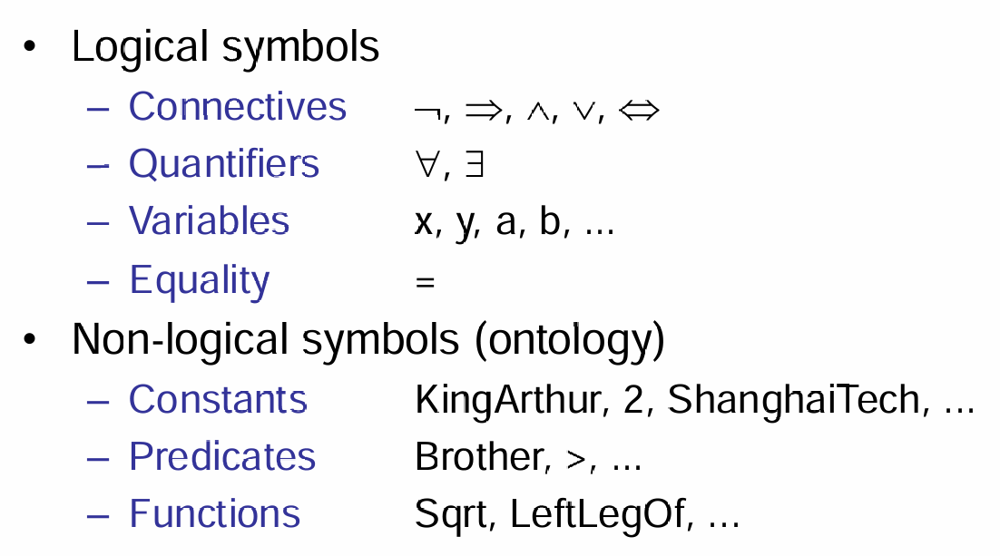
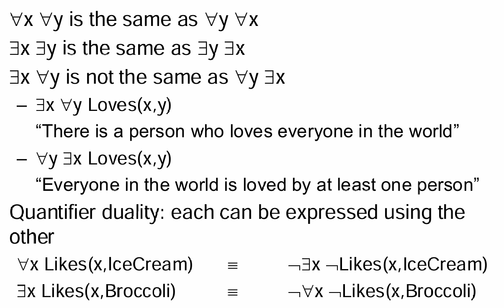
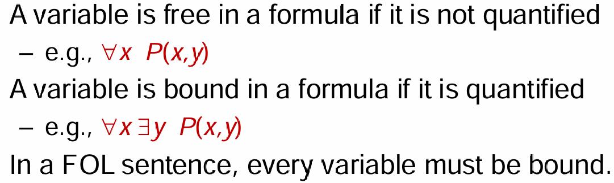
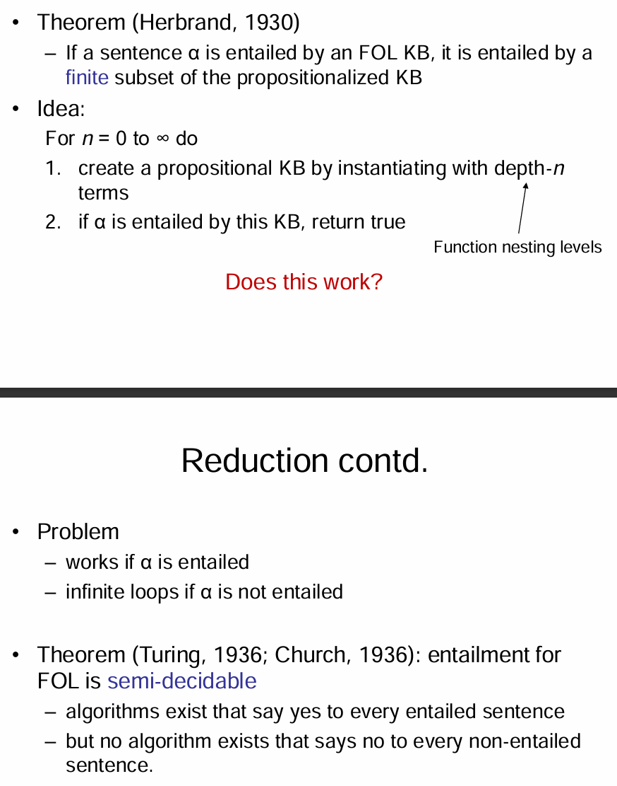
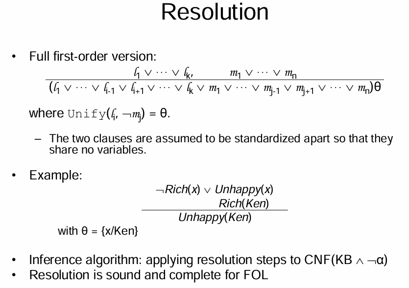
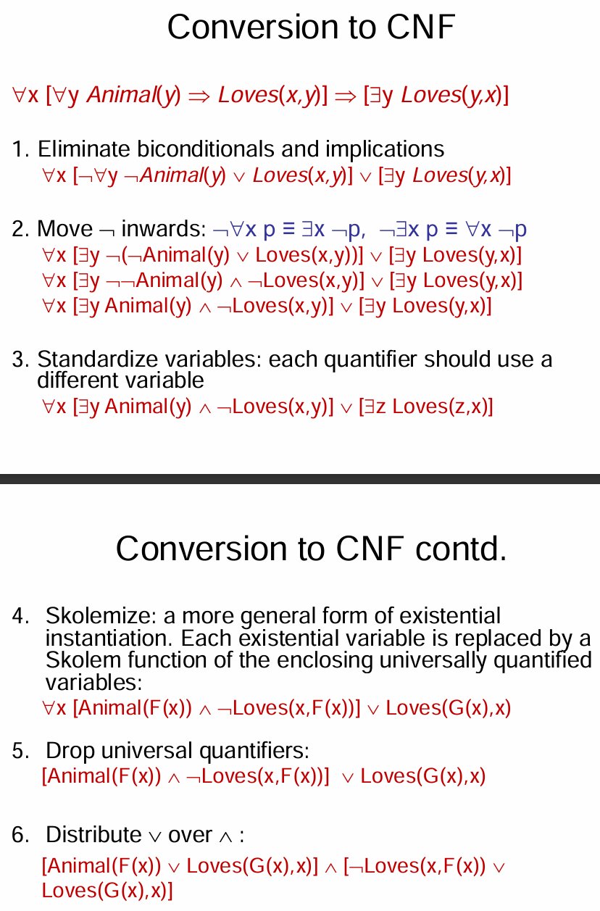
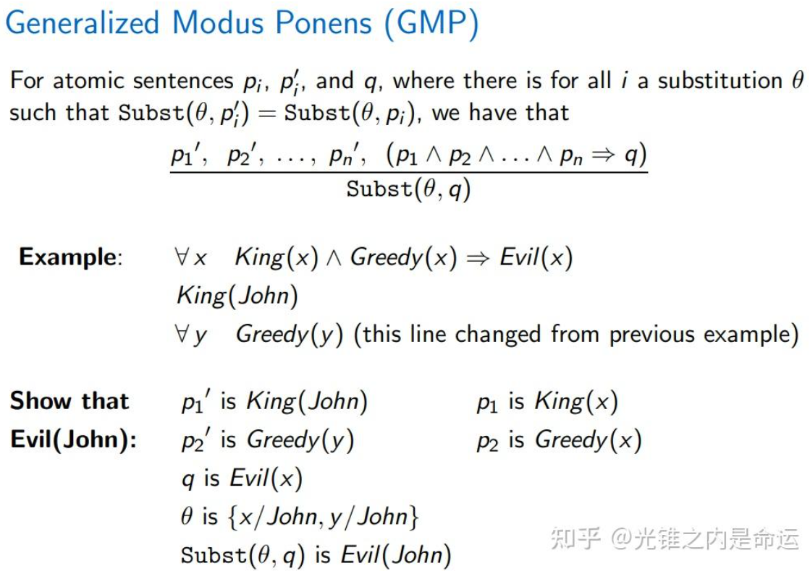

# First Order Logic

## Intuition

Propositional Logic有非常大的缺点：假如说考虑一个三段论：苏格拉底是人，人都会死，所以苏格拉底会死。那么拿到另外一个命题：小明是人。那么严格来说，不能使用这个三段论推出小明会死的结论，因为小明是人和苏格拉底是人是两个不同的命题。因此First-order Logic就试图解决这个弊端。

## FOL

FOL假设这个世界包含三种角色：objects，如人类、房子等具象物品；relations，比如说是...一部分，比谁大；最后是functions，比如说...是不是教授，是...的父亲。FOL也称为First-Order Predicate Logic。在FOL中的语法，有两种最基本的元素：logical symbols与non-logical symbols。如下图。

一个complex sentence就是由atomic sentences，利用connectives拼接而成的。

由于objects是无数种的，因此引入quantifiers来allows us to express properties of collections of objects  instead of enumerating objects by name。需要注意的是，‘任意’符号经常配合使用的connectives是$\Rightarrow$，而不是$\land$；‘存在’符号经常配合使用的是$\land$，而不是$\Rightarrow$。下图为quantifiers的一些性质：

那么变量也能根据是否是quantified而分为两类，如下：

## Inference in FOL

> Reference: https://zhuanlan.zhihu.com/p/22167116100

### Instantiation

**通用实例化（[Universal Instantiation](https://zhida.zhihu.com/search?content_id=253455625&content_type=Article&match_order=1&q=Universal+Instantiation&zhida_source=entity), UI）**

- **定义**：对于带有**全称量词**的句子（如 ∀x），可以通过替换变量 x 为具体的**常量项**（ground term）来得到新句子。

- **例子**：
  原句：
  ∀x (King(x) ∧ Greedy(x) ⇒ Evil(x))
  替换 x 为具体的常量：

- - King(John) ∧ Greedy(John) ⇒ Evil(John)
  - King(Richard) ∧ Greedy(Richard) ⇒ Evil(Richard)

- **规则**：

- - 可以用任意不带变量的项（如 John、Father(John)）来替代变量 xxx。
  - 记号：
    Subst(θ, α) 表示将 θ（替换规则）应用到句子 α 上。
    例如，{x/John} 表示将 xxx 替换为 John。

**存在实例化（Existential Instantiation, EI）**

- **定义**：对于带有**存在量词**（∃x）的句子，替换变量 x 为一个新的常量**[Skolem 常量](https://zhida.zhihu.com/search?content_id=253455625&content_type=Article&match_order=1&q=Skolem+常量&zhida_source=entity)**，这常量在知识库中其他地方不能出现。

- **例子**：
  原句：
  ∃x (Crown(x) ∧ OnHead(x, John))
  替换 xxx 为 Skolem 常量 C1 ​：

- - Crown(C₁) ∧ OnHead(C₁, John)

- **规则**：

- - Skolem 常量表示某个不具体的对象（例如，"某个皇冠"），但它在整个推理过程中必须保持一致。
  - 示例：
    ∃x (d(x^y) / dy = x^y)
    替换 x 为常量 e（欧拉数），得到：
    d(e^y) / dy = e^y

**全称实例化（Universal Instantiation）**

- **添加新句子**：

- - 可以多次进行全称实例化（UI），通过对不同常量的替换增加多个新句子。
  - 新知识库与原知识库在逻辑上**等价**，即它们在所有模型中都具有相同的真值。
  - 等价成立的两种方法：

1. **替换所有可能的值**并删除量词句子。
2. **同时保留量词句子**并新增实例化后的句子。

**存在实例化（Existential Instantiation）**

- **替换句子**：

- - 存在实例化（EI）只能进行一次，**用新句子替换原句**。

  - 新知识库**不等价**于原知识库：

  - - 原因：可能存在多个满足条件的对象，但实例化时只能引入一个 Skolem 常量。
    - 但新的知识库**可满足性**与原知识库保持一致（即，如果原知识库是可满足的，新知识库也是可满足的）。

命题化虽然让推理过程变得直接，但生成大量无关或冗余的句子，导致时间和空间复杂度急剧增加。

### Two Theorems:

1. **Herbrand 定理（1930）**

**定理内容**：如果一阶逻辑（FOL）知识库（KB）能够蕴含一个句子 α\alphaα，那么这个句子 α\alphaα 也可以由知识库的一个有限子集（其已经经过命题化）蕴含。

- **解释**：这个定理的核心思想是，如果我们想知道一个一阶逻辑知识库是否蕴含某个句子 α\alphaα，我们并不需要考虑整个一阶逻辑知识库，而只需要关注一个命题化的子集。通过将知识库的公式进行实例化（即替换为命题公式），最终可以通过该有限子集来确定 α\alphaα 是否被蕴含。
- **举例**：假设你有一个包含多个逻辑公式的一阶逻辑知识库，如果你想知道某个句子 α\alphaα 是否可以从中推导出来，Herbrand 定理告诉你，你只需要创建知识库的一个有限子集，这个子集是通过实例化一阶公式得到的命题公式。然后，只需要在这个子集上进行推理，就能判断 α\alphaα 是否被蕴含。

思路：

对于每个递增的深度 n（从 0 到无穷大），我们：

1. 通过实例化知识库中的公式，生成一个命题逻辑的知识库，深度为 nnn。
2. 如果 α\alphaα 被该命题化知识库蕴含，则返回“是”（True）。

**问题**：

- 如果 α\alphaα 被蕴含，方法有效。
- 如果 α\alphaα 没有被蕴含，可能会导致无限循环。

2. **Turing/Church 定理（1936）**

**定理内容**：一阶逻辑的蕴含问题是**半可判定的**（semi-decidable）。

- **解释**：半可判定性是指，存在一些算法能够在给定句子时说“是”，即该句子是被蕴含的；但是不存在任何算法能够始终正确地说“否”，即确定一个句子是否**不被**蕴含。

  换句话说，关于一阶逻辑蕴含的问题是不可判定的。如果我们询问一个一阶逻辑句子是否是某个知识库的蕴含，虽然我们可以使用算法找到所有的“是”答案，但对于“否”的答案，可能会陷入无法终止的计算过程，无法得出最终结论。

关键点：

- **存在算法能够说“是”**：也就是说，如果句子 α\alphaα 被蕴含，算法能正确地给出答案。
- **没有算法能够说“否”**：如果句子 α\alphaα 没有被蕴含，可能没有办法通过算法得出确定答案，或者算法无法终止。

**总结**：

- **Herbrand 定理** 表示，虽然我们可以用一个有限的命题化子集来进行推理，但这可能涉及到大量的计算，尤其当 α\alphaα 不被蕴含时，可能导致无限循环。
- **Turing/Church 定理** 则进一步指出，一阶逻辑的蕴含问题是半可判定的，意味着我们无法对所有可能的情况提供一个总是能够正确回答的算法。

### Horn Logic(FOL case)

$p_1 \land \dots \land p_n \Rightarrow q$，其中p q都是atomic sentences。

### General FOL

$$

\frac{p_1', p_2', \ldots, p_n', (p_1 \land p_2 \land \ldots \land p_n \Rightarrow q)}{q\theta} \quad \text{where } p_i'\theta = p_i \theta \text{ for all } i
$$

- *p*1′,*p*2′,…*p*,*n*′ 是前提。
- (*p*1∧*p*2∧…∧*pn*⇒*q*) 是一个条件语句，表示如果所有 *pi* 都为真，则 *q* 也为真。
- *qθ* 是结论，表示在给定的替换 *θ* 下，*q* 为真。

同样，可以考虑将语句转化为CNF（合取范式），利用$p \Rightarrow q \equiv \neg p \lor q$，与quantifier的公式，将原式子转化为CNF。如下面的例子：
$$
\neg \exists x P(x) \equiv \forall x \neg P(x) \\
\neg \forall x P(x) \equiv \exists x \neg P(x)
$$

### 示例解释

示例：

- 前提：King(John), Greedy(y), (King(x) ∧ Greedy(x) ⇒ Evil(x))
- 其中：
  - *p*1′ 是 King(John)，*p*1 是 King(x)
  - *p*2′ 是 Greedy(y)，*p*2 是 Greedy(x)
- 因此，替换 *θ* 是 {*x*/*J**o**hn*,*y*/*J**o**hn*}
- 结论 q \ 是) Evil(x)，所以 \( q\theta 是 Evil(John)

## [Unification](https://zhida.zhihu.com/search?content_id=253455625&content_type=Article&match_order=1&q=Unification&zhida_source=entity) and Lifting

> https://zhuanlan.zhihu.com/p/22167116100

### A First-Order Inference Rule

由于命题化生成大量冗余信息的问题，我们希望直接在一阶逻辑（FOL）中进行推理，而不必先将其命题化。

**例子：**

我们想推导出 **Evil(John)**，给出的知识有：

1. **∀x (King(x) ∧ Greedy(x) ⇒ Evil(x))**（所有贪婪的国王都是邪恶的）
2. **King(John)**（John是一个国王）
3. **Greedy(John)**（John是贪婪的）

**推理过程：**

- 我们寻找一个**替代（substitution）θ**，使得在规则 **∀x (King(x) ∧ Greedy(x) ⇒ Evil(x))** 中，
  **King(x)** 和 **Greedy(x)** 与知识库中的事实 **King(John)** 和 **Greedy(John)** 匹配。

- 替代项为：

- - θ = {x / John}（将变量 x 替换为常量 John）。

- 替代后，规则变为：
  **King(John) ∧ Greedy(John) ⇒ Evil(John)**，并且前提条件已经在知识库中成立，所以我们可以得出结论：
  **Evil(John)**。

This inference process is called **[Generalized Modus Ponens](https://zhida.zhihu.com/search?content_id=253455625&content_type=Article&match_order=1&q=Generalized+Modus+Ponens&zhida_source=entity)**.

### **Unification**

**概念：**

合一（unification）是一个找到变量替代（substitution）的过程，使得两个逻辑表达式变得相同。

合一算法（**Unify(p, q)**）：

- 输入：两个逻辑表达式 p 和 q。
- 输出：替代项 θ，使得 Subst(θ,p)=Subst(θ,q)（如果存在）。

**例子：**

- **p=Knows(John,x)，q=Knows(John,Jane)：**

- - 替代项 θ={x/Jane}，即将 x 替换为 Jane，使两个表达式相等。

- **p=Knows(John,x)，q=Knows(y,Elizabeth)：**

- - 替代项θ={x/Elizabeth,y/John}，通过同时替换 x 和 y，使两个表达式相等。

- **p=Knows(John,x)，q=Knows(y,Mother(y))：**

- - 替代项 θ={y/John,x/Mother(John)}。

- **p=Knows(John,x)，q=Knows(x,Elizabeth)：**

- - **合一失败：**x 不能同时取值为 **John** 和 **Elizabeth**。

**标准化变量（Standardizing Apart）**

- 为避免变量冲突，可以对变量进行标准化处理。例如，使用不同的变量名称：

- - 把 Knows(x,Elizabeth)改写为 Knows(x_{17}, Elizabeth)。
  - 这样可以避免 x 在两个表达式中冲突，提升合一的成功率。

**总结：**

- 合一是逻辑推理中关键步骤，帮助在不同表达式之间进行匹配。
- 失败的合一通常因为变量无法同时满足多个约束。
- 标准化变量有助于避免冲突。

