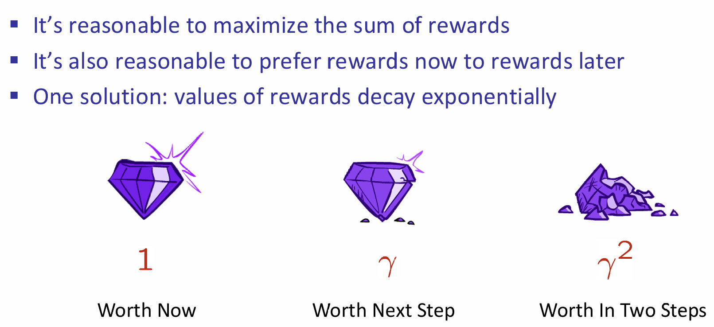

# Markov Decision Process

在课程最开始的状态搜索树或图中，一个显著的过程特征就是：所有的过程都是确定性结果，agent采取了这个操作将会面临什么样的对应的结果。但是如果是不确定性搜索呢(Non-Deterministic Search)？即：采取了一个行动之后，对应的并不是唯一的确定性状态，而是有着概率分布下的状态可能结果。

## Award

在强化学习中，award是一个非常重要的用于改进policy的措施；这里也是如此！考虑如下的一个小例子：

假设现在采取的行动只有一种：那就是移动一格；而这个行动的结果的可能情况如图所示。那么如何设计award呢？首先明显地，可以认为抵达钻石就是+1，并且游戏结束，而火坑就是-1，并且游戏结束；而其次，我们希望小人能够尽可能的活下来，那么就可以设置一个非常小的负数award（如果是整数，那么岂不是一个安全的地方不断撞墙，award就能无限大）。agent可以根据这个award来更改Action Policy。

那么神奇的地方就来了：如果我希望机器人能够尽可能快一点找到钻石，那么可以设置这个负数的绝对值稍微大一点；但是设想一下，如果过大，那么机器人极端一点可能先考虑会找火坑跳入！因为award负数太痛苦了，机器人只想快点结束游戏，钻石，甚至是直接进入火坑寻死，那么都在agent视角看来，是合理的policy。

## Markov Decision Processes

### Concept

在这里，马尔科夫的含义其实是；下一步的结果仅仅与当前的状态和采取的行动有关，与过往的任何东西都无关。这一点其实和deterministic搜索问题中的successor function较为类似，都和历史无关，只与当前state有关。

Policy：In ***deterministic*** single-agent search problems,  we wanted an optimal plan, or sequence of  actions, from start to a goal。而在MDP中：

注意这里的policy不是规划好了未来直到最终状态的所有计划步骤，而是单独对每一个可能的状态s都分配一个最优的行动。

### Example: Racing

在上面的例子中，action对应state的概率分布这一点，其实在情景设定中体现的并不明显。现在见下例：

车子有三种状态：cool  warm and overheat，在前两个状态可以选择加速或减速，而在overheat就gg；最大的特点就是选择了action，对应的下一个状态并不是确定的，而是有概率分布的。

如何用一个搜索树表达这种可能性的概念呢？甚至，比如说，在cool状态，两种action都可能导致下一个状态还是cool。这究竟如何表示？这里，引入了（s, a）q-state节点，来表示当前状态s所采取的状态a，然后下面紧跟着的是所有可能的下一状态及其概率：

那么应该agent如何选择action preferences呢？假如说两条路，都是四步，一条是一步+1分，而第二条是最终一步+4分，虽然award都是一样的，但是很明显第一条是更合理的。总结：

对于一个当前窗台来说，我们可能会考虑后面很多步的，但是鉴于刚才的说法，我们更倾向于更早，甚至是现在，的高回报，所以对之后的q-state节点所代表的utility（award）值会乘上一个衰减系数。

### Solving MDP

9

每一个state节点都要选择期望utility最大的q-state node，i.e.，其所代表的a action。而q-state utility又是如何计算的呢？又是需要其所连接的所有的state的utility值，而这又是怎么来的？又要看q-state node。可见这是一种recursion：

对于这样的一个问题，如果采用了expectimax的方法，那么有两个问题：第一是大量的表示同一state的node将会被重复创建，space complexity不友好；第二是这个树深度可能会很高，那么计算复杂度就上来了，但是又注意到由于衰减系数的存在，树深层部分切实作用并没有想象中的大。 

因此，我们可以采用bellman equation的经典问题：动态规划！这种方法称为：value iteration

这里创建的$V_k(s)$与Time-Limited Values就是对应规划问题中的'step'概念。那么推的时候，可以从k=0开始推，而这时候认为utility都是0（注意utility of node 以及 award represented by $R(s,a,s')$是不一样的）.

> 这里的Theorem其实说明的是：动态规划最终会向不动点收敛

以小车racing例子为例，展示推Vk(s)的过程中的两步，并且假设衰减系数是1：

在经过了大量的iteration之后（k非常大），最后这些状态的utility值将会稳定，代表该状态真实的optimal utility值。

原来在search problem中，在获得了所有state的utility之后，要经过***policy extraction***，才能获得optimal solution了：

但是如果有了optimal utility with action probability，i.e.，Q-values，那么action将会十分的明显：

因此有一种算法变体，就是Q-value Iteration：

