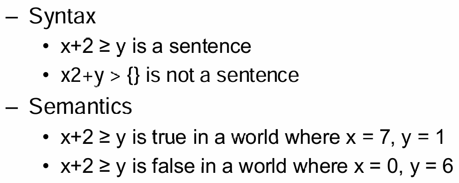
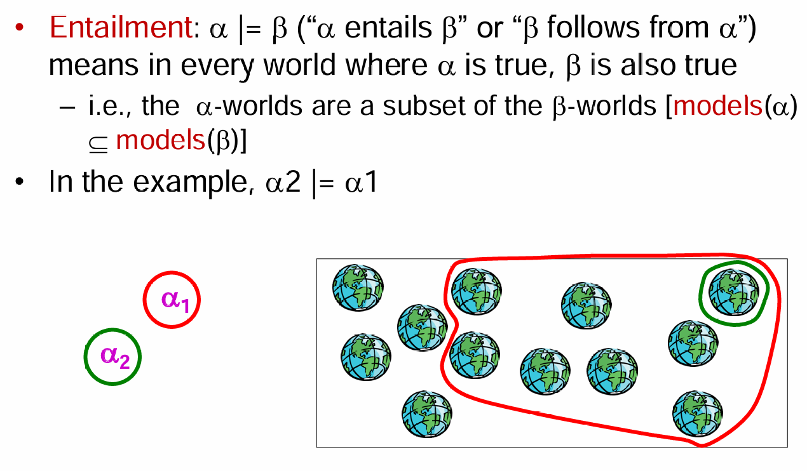
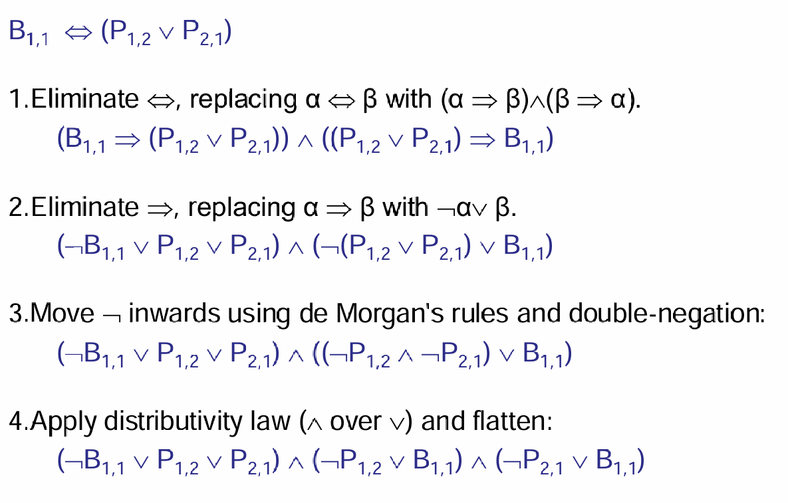
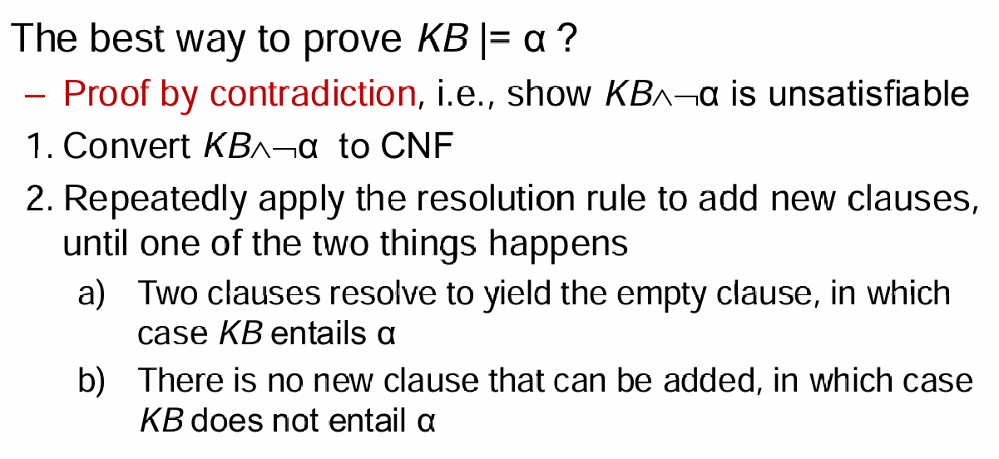
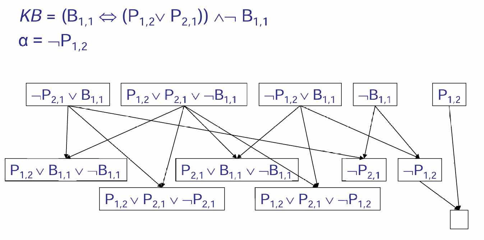

# Propositional Logic

## Propositional Logic

Logic是什么？Logic is a Formal language in which knowledge can be expressed; A means of carrying out reasoning in the language. 一个logic-based symbolic AI由以下两个元件组成：

- Knowledge base set of sentences in a formal language to represent  knowledge about the world
- Inference engine answers any answerable question following the knowledge  base

而一个logic中有两个组成部分：一个是syntax，也就是哪些语句是合法的；另一个是semantics，也就是在每一个模型（possible world）中哪些句子是真或错的。

Propositional Logic是某种意义上最简单的logic：含有一个个sentence symbol，然后通过logic connectives or operators进行组合。

implication是一种logic operator：$S1 => S2$ is true iff S1 false or S2 true。蕴含什么时候为true？如果S1是错误的话，那么这个命题就是对的，因为错误的前提能够推出任何的结论；而如果S2是对的，那么命题也是对的。只有S1是对的但是S2是错的时候，这个命题才是错误的。Logical Equivalence, Validity and Satisfiability就不在赘述了。

下面介绍entailment：

如果在任何的世界中，如果a是正确的，那么b也是正确的；如果想要证明这一点，有两种方法：第一种是列出真值表，列举在所有的世界可能性下，如果a是对的，b总是对的，那么就完成了说明，但是时间复杂度并不是很友好；第二种是寻找一个有限的句子序列，每个句子要么是一个公理，要么是通过推理规则从前一个句子推导出来的。（第二种方法其实是离散数学中的内容，相当于一步步将a的式子推导到b）

一类非常特殊的命题叫做Conjunctive Normal Form（CNF），合取范式（CS101中有所涉及）。如下图：一个重言蕴含就能转化为CNF的形式：

那么证明entailment的方式就多了一种：

说明上述的命题是不可满足的，那么首先转化为CNF，然后不断利用resolution rule去合并，直到：如果产生了空clause，那么就说明是不可满足的，entailment成立；否则一直合并，直到无法产生新的clause，那么说明entailment不成立。

那么什么是Resolution Rule？给定两个子句 *C*1 和 *C*2，如果存在一个文字 *L* 和它的否定 ¬*L* 分别出现在 *C*1 和 *C*2 中，那么可以通过解析规则从 *C*1 和 *C*2 推导出一个新的子句 *C*，其中 *C* 是 *C*1 和 *C*2 中除去 *L* 和 ¬*L* 后剩余文字的析取。如下图的例子：

以第一行的前两个进行resolution为例：注意到$P_{2,1}$在两个clause中都有出现，而且是neg关系（一个中有neg，一个中无neg），于是将两个句子除去$P_{2,1}$的剩余部分放在一起，形成了新的clause。

