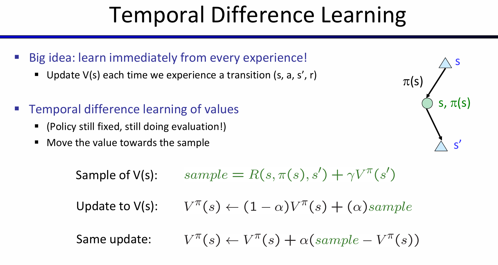
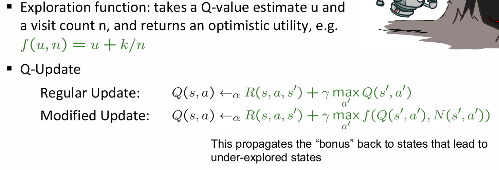

# Reinforcement Learning

## Intro-Double Bandits

考虑下面的这样一个场景：

再这样的一个场景中，由于我们知道过程中的所有reward, action，因此其实我们都不需要玩这个游戏，都能对MDP进行推演。甚至能直接推出：全部选择蓝色的期望是100，而全部选择红色的期望是150

假如说规则改变了：红色策略的各自可能情况的reward不变，但是win chance发生了改变——我不知道win rate是什么。那么此时发生了什么？This wasn't planning, it was learning！（More specifically, reinforcement learning）

很明显这依然是一个马尔科夫过程，但是我们无法计算，很多的细节、概率需要自己进行行动（act）才能知道！因此感性理解这就是一个exploration and exploitation trade-off——我需要一定的多样行动，来探究概率；而最终，我们必须使用之前学到的东西。具体许多idea如下：

用之前的例子再一次举个例子：在赛车加速或降速的例子中，我们知道了cool warm overheat之间的状态转换的概率和reward，但是强化学习问题背景下，就是这两者都是不知道的。但是，依然这是一个MDP，我们依然寻找的是一个policy：

## Learning

在这样的一个问题下：如何学习呢？基本的想法是：

- 采取行动然后观察结果（包括：新到达的状态，以及收获的reward）
- 学习是基于观察的结果样本的
- 必须学习如何采取行动以最大化期望奖励

很显然与上一节的MDP解法不同的是，在一个状态下，采取不同行动所收获的不同可能的结果都是提前知道的，但是现在，我们不知道，我们必须采取可能行动中的一个行动，然后观察发生了什么。这一种学习思想称为：Model-Based Idea。即：

- 根据现有经验来学习近似的模型
- 最后运用近似模型的过程中，就当做近似模型就是真实模型，然后进行MDP的策略求解

> Two Steps: Learn empirical MDP model, and then solve the learned MDP(like value iteration)

下面是一个非常生动形象的observed episode推出learned model的例子：

Passive Reinforcement Learning：

那么discounted rewards是如何计算的呢？就是从这个状态开始，按照流程执行，之间所有的reward和。对于output value for this state，就是所有episode下该state的reward和的总和，除以episode的数量。

上图例子中的C：Episode1 2 3的discounted value都是-1+10=9，4是-11，所以平均下来是（9*3-11）/4 = 4。Direct Evaluation的确能够很好的衡量一个节点代表的reward期望，而且非常容易理解。不需要T R的任何只是，最终就是计算correct average values using sample transitions。

但是也是有弊端的：首先，浪费了状态之间关联的信息；其次，每一个状态都必须要单独学习出来；最后，学习时间很长。其中最重要的，是T R的信息没有显式的学出来。

那么这些弊端决定了Policy Evaluation方法并不适合用来辅助解决MDP问题：因为MDP非常需要T R的信息，但是这个方法并没有提供这些信息。所以关键问题来到了：如何在不知道TR信息的前提下实现bellman equation中的update？换而言之：

***How do we take a weighted average without knowing the weights?***

那么一种想方法就是：take samples of outcomes by doing action and take the average！我通过随机行动，来随机采样结果，那么平均一下即可！采取的随机行动应该是服从Transition分布的。但是这样一来，需要能够采取一个行动，抵达下一个状态，然后返回之前的状态，重复循环。但是通常来说：we can't rewind time to get sample after sample from state s! 

于是有了一个大胆的想法：learn immediately from every experience！每一次经历一个transition，都进行一次V(s)的更新：

按照时序进行sequential action sampling，每一次的action将会收到reward，以及接受下一个状态的state value。按照一定的比例组合起来，将用于之前这个state value的更新。TD value learning可以很好的拟合每一个状态的state，但是当我们需要做决策的时候，transition and reward这两个信息是没有的！

这个问题启发我们：learn Q-values, not values！
$$
\pi (s) = argmax_aQ(s, a) \\
Q(s,a) = \sum_{s'}T(s, a, s')[R(s,a,s') + \gamma V(s')]
$$

## Q-learning

Q-value iteration是十分重要的，这个式子的设计可以灵感来自于value learning中对state value的更新：
$$
Q_{k+1}(s,a)\leftarrow \sum_{s'}T(s,a,s')[R(s,a,s')+\gamma max_{a'}Q_k(s',a')]
$$
那么和TD value learning类似的：每一次随机采取一个行动，将会得到：
$$
sample=R(s,a,s')+\gamma max_{a'}Q(s', a')
$$
然后更新：$Q(s,a)\leftarrow (1-\alpha)Q(s,a)+(\alpha)[sample]$

在全强化学习（***Full reinforcement learning***）中，代理（agent）并不直接知道环境的转移函数 T(s,a,s′) 和奖励函数 R(s,a,s′)，这意味着：

- **不知道转移函数T(s, a, s')**：代理不知道从状态 s 执行动作 a 后会转移到哪个状态 s′，也就是环境的动态过程是未知的。
- **不知道奖励函数 R(s, a, s')**：代理不知道在每次状态转移时会获得什么奖励 r。
- **当前选择动作**：代理需要根据当前的估计来选择动作，而不是事先知道所有的结果。

**目标**：通过与环境的互动，代理的最终目标是**学习最优策略和最优值函数**，也就是说，要找到使得未来奖励最大化的行为策略。在全强化学习中，代理（agent）并不直接知道环境的转移函数T(s,a,s′) 和奖励函数R(s,a,s′)，这意味着：

**Q学习** 是一种强化学习算法，代理根据当前的值函数和策略来选择动作，同时还会进行探索以改进决策。具体特点如下：

- **代理根据当前的值函数/策略选择动作**：代理通过估计的 Q 值函数（状态-动作值函数）来选择当前最优的动作，但它同时也可能进行**探索**，即尝试新的、未知的动作。
- **探索与利用的权衡**：
  - **探索（Exploration）**：代理尝试新的动作，目的是获取更多的信息，了解环境的动态，从而能够做出更好的决策。
  - **利用（Exploitation）**：代理根据当前已有的信息（如已学到的 Q 值）选择最有可能带来最大回报的动作。
  - 这是一个**根本性的权衡**：代理必须在利用已知的最优动作和探索新的可能性之间做出选择。过多的探索可能导致较低的短期奖励，而过多的利用可能错过一些潜在的长期回报。
- **Q学习并不是离线规划**：这意味着，Q学习并不依赖于已知的环境模型来预先计算最优策略，而是代理在环境中不断地采取实际行动，并从环境反馈中学习。
  - 在Q学习中，代理通过实际与环境的互动（例如在迷宫中走动或在游戏中尝试动作）来不断调整它的策略和价值函数。
  - 代理通过不断的试错过程来**发现**不同动作的结果，并根据这些经验来逐步改进其行为策略。

这种不需要知道T R的学习方法效果怎么样？出乎意料的是，惊人的好，常常收敛到最佳策略！即使采取的行动序列是次优的！Q-learning是一种off-policy learning！

## Story so far

## Exploration and Exploitation

之前提及过，需要一部分的时间和行动来进行探索，然后最终用学习到的来获得更高的分数，这就是探索和利用的平衡。如何探索呢？

其中最简单的一种方案是 **ε-贪婪（ε-greedy）** 策略。

ε-贪婪策略（ε-greedy）：

- **每一步都抛一次硬币**，决定是否采取探索性动作。
  - **以小概率**（ε的概率），代理会随机选择一个动作，即进行探索。
  - **以大概率**（1-ε的概率），代理会选择根据当前策略选择的动作，即进行利用，最大化奖励。
- 这种方法的核心是：
  - **ε** 控制了探索和利用之间的权衡，较小的ε意味着代理更多地利用已知的最佳策略，较大的ε则意味着代理更多地进行随机探索。

存在的问题：

- **通过随机动作来强制探索**，存在一定问题：

  - 代理最终确实会探索整个环境，但一旦学习完成后，仍然会继续进行探索，这会导致代理在已经学会了最优策略后仍然“乱打乱撞”。
  - 这种方法在学习过程中可能会导致效率低下，因为即使代理已经学到有效的策略，过度的探索会使得代理的行为变得混乱。

  一种解决方案是随着时间逐步降低$\epsilon$的值。另一种解决方法是：使用一种更加智能的exploration functions。首先我们要明确：什么时候需要进行explore？这个探索是整个过程中都需要进行的吗？

  - Explore states that haven't been sufficiently explored
  - Eventually stop exploring

Idea：select actions based on modified Q-value

探索函数是一种方法，它结合了Q值估计（表示某个状态-动作对的价值）和访问计数（表示该状态-动作对被选择的频率），返回一个 **乐观的效用值**，使得代理在探索时能够更加关注未被充分探索的状态。目的是为了加强对未探索状态的学习。

## Approximate Q-learning

基础的Q-learning保持一个q-values的table，但是在现实世界中，我们不可能学习到所有状态的state value！因为现实世界中，state太多了，memory存放不下。因此我们想要一种泛化能力更广的方案！

理想情况下，我们希望：学习一小部分的state，然后将学习到的内容扩展到新的、相似的情况。那么这就和机器学习相关了。首先需要介绍的是feature-based reepresentation：

与其用具体的现实参数数据描述状态，我们可以用一组代表特征的向量来描述状态。这里的feature其实就是一种函数，将一个state映射到0-1之间的一个数字。同样，也可以用这种类似的方法来表述q-state。

于是用上述的特征和一组权重，就能用来表述$V(s),Q(s,a)$。

以q-state为例子，那么在这样的表述下，如何更新q-value呢？公式图如下：

当然，由特征转化为q-value的函数可以不仅仅是线性的，还可以是多种多样的，甚至可以是神经网络的方式：

## Policy Search

1. **Q学习的优先级：让Q值接近**

- **Q学习的目标**是使 Q 值尽可能准确，通过 Q 值来做决策。Q 值代表了从某个状态采取某个动作的预期回报，准确的 Q 值能帮助代理做出最优决策。
- 然而，通过特征来生成策略并不一定直接与 Q 值的准确性挂钩。换句话说，某些基于特征的策略在赢得游戏或最大化效用时，可能并不完全是最佳的 Q 值估计。但它们往往仍然能做出有效的决策。
- **例子**：在项目中，你可能计算的值函数（V）并不是未来奖励的最佳估计，但它们仍然能够产生好的决策。因此，**关键在于确保Q值的排序是正确的**，也就是说，准确地预测动作的优先级。

2. **策略搜索的思路**

- **策略搜索的核心思想**：目标是 **学习最大化奖励的策略**，而不是仅仅关注预测奖励的值（V 或 Q）。也就是说，真正需要的是一个能够 **最大化实际奖励** 的策略，而不仅仅是能正确估计奖励的值函数。
- **如何进行策略搜索**：
  - 从一个**还算不错的初步解决方案**开始（例如，基于 Q 学习的近似方法）。
  - 然后通过 **微调特征的权重**，进一步优化策略，从而得到一个更好的策略。

3. **最简单的策略搜索方法**

- 最简单的策略搜索方法是：
  1. **从一个初始的线性值函数或 Q 函数开始**。
  2. 通过**调整每个特征的权重**，观察在不同权重下策略是否变得更好。
  3. 每次改变权重后，检查策略的表现，看是否有改进。
- **存在的问题**：
  - **如何判断策略是否变好了？**：很难通过单一的量化标准来判断策略的好坏，可能需要多次尝试。
  - **需要运行大量的样本**：这种方法通常需要在不同的样本上反复训练和测试，以验证策略的效果。
  - **当特征很多时，这种方法不实际**：如果特征空间非常大，调整每个特征的权重可能非常耗时，而且计算开销大。

4. **更好的策略搜索方法**

- 更好的策略搜索方法会**利用前瞻结构**，即考虑未来的可能性，进行更加有效的探索。
- **明智地选择样本**：选择更具代表性的样本来进行训练，避免盲目地遍历所有可能的样本。
- **改变多个参数**：通过调整多个参数来优化策略，而不仅仅是单一特征的权重调整，从而加速收敛。

总结：

- **Q学习**的重点是确保 Q 值的排序准确，而不是单纯地追求值函数的精确性。
- **策略搜索**的目标是通过搜索找到最优策略，不仅仅是优化值函数。
- 最简单的策略搜索方法是从一个基本的模型开始，调整特征权重，但这种方法在特征较多时会变得不实际。
- 更有效的策略搜索方法利用了前瞻结构、精明的样本选择和调整多个参数，以提高搜索效率和优化策略。

通过这些方法，代理可以在复杂的环境中更好地优化自己的行为策略。