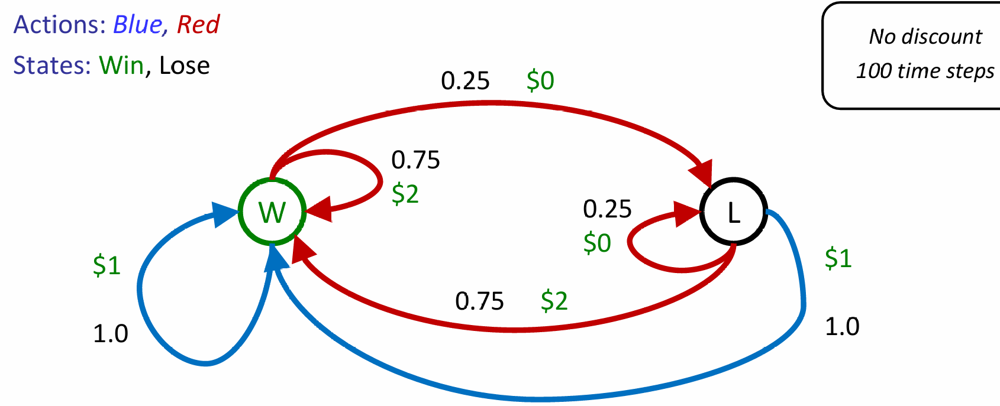
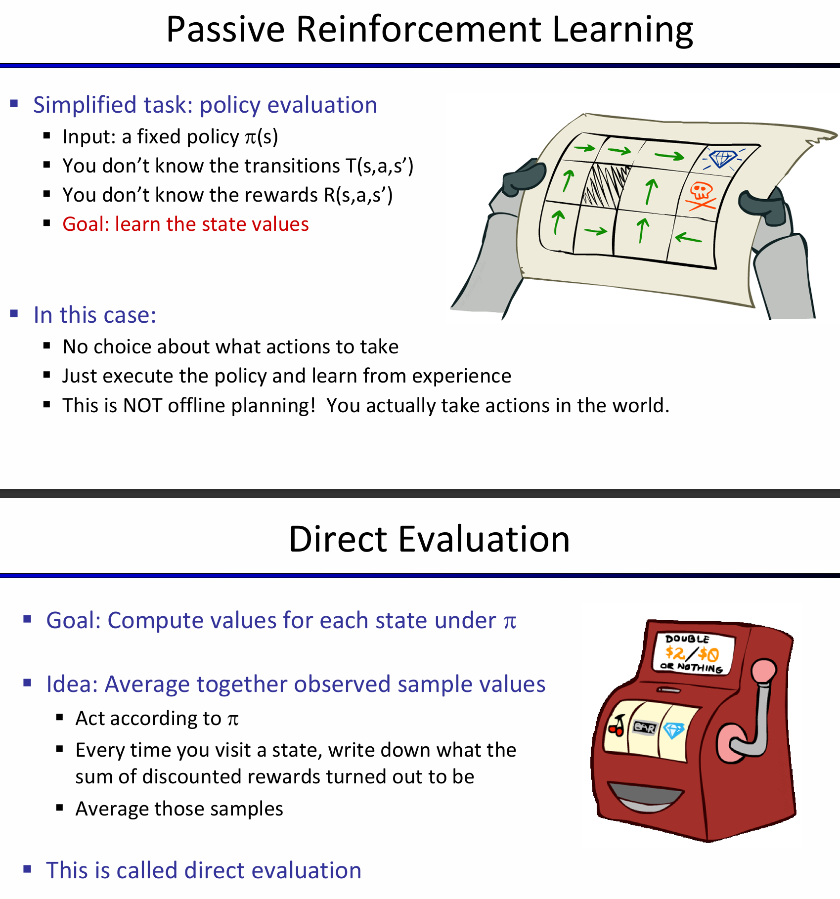

# Reinforcement Learning

## Intro-Double Bandits

考虑下面的这样一个场景：

再这样的一个场景中，由于我们知道过程中的所有reward, action，因此其实我们都不需要玩这个游戏，都能对MDP进行推演。甚至能直接推出：全部选择蓝色的期望是100，而全部选择红色的期望是150

假如说规则改变了：红色策略的各自可能情况的reward不变，但是win chance发生了改变——我不知道win rate是什么。那么此时发生了什么？This wasn't planning, it was learning！（More specifically, reinforcement learning）

很明显这依然是一个马尔科夫过程，但是我们无法计算，很多的细节、概率需要自己进行行动（act）才能知道！因此感性理解这就是一个exploration and exploitation trade-off——我需要一定的多样行动，来探究概率；而最终，我们必须使用之前学到的东西。具体许多idea如下：

用之前的例子再一次举个例子：在赛车加速或降速的例子中，我们知道了cool warm overheat之间的状态转换的概率和reward，但是强化学习问题背景下，就是这两者都是不知道的。但是，依然这是一个MDP，我们依然寻找的是一个policy：

## Learning

在这样的一个问题下：如何学习呢？基本的想法是：

- 采取行动然后观察结果（包括：新到达的状态，以及收获的reward）
- 学习是基于观察的结果样本的
- 必须学习如何采取行动以最大化期望奖励

很显然与上一节的MDP解法不同的是，在一个状态下，采取不同行动所收获的不同可能的结果都是提前知道的，但是现在，我们不知道，我们必须采取可能行动中的一个行动，然后观察发生了什么。这一种学习思想称为：Model-Based Idea。即：

- 根据现有经验来学习近似的模型
- 最后运用近似模型的过程中，就当做近似模型就是真实模型，然后进行MDP的策略求解

> Two Steps: Learn empirical MDP model, and then solve the learned MDP(like value iteration)

下面是一个非常生动形象的observed episode推出learned model的例子：

Passive Reinforcement Learning：

那么discounted rewards是如何计算的呢？就是从这个状态开始，按照流程执行，之间所有的reward和。对于output value for this state，就是所有episode下该state的reward和的总和，除以episode的数量。

上图例子中的C：Episode1 2 3的discounted value都是-1+10=9，4是-11，所以平均下来是（9*3-11）/4 = 4。Direct Evaluation的确能够很好的衡量一个节点代表的reward期望，而且非常容易理解。不需要T R的任何只是，最终就是计算correct average values using sample transitions。

但是也是有弊端的：首先，浪费了状态之间关联的信息；其次，每一个状态都必须要单独学习出来；最后，学习时间很长。其中最重要的，是T R的信息没有显式的学出来。

那么这些弊端决定了Policy Evaluation方法并不适合用来辅助解决MDP问题：因为MDP非常需要T R的信息，但是这个方法并没有提供这些信息。所以关键问题来到了：如何在不知道TR信息的前提下实现bellman equation中的update？换而言之：

***How do we take a weighted average without knowing the weights?***