# Search

## Reflex and Planning Agent

一个agent也分为多种的类型：reflex and planning。Reflex Agent总是会根据当前的认知以及过往的记忆或知识，直接对目标采取行动，但是并不会考虑后果。如下图所示：机器人收到摘苹果的命令，那么Reflex Agent就会立马冲上去，且并不会注意到下面的坑。

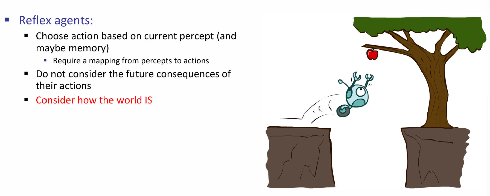

那么一个planning agent，顾名思义，就是会向未来进一步地进行规划。它所采取的决定会基于机器人所假设的它采取的行动的后果。这当然是很好的，因为Agent开始考虑了行动所带来的后果，也就是未来这一层因素。如下图的机器人将会对每一种可能的行动进行评估，而评估的重要一项就是未来的结果，那么它就会意识到直接扑上去就会GG，因此使用了长夹子。

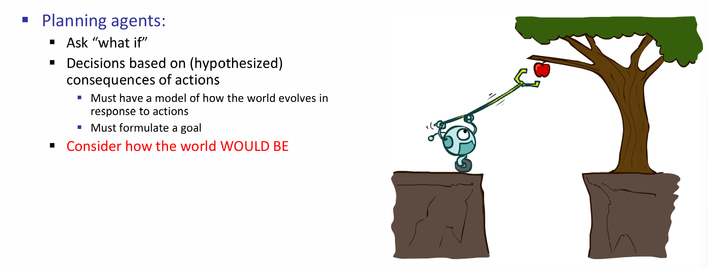

## State Space Problem

Planning Agent体现的是对未来规划的核心思想，因此一种直觉上的想法就是：将未来所有的可能性都进行列举。用更规范的语言描述：我们有一个开始的状态（start state），不同的行为会进入不同的状态空间（state space），而采取每一种行动（actions）就会有对应的成本（costs），一直采取行动直到当下的状态符合目标，而判断一个状态是够属于目标状态称为目标测试（goal test）。

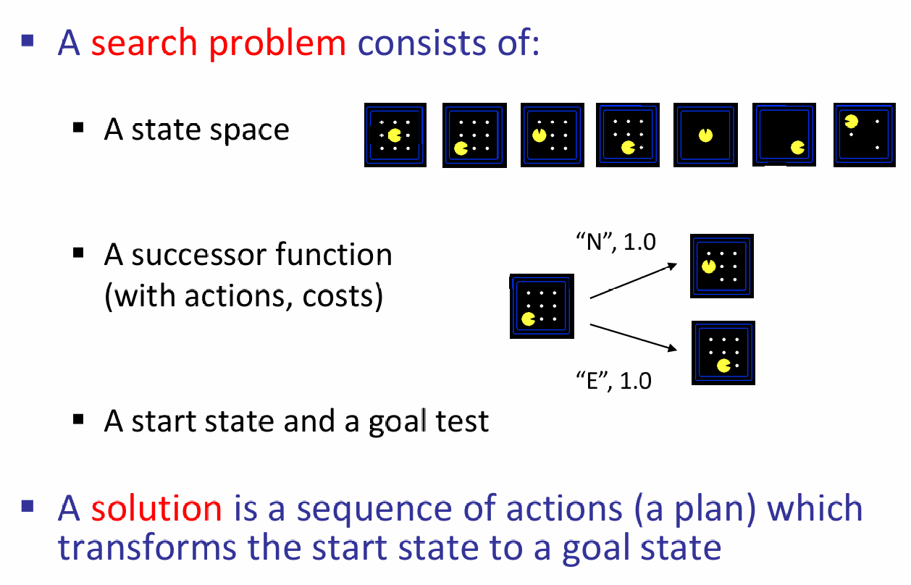

下面是几个Search的例子，其中对应的核心概念都已标注出来：

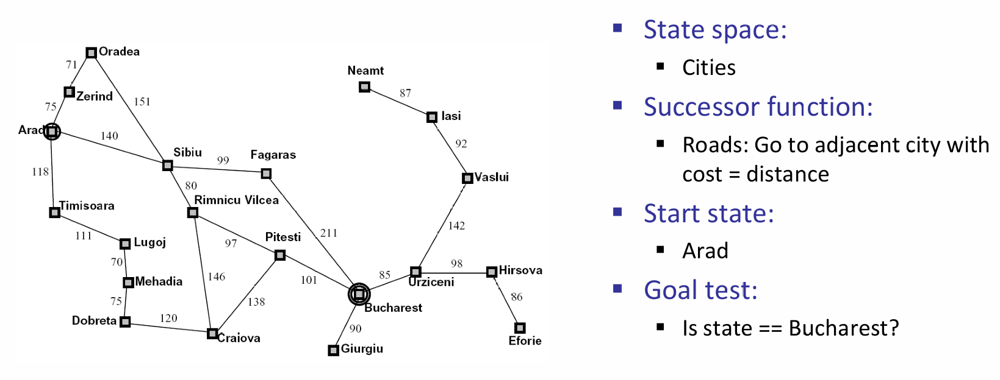

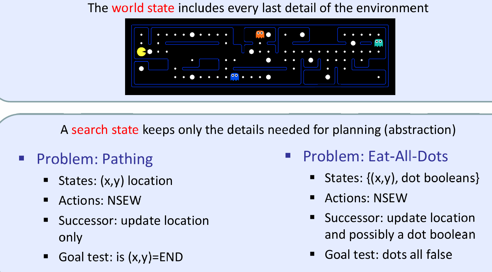

那么对于每一种可能的state space，我们首先应该理清：state space里面有什么：

 ***The world state includes every last detail of the environment***

如下面图片讨论了一个吃豆人游戏中的state space，其中环境中的details有鬼的位置、agent的位置、食物的数量以及食物实际存在、agent的面部朝向。那么我们也能求出state space的总数：

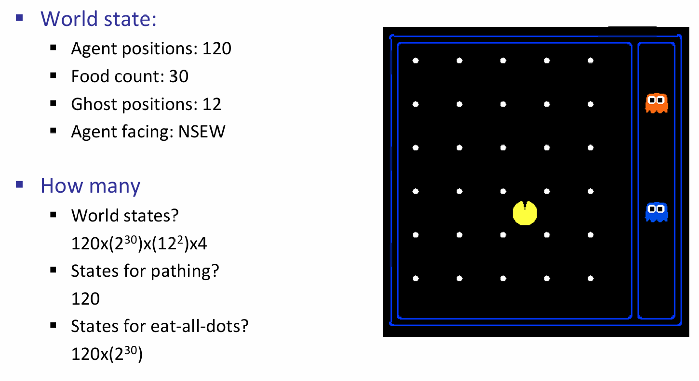

那么如果紧盯着start state以及每一次action对应的successor function and corresponding state，我们就能够得到***state space graph***。如下图的例子：从游戏的开始，然后可以向上或向右走，那么列出对应的state space，然后这样一直画下去。但是这样图一般会特别的大。同时注意在state space graph中，每一个状态只会出现一次！

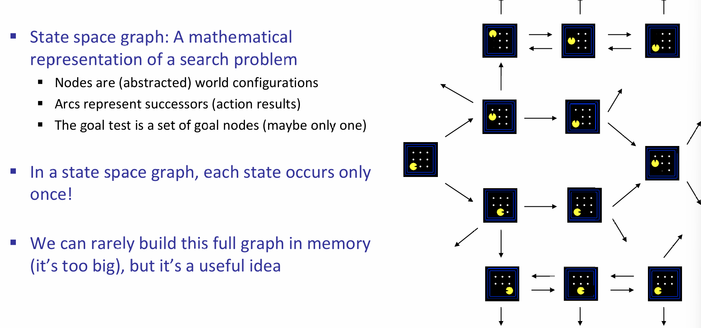

以start state作为根节点，并且只关心state-successor state（i.e.，一个状态能够出现多次），我们就能得到一颗search tree:

- A “what if” tree of plans and their outcomes 

- The start state is the root node
- Children correspond to successors 
- For most problems, we can never actually build the whole tree

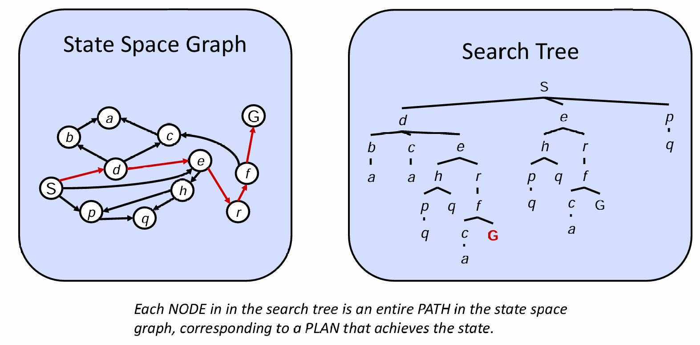

上图展示了state space graph and search tree的区别：前者将所有的states陈列出来，用箭头表示状态之间的转换，因此状态只会出现一次，而且可能有环；后者只关心当前走到的state and its corresponding successor states，因此结果是树，并且状态可能出现不止一次，但是可想而知，非常有可能树的大小是无穷的，因为可能会出现状态的循环。

## Tree Search

树的搜索其实就是从树的根节点开始向外扩展探索每一种可能的计划，并且通过边长的权重设置来表示可能行动的cost，也就是：

> Search Tree maintains a ***fringe***(边缘的) of partial plans under consideration

如果所有边长的成本都相同，那么任务等效于尝试扩展尽可能少的节点；而如果成本不同，那么这将会体现在边长权重的设置上。

在Tree Search中有一些重要的概念：fringe (frontier), expansion and exploration strategy。那么如何衡量一个Exploration Strategy，i.e.，Search Algorithm的好坏？因此我们需要考虑一些因素：首先是完备性，即能不能成功找到一个solution（先不提这个solution是最好的）；其次是最优性，是否能够找到代价最小的路径solution；同时，时间和空间复杂度也是需要考虑的因素。如下图所示：

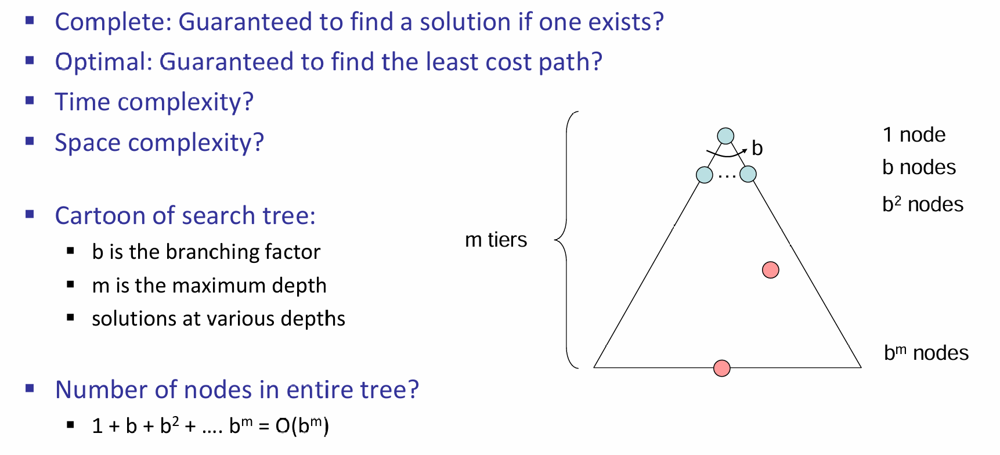

> 上图的例子中，假设平均而言，每一个节点的frontier数量为b，那么整个树的节点的数量就是$O(b^m)$

在CS101中，学过DFS、BFS、A*。那么它们的表现怎么样呢？ 以及有没有更好的算法呢？

### DFS

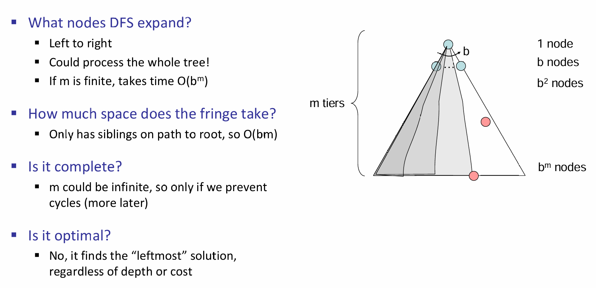

> 可见，DFS表现并不佳

### BFS

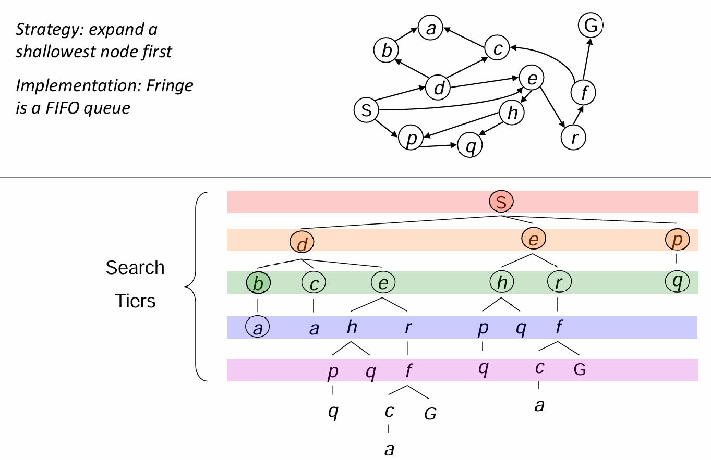

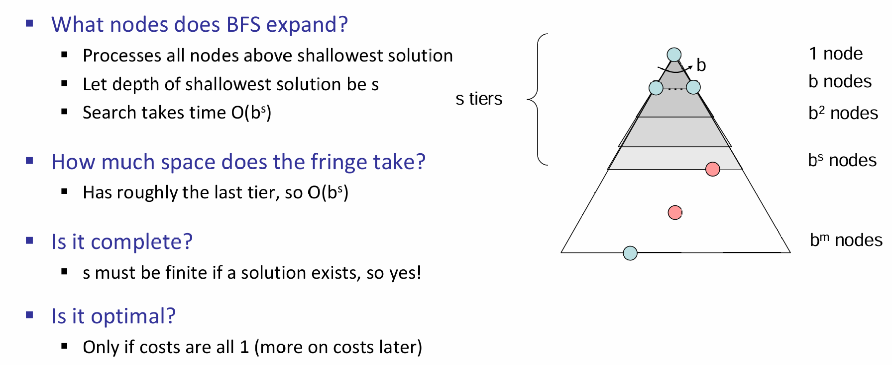

### Iterative Deepening

通过DFS BFS，发现前者很容易沉迷深度无法自拔，因此能不能把BFS的shallow-solution advantage对它赋能呢？当然可以，那就是先限制DFS的搜索深度，如果这个深度找不到目标节点，那么就可以进一步打算了，如加大深度，或转为BFS，诸如此类。通常这个算法表现并不差！

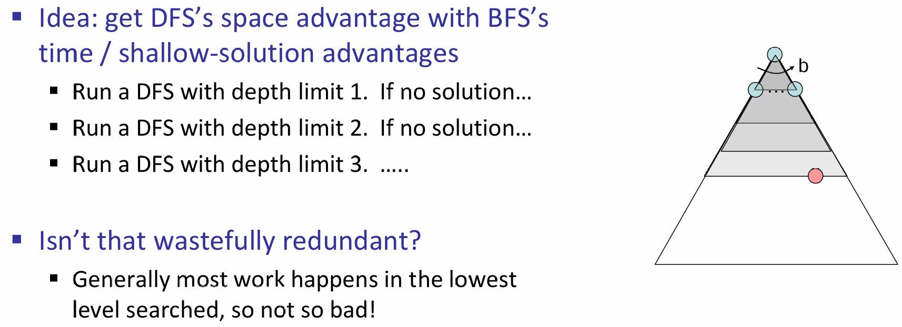

### Uniform Cost Search

上述的三种算法的重要假设就是所有的状态转移cost是相同的，因为只有这样，optimal solution才会等价于最短路径。但是如果代价是不同的呢？因此这里介绍一种对代价敏感(cost-sensitive)的搜索算法：UCS

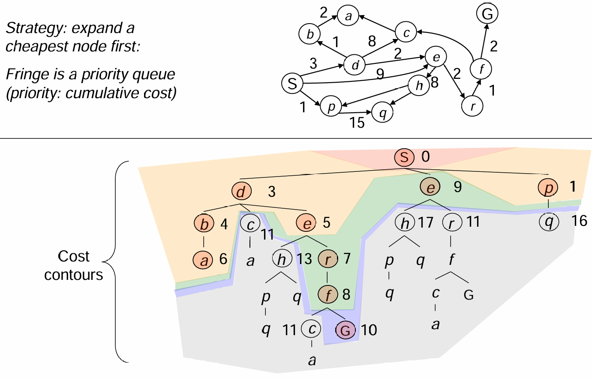

在上述的算法中，search fringe会逐步扩张，而每一步的扩张的依据就是：纳入path cumulative cost最低的path！具体算法基于优先队列而实现：

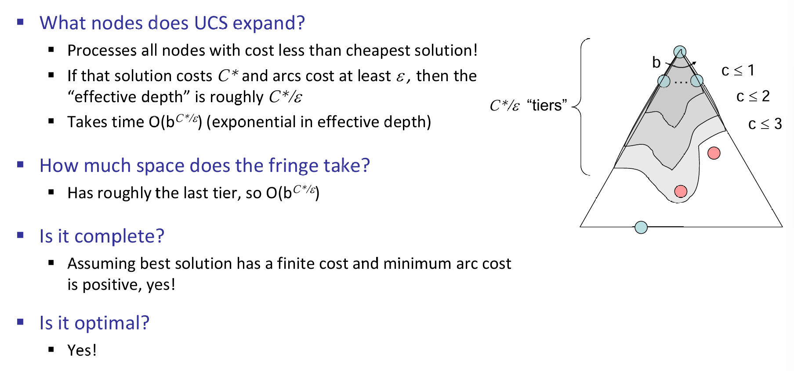UCS算法流程：

> Reference: kimi.moonshot.cn

1. **初始化**：
   - 将起点加入优先队列，其路径代价为0。
   - 初始化一个已探索集合，用于记录已扩展的节点。
2. **节点扩展**：
   - 从优先队列中取出路径代价最小的节点，作为当前节点。
   - 如果当前节点是目标节点，则算法结束，返回路径。
3. **邻居节点处理**：
   - 遍历当前节点的所有邻居节点。
   - 对于每个邻居节点，计算从起点到该邻居节点的路径代价（当前节点的代价 + 当前节点到邻居节点的代价）。
   - 如果邻居节点未被探索过，或者新的路径代价小于之前记录的代价，则将邻居节点加入优先队列，并更新其路径代价。
4. **重复步骤**：
   - 重复步骤2和3，直到优先队列为空或找到目标节点。

好消息是：UCS算法是complete and optimal的。但是坏消息是：每一次算法的探索选项几乎是所有方向，而没有关注起始或当前状态距离终点状态的距离。也就是：No information about goal location。

### Informed Search - A*

上述介绍的算法其实本质上都是一样的，唯一不同的是fringe strategy。从概念上来说，搜索的frontier其实就是优先队列，只不过是优先级的定义是不同的。但是假如说，我们现在面临的场景是一个有着information的搜索呢？比如说走迷宫，那么假如说知道了出口和自己的坐标呢？这样的信息如何利用？

那么这就是启发式算法(heuristic algorithm)。一个heuristic是一个***估计***current state到goal state距离的函数。A*算法应运而生，而它也在CS101中学习过。如城市traversal中的Euclidean distance，吃豆人与走迷宫中的manhattan distance，它们都是启发式距离。

举一个例子：Pancake Problem。铲子会使得铲子上方的煎饼倒置，那么如何用最少的次数来将煎饼从小到大排序？那么启发式距离如何定义呢？一种很好的heuristic的设置是：the number of the largest pancake that is still out of place

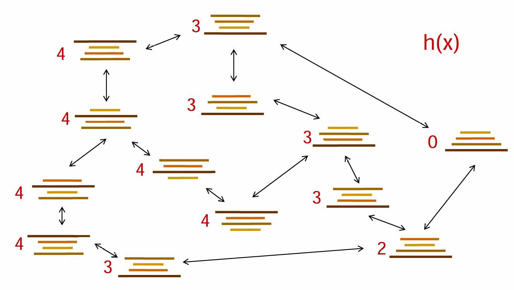

有了启发式距离，那么应该如何推进fringe？如果按照贪心的算法来说，那就是每一次都选看起来启发式距离最近的节点，但是贪心算法往往不能很好的完成任务。理想情况和最坏情况都如下图所示：

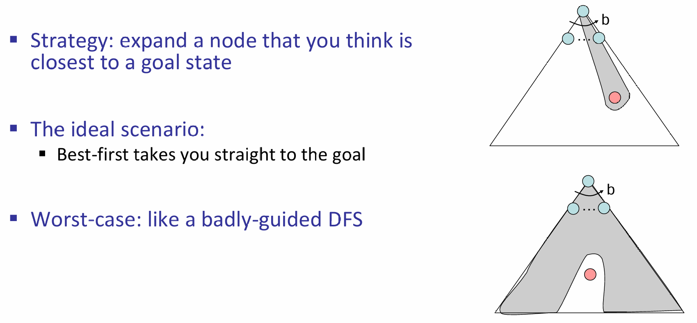

因此A*算法就是为了解决这个问题。在贪心中，只关心启发式距离了，但是浑然忘了每走一步会有代价。因此我们可以把path cost以及forward cost (heuristic)结合起来：如下图所示：

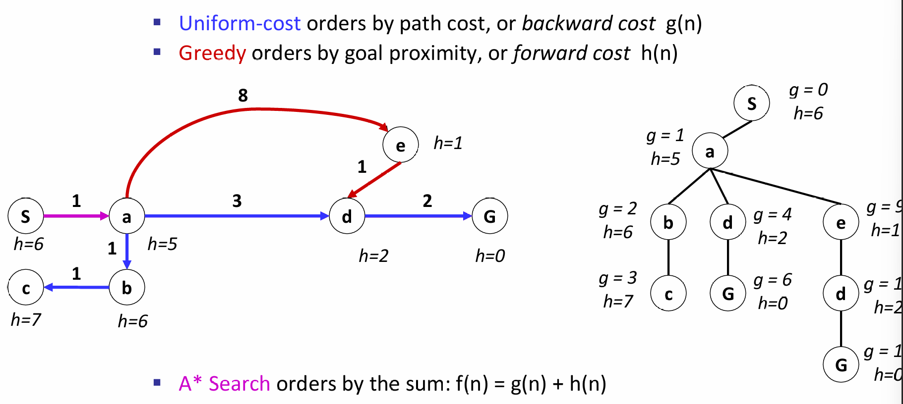

在A*算法中，一个节点真正的访问，是它出队列的时候。因此这里也需要注意：the algorithm stops only when we dequeue a goal！（即：其他路径也能到达goal，但是只有最好的solution才会使得goal state node dequeue）

同时A star算法虽然很好，但是需要着重强调启发式算法的合理性，即admissibility and consistency （CS101）。

> CS181的A star中最广泛使用的是admissible heuristics

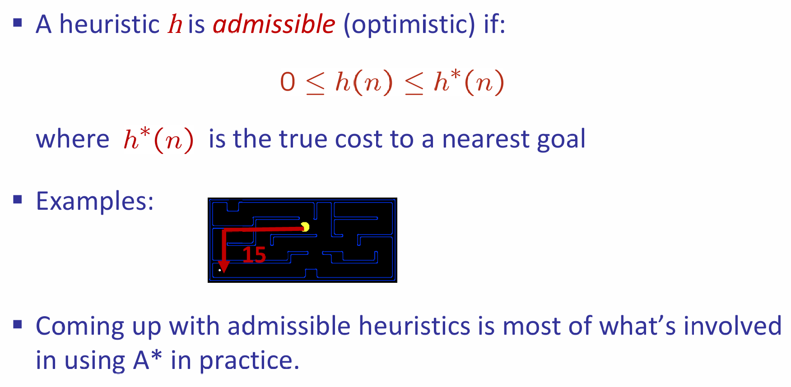

A星总是能找到最好的结果！假设A是最好的goal node，B是suboptimal goal node，证明如下：对于探索边界上的B以及A的祖先（包括A自己），那么后者总是会先被纳入fringe！

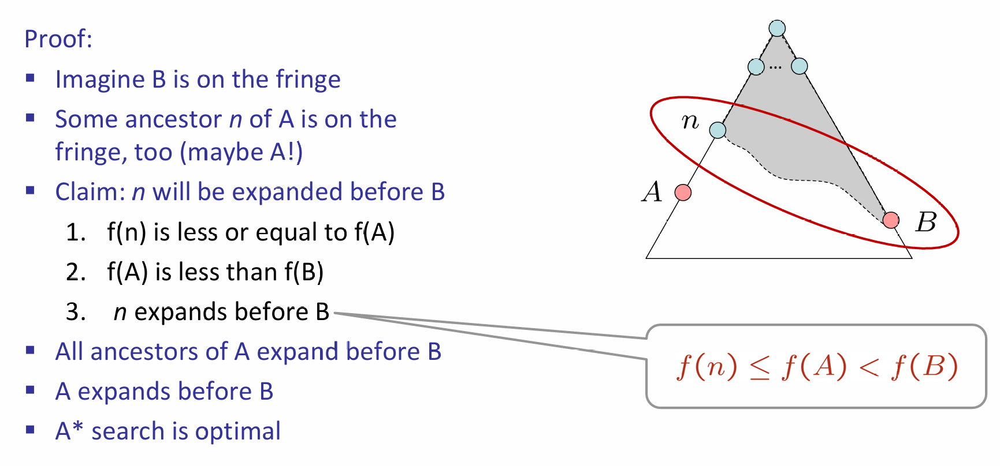

其中，1是因为：$f(n) = g(n)+h(n) \leq g(A) = f(A)$，其中小于等于号是因为heuristic的admissibility，最后一个等号是因为在目标节点heuristic为0；2是因为根据定义，$f(A)=g(A)<g(B)$，而$g(B)=f(B)$（B is on the fringe）。

A星算法大体上还是向着目标靠近，但是也会保护它'赌'最优性的尝试。

> A* expands mainly toward the goal,  but does hedge its bets to ensure optimality

A*算法非常的奈斯，但是关键核心是启发式距离的设计。我们应该设计的启发式距离是乐观的（admissible），但同时也应该尽可能靠近真实的距离。

>  Inadmissible heuristics are often useful too

## Graph Search

状态图空间每一个节点只出现一次，这是一个大大的好处！如何利用这个好处？那就是图搜索。但是之前提及过：状态图中可能会出现循环，那岂不是不能搜索了？实际上，如果加上一些约束和技巧，这个问题是能够迎刃而解的。

核心是：never expand a state twice!那么如何实现这一点呢？

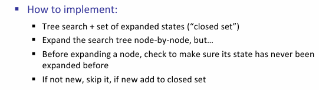

图搜索A星并不是任何情况下都能找到最优的解！如果optimal，那么heuristic距离应该是consistent的！

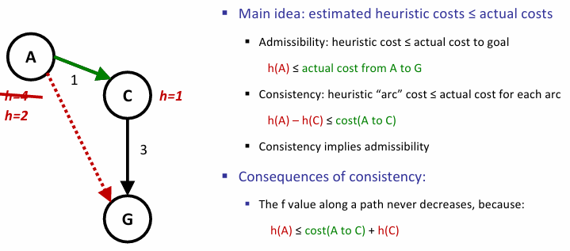

## Optimality

Tree search：A星算法是最优的，如果启发式距离admissible；UCS是启发式距离为0的特殊A星算法，并不一定是最优的

Graph Search：A星算法是最优的，如果启发式距离consistent；UCS是启发式距离为0的特殊A星算法，是最优的，因为h=0天生为consistent