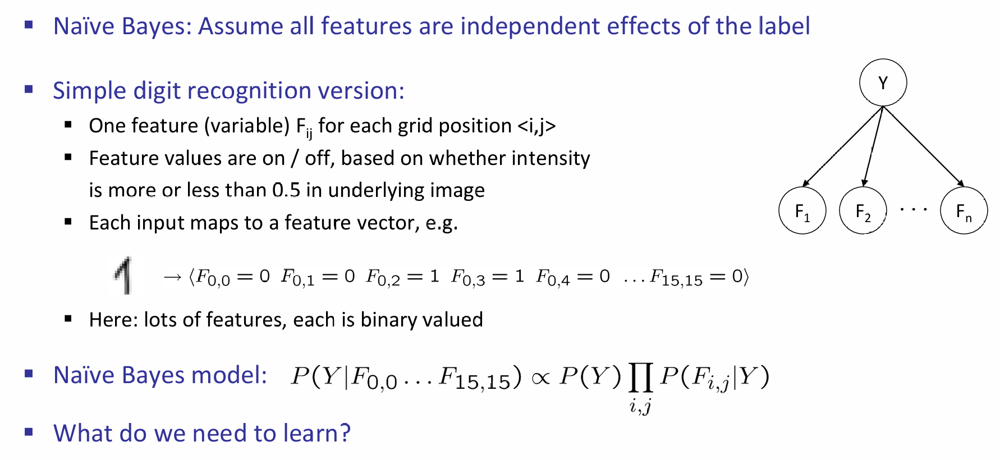
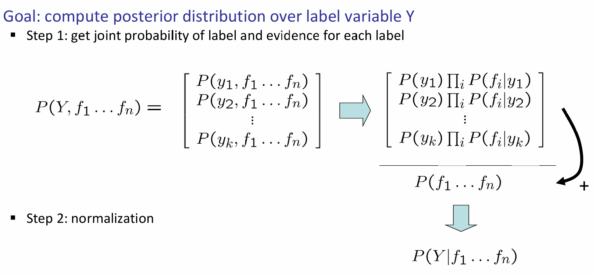
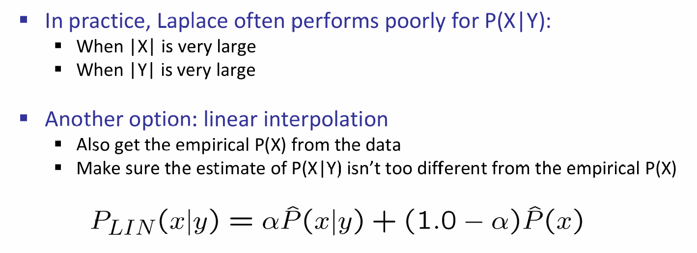

# Supervised Learning

监督学习已经是十分的熟悉了：要学习一个目标函数，输入的是训练集，最终要求的是输出一个近似拟合的函数，要求尽可能的接近目标函数。监督学习由下游任务的不同而进一步的分类：分类，回归（输出的是实数），以及结构化输出（structured output）

此处仅介绍naive bayes approach，关于分类任务的perceptron approach，regression及其loss function and regularization在182中有所讲解。

> Unsupervised Learning也将略过，因为是182中的K-Means and Gaussian Mixture Model with EM steps

## Classification

分类任务是非常常见的，比如说span email classifier，比如手写数字识别，比如物体识别分类。那么如何建模一个分类器呢？

***Naive Bayes Classifier***

一种model-based approach是设计一个模型（比如说贝叶斯网络），数据的label and feature都视作随机变量，然后对每一个观察到的feature进行实例化，最后根据features来query label's distribution。这是经典的建模思想。但是问题在于：如果是这样，贝叶斯网络的结果如何？我们如何学习参数？这几乎是下至传统人工智能上至高级机器学习的终极问题。

一种非常简单的例子如下：

将图片中的每一个像素都看成是一个feature，进一步地，看成一个随机变量，那么在这些像素组成的那么多随机变量的condition下，我们想知道label random variable Y的条件分布是怎样的。根据贝叶斯，我们知道这个分布是正比于Y的分布和在对应Y下Feature这些随机变量的条件联合分布的乘积的。那么问题就来了：我们应该学什么？我们需要明确：label and feature之间的关系是什么，并且进一步表示这个关系。如果feature之间条件独立（至少在我们认为的inductive bias下是），那么表现形式可以是条件概率分布。

如果有了这些关系的条件概率，那么inference就十分明确了，流程如下：

如果考虑诈骗邮件分辨的情景，那么核心参数就是label下每一个单词出现的概率了。这样是不是有点奇怪，那岂不是丢失了单词的order信息吗？没错，所以这种方式叫做'bag of words' approach。那么这个条件概率分布应该怎么学到呢？当然是得从数据集里面学了。一种很简单的方法是：在对应label下，该feature是否出现，在数据集上对这个进行统计，那么就能得到一个近似的条件概率。比如说这个情境中，1000个诈骗邮件中有50封出现了money单词，因此我们认为：在是诈骗邮件的背景下，出现money单词的概率是0.05.或者更专业地，可以考虑最大化似然来算出条件概率，而不是简单的看出现频率。

## Laplace Smoothing

Laplace Smoothing（拉普拉斯平滑）是一种用于处理概率估计中的零概率问题的技术，特别是在朴素贝叶斯分类器中。当某个特征值在训练数据中没有出现时，直接使用经验频率会导致某些概率估计为零，这可能会影响模型的性能。Laplace Smoothing通过添加一个很小的常数（通常为1）来避免这种情况，从而确保所有概率都是正的。

原理

Laplace Smoothing的基本思想是为每个可能的特征值添加一个计数，即使它在训练数据中没有出现。这样做可以确保即使某个特征值在训练集中没有出现，其条件概率也不会是零。

公式

对于特征 *f* 和类别 *y*，Laplace Smoothing后的条件概率估计为：

$P(f∣y)=count(y)+Vcount(f,y)+1$

其中：

- count(f,y)是特征 *f* 在类别 *y* 中出现的次数。
- count(y)是类别 *y* 在训练数据中出现的次数。
- *V* 是特征 *f* 可能取值的总数。

应用

在朴素贝叶斯分类器中，Laplace Smoothing通常用于计算每个特征在给定类别下的条件概率。例如，如果我们有一个文本分类问题，其中特征是单词，类别是文档的主题，我们可以使用Laplace Smoothing来估计在给定主题下某个单词出现的概率。

优点

- **避免零概率**：通过添加一个小的常数，Laplace Smoothing确保了所有概率都是正的，从而避免了零概率问题。
- **简单易用**：实现简单，计算效率高。

缺点

- **平滑参数选择**：虽然通常使用1作为平滑参数，但这个选择可能不是最优的，不同的问题可能需要不同的平滑参数。
- **过度平滑**：在某些情况下，添加的计数可能过多，导致模型对训练数据过度敏感，从而影响泛化能力。

总的来说，Laplace Smoothing是一种简单有效的技术，用于处理概率估计中的零概率问题，特别是在朴素贝叶斯分类器中。然而，它也有其局限性，可能需要根据具体问题进行调整。

在条件和特征的取值空间都很大的时候，这种方法表现不佳，因此有线性插值这种新的方式：

