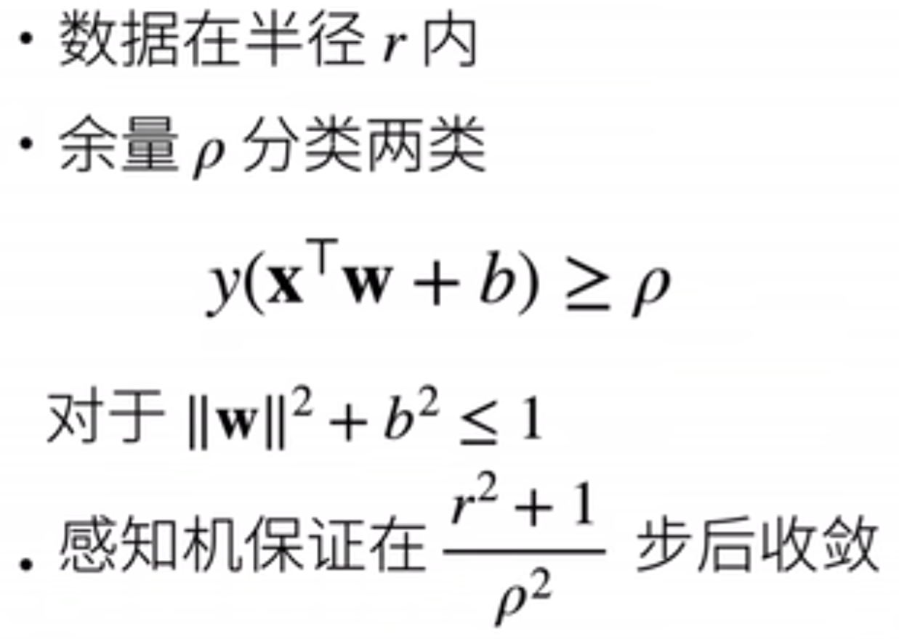
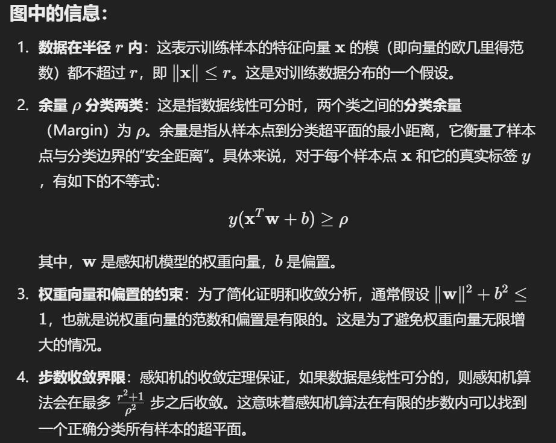
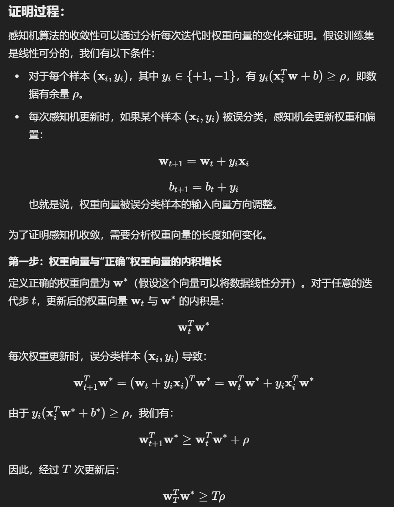
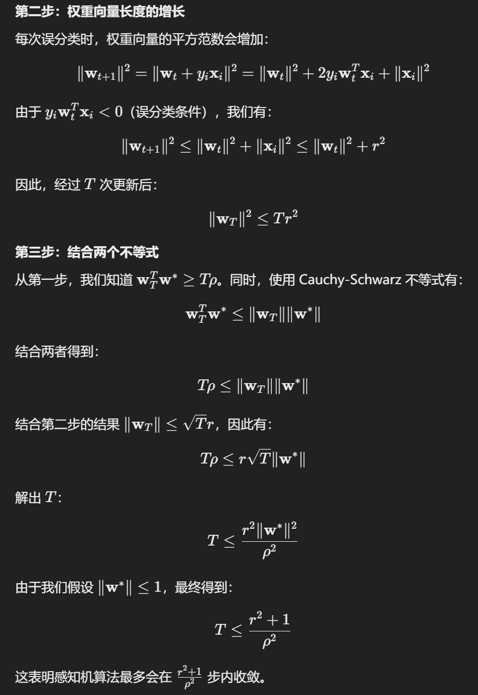
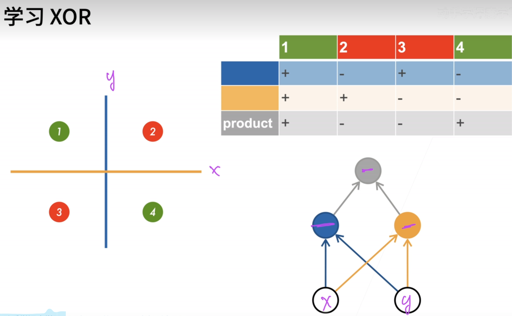
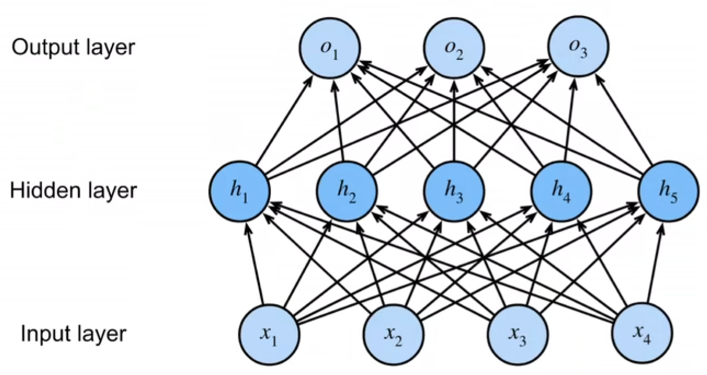

# 感知机

## 感知机（Perceptron）

在最早的感知机中，结构非常简单，给参数x，然后希望用w, b两个参数去判断：输入x对应的y究竟是1还是-1。那么可以用如下来表示：
$$
o = \sigma(wx+b)\hspace{1cm} \sigma(x)=1,\ if\ x>0\ ,\ otherwise\ -1
$$
训练这个感知机的流程也十分简单：输入x，看输出的y是否和真实的y一样，如果一样，那么就不更新参数；反之，则$w\leftarrow w+y_ix_i\ and\ b\leftarrow b+y_i$。关于更新参数这一点，这里相当于使用批量大小为1的梯度下降。

由于这个感知机结构简单，因此它有很好的收敛定理，如下：



关于该定理的详细说明和证明，ChatGPT解释如下：







但是感知机不是万能的，比如说感知机不能拟合XOR（异或）函数，**它只能产生线性分割平面**。当时的人们发现感知机有些函数无法拟合，感到非常的悲伤，人工智能的第一次寒冬来临。但是十余年之后，人们就成功发现了解决这个问题的方法，那就是：深层感知机。

总而言之：感知机是一个二分类模型，是最早的AI模型。它的求解算法等价于使用批量大小为1的梯度下降。它不能拟合XOR函数，仍有很大的困难需要克服。

## 多层感知机

模型如何学习XOR函数？既然之前的一个感知机不能通过拟合一个函数来划分，那么能不能用多个函数呢？如下图所示。用两个感知机拟合出两个函数，然后再用一个函数去利用这两个函数的结果。那么最后，就可以用三个函数来划分这个数据空间了。



这种思路可以用下面这个图来演示：原来单层感知机就是input -> output，但是现在的解决方案明显有一个中间过程，那么这个中间过程就称为隐藏层；上图的解决方法，就相当于是下图中的input layer有两个单元（x, y值），中间过程有两个单元（一个蓝色划分线，一个黄色划分线），output layer是一个单元（(x,y)点是红色还是绿色）。



我们通过矩阵$\mathbf{X} \in \mathbb{R}^{n \times d}$来表示$n$个样本的小批量，其中每个样本具有$d$个输入特征。对于具有$h$个隐藏单元的单隐藏层多层感知机，用$\mathbf{H} \in \mathbb{R}^{n \times h}$表示隐藏层的输出，称为**隐藏表示**（hidden representations）。在数学或代码中，$\mathbf{H}$也被称为**隐藏层变量**（hidden-layer variable）或**隐藏变量**（hidden variable）。因为隐藏层和输出层都是全连接的，所以我们有隐藏层权重$\mathbf{W}^{(1)} \in \mathbb{R}^{d \times h}$和隐藏层偏置$\mathbf{b}^{(1)} \in \mathbb{R}^{1 \times h}$以及输出层权重$\mathbf{W}^{(2)} \in \mathbb{R}^{h \times q}$和输出层偏置$\mathbf{b}^{(2)} \in \mathbb{R}^{1 \times q}$。

形式上，我们按如下方式计算单隐藏层多层感知机的输出$\mathbf{O} \in \mathbb{R}^{n \times q}$：
$$
\begin{aligned}
    \mathbf{H} & = \mathbf{X} \mathbf{W}^{(1)} + \mathbf{b}^{(1)}, \\
    \mathbf{O} & = \mathbf{H}\mathbf{W}^{(2)} + \mathbf{b}^{(2)}.
\end{aligned}
$$
注意在添加隐藏层之后，模型现在需要跟踪和更新额外的参数。可我们能从中得到什么好处呢？在上面定义的模型里，我们没有好处！原因很简单：上面的隐藏单元由输入的仿射函数给出，而输出（softmax操作前）只是隐藏单元的仿射函数。仿射函数的仿射函数本身就是仿射函数，但是我们之前的线性模型已经能够表示任何仿射函数。

我们可以证明这一等价性，即对于任意权重值，我们只需合并隐藏层，便可产生具有参数$\mathbf{W} = \mathbf{W}^{(1)}\mathbf{W}^{(2)}$和$\mathbf{b} = \mathbf{b}^{(1)} \mathbf{W}^{(2)} + \mathbf{b}^{(2)}$的等价单层模型：
$$
\mathbf{O} = (\mathbf{X} \mathbf{W}^{(1)} + \mathbf{b}^{(1)})\mathbf{W}^{(2)} + \mathbf{b}^{(2)} = \mathbf{X} \mathbf{W}^{(1)}\mathbf{W}^{(2)} + \mathbf{b}^{(1)} \mathbf{W}^{(2)} + \mathbf{b}^{(2)} = \mathbf{X} \mathbf{W} + \mathbf{b}.
$$
为了发挥多层架构的潜力，我们还需要一个额外的关键要素：在仿射变换之后对每个隐藏单元应用非线性的**激活函数**（activation function）$\sigma$。

## 激活函数

### sigmoid

**对于一个定义域在$\mathbb{R}$中的输入，**sigmoid函数**将输入变换为区间(0, 1)上的输出**。因此，sigmoid通常称为**挤压函数**（squashing function）：它将范围（-inf, inf）中的任意输入压缩到区间（0, 1）中的某个值：
$$
\operatorname{sigmoid}(x) = \frac{1}{1 + \exp(-x)}.
$$
sigmoid函数是一个自然的选择，因为它是一个平滑的、可微的阈值单元近似。当我们想要将输出视作二元分类问题的概率时，sigmoid仍然被广泛用作输出单元上的激活函数（sigmoid可以视为softmax的特例）。然而，sigmoid在隐藏层中已经较少使用，它在大部分时候被更简单、更容易训练的ReLU所取代。注意，当输入接近0时，sigmoid函数接近线性变换。

sigmoid函数的导数为下面的公式：
$$
\frac{d}{dx} \operatorname{sigmoid}(x) = \frac{\exp(-x)}{(1 + \exp(-x))^2} = \operatorname{sigmoid}(x)\left(1-\operatorname{sigmoid}(x)\right).
$$

### tanh

与sigmoid函数类似，***tanh(双曲正切)函数也能将其输入压缩转换到区间(-1, 1)上***。tanh函数的公式如下：
$$
\operatorname{tanh}(x) = \frac{1 - \exp(-2x)}{1 + \exp(-2x)}.
$$
注意，当输入在0附近时，tanh函数接近线性变换。函数的形状类似于sigmoid函数，不同的是tanh函数关于坐标系原点中心对称。tanh函数的导数是：
$$
\frac{d}{dx} \operatorname{tanh}(x) = 1 - \operatorname{tanh}^2(x).
$$

### ReLU

最受欢迎的激活函数是**修正线性单元**（Rectified linear unit，**ReLU**），因为它实现简单，同时在各种预测任务中表现良好。给定元素$x$，ReLU函数被定义为该元素与$0$的最大值：
$$
\operatorname{ReLU}(x) = \max(x, 0).
$$
通俗地说，ReLU函数通过将相应的活性值设为0，仅保留正元素并丢弃所有负元素。当输入为负时，ReLU函数的导数为0，而当输入为正时，ReLU函数的导数为1。注意，当输入值精确等于0时，ReLU函数不可导。

**使用ReLU的原因是，它求导表现得特别好**：要么让参数消失，要么让参数通过。这使得优化表现得更好，并且ReLU减轻了困扰以往神经网络的梯度消失问题。而计算例如sigmoid的导数非常的贵，因为e为底的指数运算相当于大量的乘法之类的操作，即使是GPU有专门的单元处理这个，也是非常麻烦的一件事。

## 实现多层感知机

如果想要手写多层感知机，那么其实需要关注的有以下：

1. 多少个隐藏层
2. 每层有多少个神经元？方便理解，这里多少个神经元就是将数据转化到**几维**
3. 根据上述的信息设置w b参数。注意矩阵的维度

````python
num_inputs, num_outputs, num_hiddens = 784, 10, 256

W1 = nn.Parameter(torch.randn(
    num_inputs, num_hiddens, requires_grad=True) * 0.01)
b1 = nn.Parameter(torch.zeros(num_hiddens, requires_grad=True))
W2 = nn.Parameter(torch.randn(
    num_hiddens, num_outputs, requires_grad=True) * 0.01)
b2 = nn.Parameter(torch.zeros(num_outputs, requires_grad=True))
params = [W1, b1, W2, b2]

def relu(X):
    # torch.zeros_like 用于创建一个与给定张量（Tensor）形状相同且所有元素都为0的新张量
    a = torch.zeros_like(X)
    return torch.max(X, a)

def net(X):
    X = X.reshape((-1, num_inputs))
    H = relu(X@W1 + b1)  # 这里“@”代表矩阵乘法
    return (H@W2 + b2)
loss = nn.CrossEntropyLoss(reduction='none')
num_epochs, lr = 10, 0.1
updater = torch.optim.SGD(params, lr=lr)
d2l.train_ch3(net, train_iter, test_iter, loss, num_epochs, updater)
````

同样，pytorch API提供了集成的方法可以调用。其中注意的点有：

- `nn.Flatten()` 是 PyTorch 中的一个模块，用于将多维张量展平为一维张量。例如一个形状为 `[32, 1, 5, 5]` 的输入张量，使用 `nn.Flatten()` 后，输出的形状将是 `[32, 25]`
- 定义了一个函数 `init_weights`，它接受一个模块 `m` 作为参数。这个函数用于初始化模型中的权重
- `net.apply(init_weights)`将 `init_weights` 函数应用到模型 `net` 的每个模块上。`apply` 方法会递归地遍历模型中的所有子模块，并对每个子模块调用 `init_weights` 函数。这样，模型中所有的线性层都会被初始化。
- 原先的params参数就会变成通过`net.parameters()`获取，从而放进optimizer里面

````python
import torch
from torch import nn

net = nn.Sequential(nn.Flatten(),
                    nn.Linear(784, 256),
                    nn.ReLU(),
                    nn.Linear(256, 10))

def init_weights(m):
    if type(m) == nn.Linear:
        nn.init.normal_(m.weight, std=0.01)

net.apply(init_weights)
loss = nn.CrossEntropyLoss(reduction='none')
trainer = torch.optim.SGD(net.parameters(), lr=lr)
````

