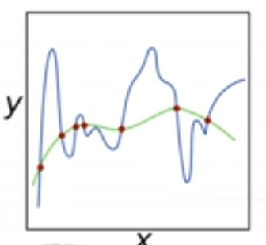
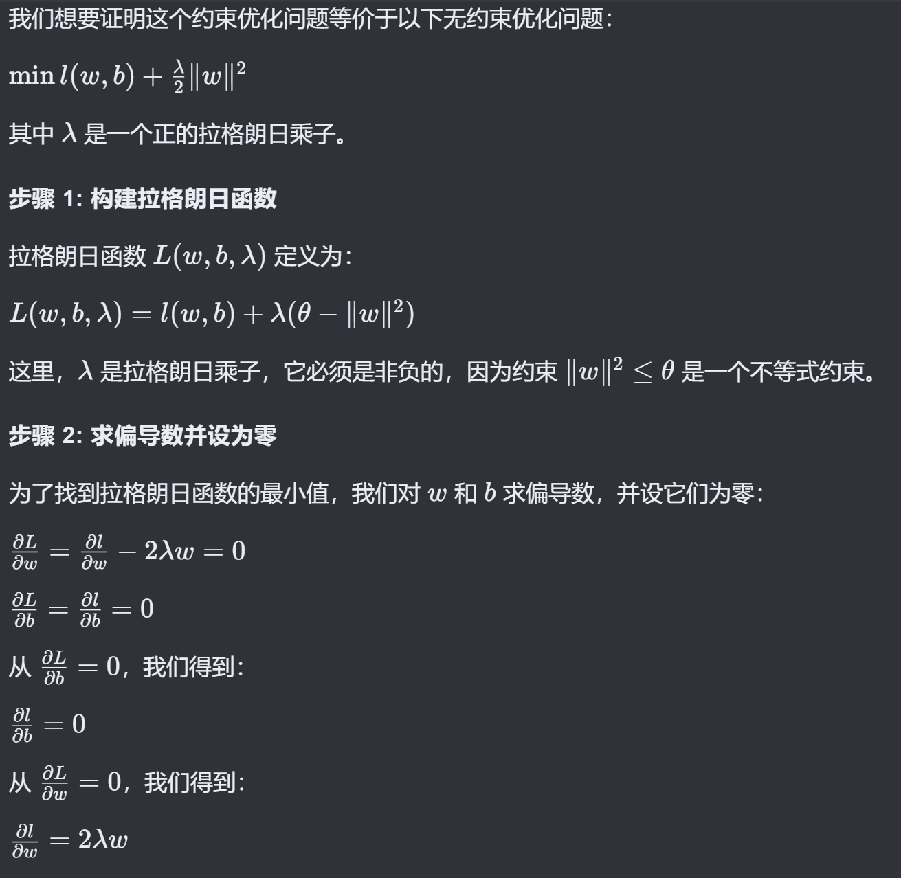
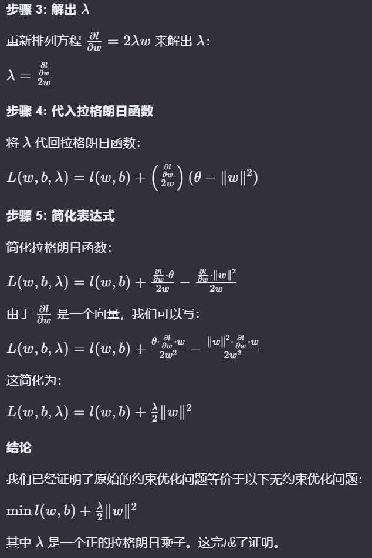
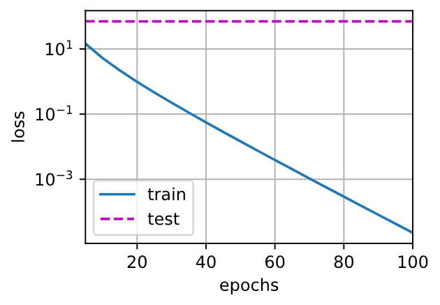
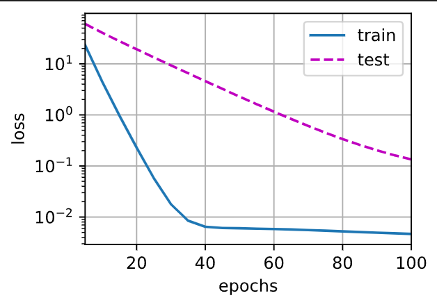

# 权重衰退

# 什么是权重衰退

我们知道了过拟合的问题，那么现在将介绍一些**正则化**（regularization）模型的技术。限制特征的数量是缓解过拟合的一种常用技术，则一点在直觉上可以认同，因为每一个点的特征都过度提取了，导致函数的拟合都被这些被过度提取的特征主导了。如下面的小图，由于weight矩阵过大，导致函数过度拟合，那么如果设想让函数的变化趋于保守，也就是w范数下降，那么是不是能够缓解下图的过拟合现象呢？



但是仅仅通过简单的限制特征数量可能仍然使模型在过简单和过复杂中徘徊，我们需要一个更细粒度的工具来调整函数的复杂性，使其达到一个合适的平衡位置。

在训练参数化机器学习模型时，**权重衰减**（weight decay）是最广泛使用的正则化的技术之一，它通常也被称为$L_2$**正则化**。这项技术通过函数与“零”的距离来衡量函数的复杂度，因为在所有函数$f$中，函数$f = 0$（所有输入都得到值$0$）在某种意义上是最简单的。但是我们应该如何精确地测量一个函数和零之间的距离呢？没有一个正确的答案。

一种简单的方法是通过线性函数$f(\mathbf{x}) = \mathbf{w}^\top \mathbf{x}$中的权重向量的某个范数来度量其复杂性，例如$\| \mathbf{w} \|^2$。要保证权重向量比较小，最常用方法是将其范数作为惩罚项加到最小化损失的问题中。将原来的训练目标**最小化训练标签上的预测损失**，调整为**最小化预测损失和惩罚项之和**。现在，如果我们的权重向量增长的太大，我们的学习算法可能会更集中于最小化权重范数$\| \mathbf{w} \|^2$。

通过限制参数值的选择范围来控制模型容量：
$$
min\ l(\mathbf{w},b)\ subject\ to\ ||w||^2≤\theta
$$
则对于每个$\theta$，都可以找到$\lambda$使得之前的目标函数等价于下面：
$$
min\ l(\mathbf{w},b)+\frac{\lambda}{2}||w||^2
$$
这一点可以通过拉格朗日乘子证明。证明如下：

> reference: kimi.moonshot.cn  该证明过程已被证明正确无误





回归之前的线性回归例子中，损失函数定义如下：
$$
L(\mathbf{w}, b) = \frac{1}{n}\sum_{i=1}^n \frac{1}{2}\left(\mathbf{w}^\top \mathbf{x}^{(i)} + b - y^{(i)}\right)^2.
$$
$\mathbf{x}^{(i)}$是样本$i$的特征，$y^{(i)}$是样本$i$的标签，$(\mathbf{w}, b)$是权重和偏置参数。为了惩罚权重向量的大小，我们必须以某种方式在损失函数中添加$\| \mathbf{w} \|^2$，但是模型应该如何平衡这个新的额外惩罚的损失？实际上，我们通过**正则化常数**$\lambda$来描述这种权衡，这是一个非负超参数，我们使用验证数据拟合：
$$
L(\mathbf{w}, b) + \frac{\lambda}{2} \|\mathbf{w}\|^2
$$
对于$\lambda = 0$，我们恢复了原来的损失函数。对于$\lambda > 0$，我们限制$\| \mathbf{w} \|$的大小。这里我们仍然除以$2$：当我们取一个二次函数的导数时，$2$和$1/2$会抵消，以确保更新表达式看起来既漂亮又简单。

为什么在这里我们使用平方范数而不是标准范数（即欧几里得距离）？我们这样做是为了便于计算。通过平方$L_2$范数，我们去掉平方根，留下权重向量每个分量的平方和。这使得惩罚的导数很容易计算：导数的和等于和的导数。

此外，为什么我们首先使用$L_2$范数，而不是$L_1$范数。事实上，这个选择在整个统计领域中都是有效的和受欢迎的。$L_2$正则化线性模型构成经典的**岭回归**（ridge regression）算法，$L_1$正则化线性回归是统计学中类似的基本模型，通常被称为**套索回归**（lasso regression）。使用$L_2$范数的一个原因是它对权重向量的大分量施加了巨大的惩罚。这使得我们的学习算法偏向于在大量特征上均匀分布权重的模型。在实践中，这可能使它们对单个变量中的观测误差更为稳定。相比之下，$L_1$惩罚会导致模型将权重集中在一小部分特征上，而将其他权重清除为零。这称为**特征选择**（feature selection），这可能是其他场景下需要的。

$L_2$正则化回归的小批量随机梯度下降更新如下式：
$$
\begin{aligned}
\mathbf{w} & \leftarrow \left(1- \eta\lambda \right) \mathbf{w} - \frac{\eta}{|\mathcal{B}|} \sum_{i \in \mathcal{B}} \mathbf{x}^{(i)} \left(\mathbf{w}^\top \mathbf{x}^{(i)} + b - y^{(i)}\right).
\end{aligned}
$$
可以注意到：相比与原先的参数更新，现在唯一的变化就是$\left(1- \eta\lambda \right) $中的$- \eta\lambda$系数。

我们根据估计值与观测值之间的差异来更新$\mathbf{w}$。然而，我们同时也在试图将$\mathbf{w}$的大小缩小到零。这就是为什么这种方法有时被称为**权重衰减**。我们仅考虑惩罚项，优化算法在训练的每一步**衰减**权重。与特征选择相比，权重衰减为我们提供了一种连续的机制来调整函数的复杂度。较小的$\lambda$值对应较少约束的$\mathbf{w}$，而较大的$\lambda$值对$\mathbf{w}$的约束更大。是否对相应的偏置$b^2$进行惩罚在不同的实践中会有所不同，在神经网络的不同层中也会有所不同。***通常，网络输出层的偏置项不会被正则化。***

## Implementation

### 从零开始

首先，我们**像以前一样生成一些数据**，生成公式如下：
$$
y = 0.05 + \sum_{i = 1}^d 0.01 x_i + \epsilon \text{ where }
\epsilon \sim \mathcal{N}(0, 0.01^2).
$$
我们选择标签是关于输入的线性函数。标签同时被均值为0，标准差为0.01高斯噪声破坏。为了使过拟合的效果更加明显，我们可以将问题的维数增加到$d = 200$，并使用**一个只包含20个样本的小训练集**。(为了方便过拟合，从而演示权重衰退的威力)

````python
n_train, n_test, num_inputs, batch_size = 20, 100, 200, 5
true_w, true_b = torch.ones((num_inputs, 1)) * 0.01, 0.05
train_data = d2l.synthetic_data(true_w, true_b, n_train)
train_iter = d2l.load_array(train_data, batch_size)
test_data = d2l.synthetic_data(true_w, true_b, n_test)
test_iter = d2l.load_array(test_data, batch_size, is_train=False)
def init_params():
    w = torch.normal(0, 1, size=(num_inputs, 1), requires_grad=True)
    b = torch.zeros(1, requires_grad=True)
    return [w, b]
def l2_penalty(w):
    return torch.sum(w.pow(2)) / 2
def train(lambd):
    w, b = init_params()
    net, loss = lambda X: d2l.linreg(X, w, b), d2l.squared_loss
    num_epochs, lr = 100, 0.003
    animator = d2l.Animator(xlabel='epochs', ylabel='loss', yscale='log',
                            xlim=[5, num_epochs], legend=['train', 'test'])
    for epoch in range(num_epochs):
        for X, y in train_iter:
            # 增加了L2范数惩罚项，
            # 广播机制使l2_penalty(w)成为一个长度为batch_size的向量
            l = loss(net(X), y) + lambd * l2_penalty(w)
            l.sum().backward()
            d2l.sgd([w, b], lr, batch_size)
            # 梯度清零在d2l.sgd函数里面有
        if (epoch + 1) % 5 == 0:
            animator.add(epoch + 1, (d2l.evaluate_loss(net, train_iter, loss),
                                     d2l.evaluate_loss(net, test_iter, loss)))
    print('w的L2范数是：', torch.norm(w).item())
train(lambd=0)
train(lambd=3)
````

这里第一次其实是禁用了权重衰退，可以发现loss如下图：可以发现，训练的loss在下降，但是测试的loss却高居不下，说明发生了严重的过拟合。



第二次的训练结果如下，就能直观发现，权重衰退很好的减少了过拟合：



### 简洁实现

在下面的代码中，我们在实例化优化器时直接通过`weight_decay`指定weight decay超参数。默认情况下，PyTorch同时衰减权重和偏移。这里我们只为权重设置了`weight_decay`，所以偏置参数$b$不会衰减。

````python
def train_concise(wd):
    net = nn.Sequential(nn.Linear(num_inputs, 1))
    for param in net.parameters():
        param.data.normal_()
    loss = nn.MSELoss(reduction='none')
    num_epochs, lr = 100, 0.003
    # 偏置参数没有衰减
    trainer = torch.optim.SGD([
        {"params":net[0].weight,'weight_decay': wd},
        {"params":net[0].bias}], lr=lr)
    animator = d2l.Animator(xlabel='epochs', ylabel='loss', yscale='log',
                            xlim=[5, num_epochs], legend=['train', 'test'])
    for epoch in range(num_epochs):
        for X, y in train_iter:
            trainer.zero_grad()
            l = loss(net(X), y)
            l.mean().backward()
            trainer.step()
        if (epoch + 1) % 5 == 0:
            animator.add(epoch + 1,
                         (d2l.evaluate_loss(net, train_iter, loss),
                          d2l.evaluate_loss(net, test_iter, loss)))
    print('w的L2范数：', net[0].weight.norm().item())
````

附：`net[0]`将返回`nn.Sequential`容器中的第一个模块，即`nn.Linear(num_inputs, 1)`创建的线性层。这个线性层是一个`nn.Module`实例，它包含了该层的权重、偏置以及其它可能的参数。