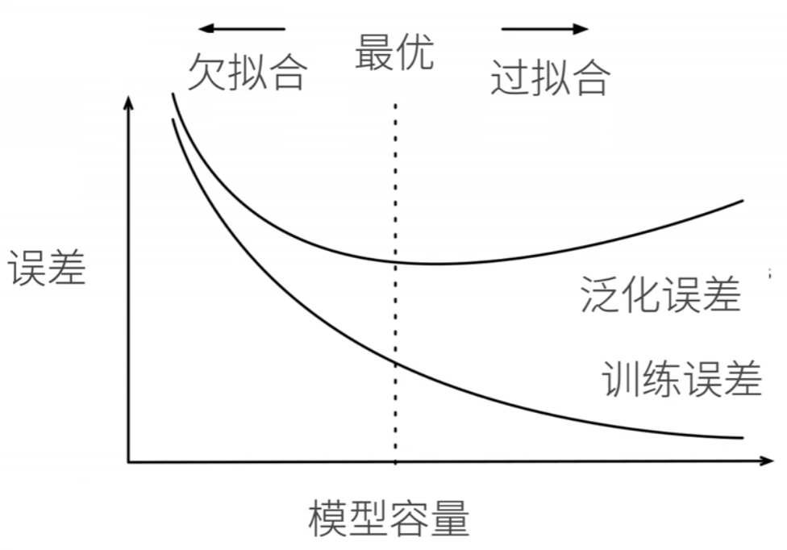

# 模型选择、欠拟合和过拟合

## 模型选择

**训练误差**（training error）是指，模型在训练数据集上计算得到的误差。

**泛化误差**（generalization error）是指，模型应用在同样从原始样本的分布中抽取的无限多数据样本时，模型误差的期望。

问题是，我们永远不能准确地计算出泛化误差。这是因为无限多的数据样本是一个虚构的对象。在实际中，我们只能通过将模型应用于一个独立的测试集来估计泛化误差，***该测试集由随机选取的、未曾在训练集中出现的数据样本构成***。

为了更好地衡量模型的泛化能力，在训练的时候，会额外设置一个***验证数据集（validation）***：这是一个用来评估模型好坏的数据集，**不能跟训练数据混在一起**。相比之下，***测试数据集***是只用一次的数据集。为什么需要验证？ *因为只有通过训练时候没见过的数据的泛化能力才能反映参数的好坏*！***但现实是验证数据和测试数据之间的边界模糊得令人担忧。***

**当训练数据稀缺时**，我们甚至可能无法提供足够的数据来构成一个合适的验证集。这个问题的一个流行的解决方案是采用$K$**折交叉验证**。这里，原始训练数据被分成$K$个不重叠的子集。然后执行$K$次模型训练和验证，每次在$K-1$个子集上进行训练，并在剩余的一个子集（在该轮中没有用于训练的子集）上进行验证。最后，通过对$K$次实验的结果取平均来估计训练和验证误差。常用K = 5 or 10。

## 过拟合和欠拟合

当我们比较训练和验证误差时，我们要注意两种常见的情况。

首先，我们要注意这样的情况：训练误差和验证误差都很严重，但它们之间仅有一点差距。如果模型不能降低训练误差，这可能意味着模型过于简单（即表达能力不足），无法捕获试图学习的模式。此外，由于我们的训练和验证误差之间的**泛化误差**很小，我们有理由相信可以用一个更复杂的模型降低训练误差。这种现象被称为**欠拟合**（underfitting）。

另一方面，当我们的训练误差明显低于验证误差时要小心，这表明严重的**过拟合**（overfitting）。注意，**过拟合**并不总是一件坏事。特别是在深度学习领域，众所周知，最好的预测模型在训练数据上的表现往往比在保留（验证）数据上好得多。最终，**我们通常更关心验证误差**，而不是训练误差和验证误差之间的差距。

是否过拟合或欠拟合可能取决于模型复杂性和可用训练数据集的大小。

定义模型容量为： 拟合各种函数的能力。低容量的模型难以拟合训练数据，而高容量的模型可以记住所有的训练数据。直观示意图如下：

模型容量过小，那么训练误差都很大，因为没有足够的能力去拟合出来一个很好的函数；而模型容量过大的话，反而可能会过度执着于所有数据都拟合进函数，但是在测试集上，泛化误差就会很大，这一点直觉上很认同。