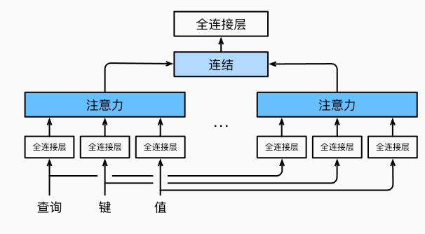

# 多头注意力

在实践中，当给定相同的查询、键和值的集合时，我们希望模型可以基于相同的注意力机制学习到不同的行为，然后将不同的行为作为知识组合起来，捕获序列内各种范围的依赖关系（例如，短距离依赖和长距离依赖关系）。因此，允许注意力机制组合使用查询、键和值的不同**子空间表示**（representation subspaces）可能是有益的。

为此，与其只使用单独一个注意力汇聚，我们可以用独立学习得到的$h$组不同的**线性投影**（linear projections）来变换查询、键和值。然后，这$h$组变换后的查询、键和值将并行地送到注意力汇聚中。最后，将这$h$个注意力汇聚的输出拼接在一起，并且通过另一个可以学习的线性投影进行变换，以产生最终输出。这种设计被称为**多头注意力**（multihead attention）。对于$h$个注意力汇聚输出，每一个注意力汇聚都被称作一个**头**（head）。

下面的图很好的展示了多头注意力：



在实现多头注意力之前，让我们用数学语言将这个模型形式化地描述出来。给定查询$\mathbf{q} \in \mathbb{R}^{d_q}$、键$\mathbf{k} \in \mathbb{R}^{d_k}$和值$\mathbf{v} \in \mathbb{R}^{d_v}$，每个注意力头$\mathbf{h}_i$（$i = 1, \ldots, h$）的计算方法为：
$$
\mathbf{h}_i = f(\mathbf W_i^{(q)}\mathbf q, \mathbf W_i^{(k)}\mathbf k,\mathbf W_i^{(v)}\mathbf v) \in \mathbb R^{p_v}
$$
其中，可学习的参数包括$\mathbf W_i^{(q)}\in\mathbb R^{p_q\times d_q}$、$\mathbf W_i^{(k)}\in\mathbb R^{p_k\times d_k}$和$\mathbf W_i^{(v)}\in\mathbb R^{p_v\times d_v}$，以及代表注意力汇聚的函数$f$。$f$可以是加性注意力和缩放点积注意力。多头注意力的输出需要经过另一个线性转换，它对应着$h$个头连结后的结果，因此其可学习参数是$\mathbf W_o\in\mathbb R^{p_o\times h p_v}$：
$$
\mathbf W_o \begin{bmatrix}\mathbf h_1\\\vdots\\\mathbf h_h\end{bmatrix} \in \mathbb{R}^{p_o}.
$$
基于这种设计，每个头都可能会关注输入的不同部分，可以表示比简单加权平均值更复杂的函数。

在实现过程中通常[**选择缩放点积注意力作为每一个注意力头**]。为了避免计算代价和参数代价的大幅增长，我们设定$p_q = p_k = p_v = p_o / h$。值得注意的是，如果将查询、键和值的线性变换的输出数量设置为$p_q h = p_k h = p_v h = p_o$，则可以并行计算$h$个头。

````python
def transpose_qkv(X, num_heads):
    """为了多注意力头的并行计算而变换形状"""
    # 输入X的形状:(batch_size，查询或者“键－值”对的个数，num_hiddens)
    # 输出X的形状:(batch_size，查询或者“键－值”对的个数，num_heads，
    # num_hiddens/num_heads)
    X = X.reshape(X.shape[0], X.shape[1], num_heads, -1)

    # 输出X的形状:(batch_size，num_heads，查询或者“键－值”对的个数,
    # num_hiddens/num_heads)
    X = X.permute(0, 2, 1, 3)

    # 最终输出的形状:(batch_size*num_heads,查询或者“键－值”对的个数,
    # num_hiddens/num_heads)
    return X.reshape(-1, X.shape[2], X.shape[3])

def transpose_output(X, num_heads):
    """逆转transpose_qkv函数的操作"""
    X = X.reshape(-1, num_heads, X.shape[1], X.shape[2])
    X = X.permute(0, 2, 1, 3)
    return X.reshape(X.shape[0], X.shape[1], -1)

class MultiHeadAttention(nn.Module):
    """多头注意力"""
    def __init__(self, key_size, query_size, value_size, num_hiddens,
                 num_heads, dropout, bias=False, **kwargs):
        super(MultiHeadAttention, self).__init__(**kwargs)
        self.num_heads = num_heads
        self.attention = d2l.DotProductAttention(dropout)
        self.W_q = nn.Linear(query_size, num_hiddens, bias=bias)
        self.W_k = nn.Linear(key_size, num_hiddens, bias=bias)
        self.W_v = nn.Linear(value_size, num_hiddens, bias=bias)
        self.W_o = nn.Linear(num_hiddens, num_hiddens, bias=bias)

    def forward(self, queries, keys, values, valid_lens):
        # queries，keys，values的形状:
        # (batch_size，查询或者“键－值”对的个数，num_hiddens)
        # valid_lens　的形状:
        # (batch_size，)或(batch_size，查询的个数)
        # 经过变换后，输出的queries，keys，values　的形状:
        # (batch_size*num_heads，查询或者“键－值”对的个数，
        # num_hiddens/num_heads)
        queries = transpose_qkv(self.W_q(queries), self.num_heads)
        keys = transpose_qkv(self.W_k(keys), self.num_heads)
        values = transpose_qkv(self.W_v(values), self.num_heads)

        if valid_lens is not None:
            # 在轴0，将第一项（标量或者矢量）复制num_heads次，
            # 然后如此复制第二项，然后诸如此类。
            valid_lens = torch.repeat_interleave(
                valid_lens, repeats=self.num_heads, dim=0)

        # output的形状:(batch_size*num_heads，查询的个数，
        # num_hiddens/num_heads)
        output = self.attention(queries, keys, values, valid_lens)

        # output_concat的形状:(batch_size，查询的个数，num_hiddens)
        output_concat = transpose_output(output, self.num_heads)
        return self.W_o(output_concat)
````

多头注意力（Multi-Head Attention）是Transformer模型中的关键机制之一，由Vaswani等人在2017年提出。其主要作用是通过多个注意力头的并行计算来增强模型的表达能力，使模型能够更灵活地捕获序列中不同位置的多种关系和特征。具体来说，多头注意力的作用如下：

1. **捕获不同的特征表示**：在多头注意力中，每个注意力头会有一组独立的权重，因此它们会在不同的子空间中计算注意力。这样，每个头可以专注于不同的模式和特征，比如句子中的长距离依赖、短距离依赖、不同的词义关系等，帮助模型更全面地理解输入序列的复杂结构。
2. **增强注意力机制的表达能力**：单头注意力虽然也能捕获输入序列的依赖关系，但其关注范围有限，难以捕捉到多种类型的依赖关系。多头注意力通过多个独立的注意力计算，可以更灵活地表示不同的关系，从而提高模型的表达能力和泛化性能。
3. **稳定梯度与避免过拟合**：通过多个注意力头的并行计算，每个头只需关注子空间的一部分信息，从而减少了过度依赖某一个头的风险。这种结构不仅有助于避免模型陷入局部最优，还能使得反向传播中的梯度更加稳定，提高训练效果。
4. **处理不同的句法和语义信息**：自然语言中的信息具有丰富的多层次结构，可能包括词法、句法、语义等不同层次的关系。多头注意力使模型能够在不同的头中分离并处理这些层次的信息，有利于捕获复杂的上下文依赖，从而提升对文本含义的理解。
5. **适应不同的查询-键值关系**：多头注意力使得模型在不同的头上可以分别对不同的查询、键和值进行不同的线性变换，这意味着在每个头中，注意力机制都可以独立地聚焦于输入序列的不同方面。这样，在每个注意力头中，模型可以学习到不同的注意力权重分布，捕捉不同的模式和信息。


