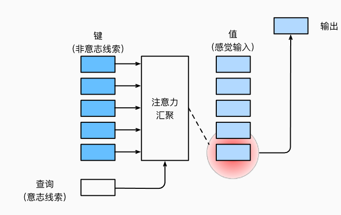
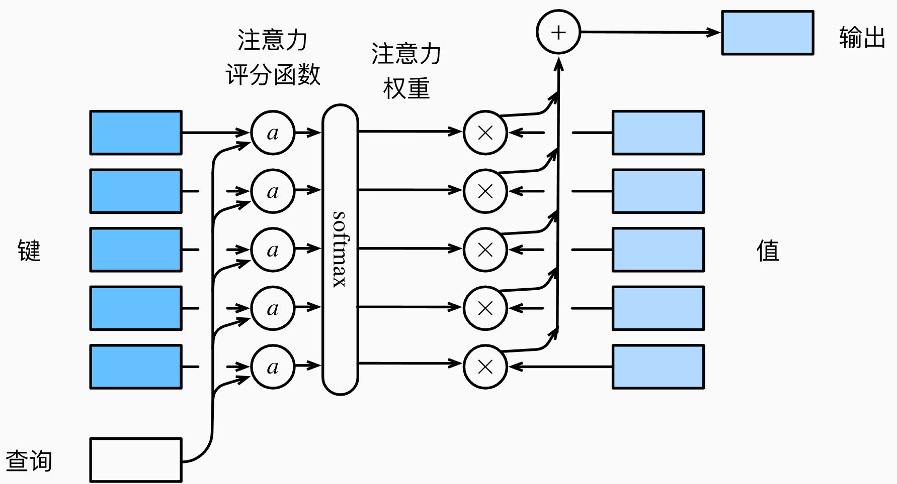

# 注意力

从心理学上来讲，动物需要在复杂环境下有效关注值得注意的点。心理学框架中提到：人类根据线索和不随意线索选择注意点。卷积、全连接、池化层其实都只考虑了不随意线索，例如池化层max pooling，我只选择出最大的signal，但是其实我也不知道这样做的意义是什么。

但是注意力机制则显示的考虑随意线索。随意线索被称为查询query，每一个输入都是一个值value和不随意线索key的对。通过注意力池化层来有偏向性选择某些输入。

## 注意力提示

注意力是稀缺的，而环境中的干扰注意力的信息却并不少。比如人类的视觉神经系统大约每秒收到$10^8$位的信息，这远远超过了大脑能够完全处理的水平。幸运的是，人类的祖先已经从经验（也称为数据）中认识到“并非感官的所有输入都是一样的”。

注意力是如何应用于视觉世界中的呢？这要从当今十分普及的**双组件**（two-component）的框架开始讲起：这个框架的出现可以追溯到19世纪90年代的威廉·詹姆斯，他被认为是“美国心理学之父” 在这个框架中，受试者基于**非自主性提示**和**自主性提示**有选择地引导注意力的焦点。

非自主性提示是基于环境中物体的突出性和易见性。

想象一下，假如面前有五个物品：一份报纸、一篇研究论文、一杯咖啡、一本笔记本和一本书。所有纸制品都是黑白印刷的，但咖啡杯是红色的。换句话说，这个咖啡杯在这种视觉环境中是突出和显眼的，不由自主地引起人们的注意。所以我们会把视力最敏锐的地方放到咖啡上，这就是因为由于***突出性的非自主性提示***（红杯子），所以注意力不自主地指向了咖啡杯。

喝咖啡后，会变得兴奋并想读书，所以转过头，重新聚焦眼睛，然后看看书，由于突出性导致的选择不同，此时选择书是受到了认知和意识的控制，因此***注意力在基于自主性提示去辅助选择***时将更为谨慎。受试者的主观意愿推动，选择的力量也就更强大。

自主性的与非自主性的注意力提示解释了人类的注意力的方式，下面来看看如何通过这两种注意力提示，用神经网络来设计注意力机制的框架。

首先，考虑一个相对简单的状况，即只使用非自主性提示。**要想将选择偏向于感官输入，则可以简单地使用参数化的全连接层**，**甚至是非参数化的最大汇聚层或平均汇聚层**。因此，“是否包含自主性提示”将注意力机制与全连接层或汇聚层区别开来。在注意力机制的背景下，自主性提示被称为**查询**（query）。给定任何查询，注意力机制通过**注意力汇聚**（attention pooling）将选择引导至**感官输入**（sensory inputs，例如中间特征表示）。在注意力机制中，这些感官输入被称为**值**（value）。更通俗的解释，每个值都与一个**键**（key）配对，这可以想象为感官输入的非自主提示。如下图所示，可以通过设计注意力汇聚的方式，便于给定的查询（自主性提示）与键（非自主性提示）进行匹配，这将引导得出最匹配的值（感官输入）。



> 下面的例子Reference：ChatGPT

假设我们走进一家大型图书馆，想要找到关于“机器学习”的书籍。图书馆中有很多书架（输入数据序列），每本书（数据点）都有相关的标签描述，如书名、作者、主题等。图书馆的管理员会帮我们找书，我们给管理员一个“关键词”——“机器学习”作为查询，希望找到与此主题相关的书籍。

在这个例子中，图书馆就是我们的输入序列，管理员是注意力机制，“机器学习”是查询 (Query)。在这个场景下：

1. **查询 (Query)** 是我们想找的主题“机器学习”，它代表了我们对特定信息的需求。
2. **键 (Key)** 是每本书的“主题标签”（例如，“数据科学”、“深度学习”、“机器学习”、“物联网”等），描述了每本书的内容主题。
3. **值 (Value)** 是每本书的“内容”，即书的实际信息（例如书中的知识和文字内容）。
4. **键值对**是每本书的“主题标签”（键）和“内容”（值）组成的一对，表示一本书的主题与它的实际内容之间的关联。

例子中的注意力机制

管理员会根据我们的查询“机器学习”，扫描图书馆里每本书的“主题标签”（键）来寻找与查询最相关的书籍。具体过程如下：

1. **查询和键的相似度匹配**：管理员会把“机器学习”这个查询和每本书的主题标签（键）逐一对比，相似度越高（比如包含“机器学习”这个词或相关词汇的标签），说明这本书的主题和我们想要的内容越匹配。
2. **选择相关的值**：管理员通过这些相似度匹配，找到那些主题标签与“机器学习”最接近的书，然后取出这些书的内容（值），将它们提供给我们。
3. **加权求和**：如果管理员发现有多本书的主题标签和“机器学习”高度相关，他们可能会权衡这些书的重要性，结合多个值中的内容，帮助我们得到一个更全面的知识集合。

之后为了可视化注意力权重，需要定义一个函数来帮助可视化权重分配。定义如下：

````python
def show_heatmaps(matrices, xlabel, ylabel, titles=None, figsize=(2.5, 2.5),
                  cmap='Reds'):
    """显示矩阵热图"""
    d2l.use_svg_display()
    num_rows, num_cols = matrices.shape[0], matrices.shape[1]
    fig, axes = d2l.plt.subplots(num_rows, num_cols, figsize=figsize,
                                 sharex=True, sharey=True, squeeze=False)
    for i, (row_axes, row_matrices) in enumerate(zip(axes, matrices)):
        for j, (ax, matrix) in enumerate(zip(row_axes, row_matrices)):
            pcm = ax.imshow(matrix.detach().numpy(), cmap=cmap)
            if i == num_rows - 1:
                ax.set_xlabel(xlabel)
            if j == 0:
                ax.set_ylabel(ylabel)
            if titles:
                ax.set_title(titles[j])
    fig.colorbar(pcm, ax=axes, shrink=0.6)
````

## Nadaraya-Warson核回归

给定的成对的“输入－输出”数据集$\{(x_1, y_1), \ldots, (x_n, y_n)\}$，如何学习$f$来预测任意新输入$x$的输出$\hat{y} = f(x)$？根据下面的非线性函数生成一个人工数据集，其中加入的噪声项为$\epsilon$：
$$
y_i = 2\sin(x_i) + x_i^{0.8} + \epsilon
$$
其中$\epsilon$服从均值为$0$和标准差为$0.5$的正态分布。在这里生成了$50$个训练样本和$50$个测试样本。

Nadaraya和Watson提出了好的想法：根据输入的位置对$y_i$进行加权
$$
f(x) = \sum_{i=1}^n \frac{K(x - x_i)}{\sum_{j=1}^n K(x - x_j)} y_i
$$
其中$K$是**核**（kernel），是可以自主定义的，可以是x值差值的L1范数，也可以是L2范数。那么受此启发，其实可以写出一个更为通用的注意力汇聚公式：
$$
f(x) = \sum_{i=1}^n \alpha(x, x_i) y_i
$$
其中$x$是查询，$(x_i, y_i)$是键值对。注意力汇聚是$y_i$​的加权平均，将查询$x$和键$x_i$之间的关系建模为**注意力权重**（attention weight）$\alpha(x, x_i)$。这个权重将被分配给每一个对应值$y_i$。对于任何查询，模型在所有键值对注意力权重都是一个有效的概率分布：它们是非负的，并且总和为1。

下面考虑一个**高斯核**（Gaussian kernel），其定义为：
$$
K(u) = \frac{1}{\sqrt{2\pi}} \exp(-\frac{u^2}{2})
$$
代入可得到：
$$
\begin{aligned} f(x) &=\sum_{i=1}^n \alpha(x, x_i) y_i\\ &= \sum_{i=1}^n \frac{\exp\left(-\frac{1}{2}(x - x_i)^2\right)}{\sum_{j=1}^n \exp\left(-\frac{1}{2}(x - x_j)^2\right)} y_i \\&= \sum_{i=1}^n \mathrm{softmax}\left(-\frac{1}{2}(x - x_i)^2\right) y_i. \end{aligned}
$$
如果一个键$x_i$越是接近给定的查询$x$，那么分配给这个键对应值$y_i$的注意力权重就会越大，也就“获得了更多的注意力”。这就好像是：每一本书都有标签，即为key，然后输入一个query，这个query和Key越接近，比如说，“机器学习”标签和我们想要寻找的“机器学习引论”相关书籍标签越接近，这本书就更应该受到我的注意，它的值，即机器学习书中的内容，就是我想要的。

那么也就是说，在这个情况中，如果query和key越接近，注意力权重越高。

虽然上述的模型很不错了，但是其实是一个非参数的模型：因为没有什么参数需要学习的，给定了数据集，那么f(x)就会随之确定。那么我们不妨加上参数部分：
$$
\begin{aligned}f(x) &= \sum_{i=1}^n \alpha(x, x_i) y_i \\&= \sum_{i=1}^n \frac{\exp\left(-\frac{1}{2}((x - x_i)w)^2\right)}{\sum_{j=1}^n \exp\left(-\frac{1}{2}((x - x_j)w)^2\right)} y_i \\&= \sum_{i=1}^n \mathrm{softmax}\left(-\frac{1}{2}((x - x_i)w)^2\right) y_i.\end{aligned}
$$
接下来上代码：

首先是核回归class的定义：class中初始化了一个形状为`(1,)` 的权重参数矩阵，其实也就是一个元素的张量。在forward的过程中，输入值、键、和查询，然后根据核回归公式给出query对应的输出是多少，这样才能形成loss，从而更新w。

其中.repeat_interleave(repeats，dim=None)是对指定的tensor沿着特定维度重复张量元素的函数。

````python
class NWKernelRegression(nn.Module):
    def __init__(self, **kwargs):
        super().__init__(**kwargs)
        self.w = nn.Parameter(torch.rand((1,), requires_grad=True))

    def forward(self, queries, keys, values):
        # queries和attention_weights的形状为(查询个数，“键－值”对个数)
        queries = queries.repeat_interleave(keys.shape[1]).reshape((-1, keys.shape[1]))
        self.attention_weights = nn.functional.softmax(
            -((queries - keys) * self.w)**2 / 2, dim=1)
        # values的形状为(查询个数，“键－值”对个数)
        return torch.bmm(self.attention_weights.unsqueeze(1),
                         values.unsqueeze(-1)).reshape(-1)
````

接下来，**将训练数据集变换为键和值**用于训练注意力模型。在带参数的注意力汇聚模型中，任何一个训练样本的输入都会和除自己以外的所有训练样本的“键－值”对进行计算，从而得到其对应的预测输出。

````python
# X_tile的形状:(n_train，n_train)，每一行都包含着相同的训练输入
X_tile = x_train.repeat((n_train, 1))
# Y_tile的形状:(n_train，n_train)，每一行都包含着相同的训练输出
Y_tile = y_train.repeat((n_train, 1))
# keys的形状:('n_train'，'n_train'-1)
keys = X_tile[(1 - torch.eye(n_train)).type(torch.bool)].reshape((n_train, -1))
# values的形状:('n_train'，'n_train'-1)
values = Y_tile[(1 - torch.eye(n_train)).type(torch.bool)].reshape((n_train, -1))
````

训练的时候，使用平方损失函数和随机梯度下降：

````python
net = NWKernelRegression()
loss = nn.MSELoss(reduction='none')
trainer = torch.optim.SGD(net.parameters(), lr=0.5)
# trainer将会接管net中的self.w权重参数，因为它是nn.Parameter
animator = d2l.Animator(xlabel='epoch', ylabel='loss', xlim=[1, 5])

for epoch in range(5):
    trainer.zero_grad()
    l = loss(net(x_train, keys, values), y_train)
    # 这里得到的是('n_train',1)形状的张量，记录了一个loss，此处求和再反向传播， 因为要求loss是张量标量
    l.sum().backward()
    trainer.step()
    print(f'epoch {epoch + 1}, loss {float(l.sum()):.6f}')
    animator.add(epoch + 1, float(l.sum()))
````

## 注意力评分函数

在nadaraya-watson中，我们使用了高斯核作为例子，那么这个高斯核指数部分其实可以视为***注意力评分函数***，简称评分函数。在注意力机制中，评分函数的作用是通过比较查询和键的相似性来确定每个键对应的值在结果中的重要性或权重。这个评分帮助模型在多条输入信息中，选择性地聚焦于与当前查询最相关的信息。评分函数和键与查询的关系如下图所示：



可以看到，评分函数可以对键与查询的匹配程度打分，然后后续再对所有的打分进行softmax，从而使得打分分布变成概率分布，概率越高，说明匹配程度越高，说明这个键对应的值应该占更高的比重。

用数学语言描述，假设有一个查询$\mathbf{q} \in \mathbb{R}^q$和$m$个“键－值”对$(\mathbf{k}_1, \mathbf{v}_1), \ldots, (\mathbf{k}_m, \mathbf{v}_m)$，其中$\mathbf{k}_i \in \mathbb{R}^k$，$\mathbf{v}_i \in \mathbb{R}^v$。注意力汇聚函数$f$就被表示成值的加权和：
$$
f(\mathbf{q}, (\mathbf{k}_1, \mathbf{v}_1), \ldots, (\mathbf{k}_m, \mathbf{v}_m)) = \sum_{i=1}^m \alpha(\mathbf{q}, \mathbf{k}_i) \mathbf{v}_i \in \mathbb{R}^v
$$
其中查询$\mathbf{q}$和键$\mathbf{k}_i$的注意力权重（标量）是通过注意力评分函数$a$将两个向量映射成标量，再经过softmax运算得到的：
$$
\alpha(\mathbf{q}, \mathbf{k}_i) = \mathrm{softmax}(a(\mathbf{q}, \mathbf{k}_i)) = \frac{\exp(a(\mathbf{q}, \mathbf{k}_i))}{\sum_{j=1}^m \exp(a(\mathbf{q}, \mathbf{k}_j))} \in \mathbb{R}
$$

### 掩蔽softmax

有的时候，我们不希望一些数据能够被纳入注意力的范围之中。因此，实际中可以进行掩蔽softmax操作，即指定一个有效序列长度，以方便计算softmax的时候滤掉超出范围的位置。如下列代码所示：

````python
def masked_softmax(X, valid_lens):
    """通过在最后一个轴上掩蔽元素来执行softmax操作"""
    # X:3D张量，valid_lens:1D或2D张量
    if valid_lens is None:
        return nn.functional.softmax(X, dim=-1)
    else:
        shape = X.shape
        if valid_lens.dim() == 1:
            valid_lens = torch.repeat_interleave(valid_lens, shape[1])
        else:
            valid_lens = valid_lens.reshape(-1)
        # 最后一轴上被掩蔽的元素使用一个非常大的负值替换，从而其softmax输出为0
        X = d2l.sequence_mask(X.reshape(-1, shape[-1]), valid_lens,
                              value=-1e6)
        return nn.functional.softmax(X.reshape(shape), dim=-1)
masked_softmax(torch.rand(2, 2, 4), torch.tensor([2, 3]))
'''
tensor([[[0.4807, 0.5193, 0.0000, 0.0000],
         [0.4595, 0.5405, 0.0000, 0.0000]],

        [[0.4470, 0.2805, 0.2725, 0.0000],
         [0.3001, 0.4655, 0.2344, 0.0000]]])
'''
````

### 加性注意力

有的时候，键和查询的维度并不相同，但是我们依然想要找到很好的衡量键和查询相似程度的评分函数。那么这个时候可以考虑采用加性注意力作为评分函数：
$$
a(\mathbf q, \mathbf k) = \mathbf w_v^\top \text{tanh}(\mathbf W_q\mathbf q + \mathbf W_k \mathbf k) \in \mathbb{R}
$$
其中可学习的参数是$\mathbf W_q\in\mathbb R^{h\times q}$、$\mathbf W_k\in\mathbb R^{h\times k}$和$\mathbf w_v\in\mathbb R^{h}$。将查询和键连结起来后输入到一个多层感知机（MLP）中，感知机包含一个隐藏层，其隐藏单元数是一个超参数$h$。通过使用$\tanh$作为激活函数，并且禁用偏置项。

````python
#@save
class AdditiveAttention(nn.Module):
    """加性注意力"""
    def __init__(self, key_size, query_size, num_hiddens, dropout, **kwargs):
        super(AdditiveAttention, self).__init__(**kwargs)
        self.W_k = nn.Linear(key_size, num_hiddens, bias=False)
        self.W_q = nn.Linear(query_size, num_hiddens, bias=False)
        self.w_v = nn.Linear(num_hiddens, 1, bias=False)
        self.dropout = nn.Dropout(dropout)

    def forward(self, queries, keys, values, valid_lens):
        queries, keys = self.W_q(queries), self.W_k(keys)
        # 在维度扩展后，
        # queries的形状：(batch_size，查询的个数，1，num_hidden)
        # key的形状：(batch_size，1，“键－值”对的个数，num_hiddens)
        # 使用广播方式进行求和
        features = queries.unsqueeze(2) + keys.unsqueeze(1)
        features = torch.tanh(features)
        # self.w_v仅有一个输出，因此从形状中移除最后那个维度。
        # scores的形状：(batch_size，查询的个数，“键-值”对的个数)
        scores = self.w_v(features).squeeze(-1)
        self.attention_weights = masked_softmax(scores, valid_lens)
        # values的形状：(batch_size，“键－值”对的个数，值的维度)
        return torch.bmm(self.dropout(self.attention_weights), values)
````

### 缩放点积注意力

使用点积可以得到计算效率更高的评分函数，***但是点积操作要求查询和键具有相同的长度$d$。***

假设查询和键的所有元素都是独立的随机变量，并且都满足零均值和单位方差，那么两个向量的点积的均值为$0$，方差为$d$。***为确保无论向量长度如何，点积的方差在不考虑向量长度的情况下仍然是$1$***，我们再将点积除以$\sqrt{d}$，则**缩放点积注意力**（scaled dot-product attention）评分函数为：
$$
a(\mathbf q, \mathbf k) = \mathbf{q}^\top \mathbf{k}  /\sqrt{d}.
$$
在实践中，我们通常从小批量的角度来考虑提高效率，例如基于$n$个查询和$m$个键－值对计算注意力，其中查询和键的长度为$d$，值的长度为$v$。查询$\mathbf Q\in\mathbb R^{n\times d}$、键$\mathbf K\in\mathbb R^{m\times d}$和值$\mathbf V\in\mathbb R^{m\times v}$的缩放点积注意力是：
$$
\mathrm{softmax}\left(\frac{\mathbf Q \mathbf K^\top }{\sqrt{d}}\right) \mathbf V \in \mathbb{R}^{n\times v}.
$$
下面的缩放点积注意力的实现使用了暂退法进行模型正则化。

````python
class DotProductAttention(nn.Module):
    """缩放点积注意力"""
    def __init__(self, dropout, **kwargs):
        super(DotProductAttention, self).__init__(**kwargs)
        self.dropout = nn.Dropout(dropout)
    # queries的形状：(batch_size，查询的个数，d)
    # keys的形状：(batch_size，“键－值”对的个数，d)
    # values的形状：(batch_size，“键－值”对的个数，值的维度)
    # valid_lens的形状:(batch_size，)或者(batch_size，查询的个数)
    def forward(self, queries, keys, values, valid_lens=None):
        d = queries.shape[-1]
        # 设置transpose_b=True为了交换keys的最后两个维度
        scores = torch.bmm(queries, keys.transpose(1,2)) / math.sqrt(d)
        self.attention_weights = masked_softmax(scores, valid_lens)
        return torch.bmm(self.dropout(self.attention_weights), values)
````

