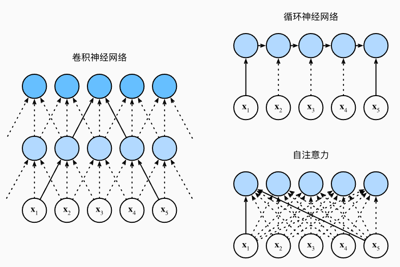

# 自注意力和位置编码

## 自注意力

如果说同一组词元同时充当了查询、键和值，那么具体来说，在对词元进行编码的过程中，每个查询都会关注所有的键值对并生成一个注意力输出。由于查询、键和值都来自同一组的输入，因此被称为自注意力。接下来具体定义自注意力：

给定一个由词元组成的输入序列$\mathbf{x}_1, \ldots, \mathbf{x}_n$，其中任意$\mathbf{x}_i \in \mathbb{R}^d$（$1 \leq i \leq n$）。该序列的自注意力输出为一个长度相同的序列$\mathbf{y}_1, \ldots, \mathbf{y}_n$，其中：
$$
\mathbf{y}_i = f(\mathbf{x}_i, (\mathbf{x}_1, \mathbf{x}_1), \ldots, (\mathbf{x}_n, \mathbf{x}_n)) \in \mathbb{R}^d
$$
从上面的式子就可以看出，每当$X_i$作为查询的时候，在输出值的时候，会关注这个查询$X_i$和其他所有键$X_j$的关系，从而决定这个输出值收到其他值$X_j$的影响权重。可以预料到的是，输入词元序列和输出序列的length应该都是一样的。

## CNN，RNN，自注意力比较

接下来比较下面几个架构，目标都是将由$n$个词元组成的序列映射到另一个长度相等的序列，其中的每个输入词元或输出词元都由$d$维向量表示。具体来说，将比较的是卷积神经网络、循环神经网络和自注意力这几个架构的计算复杂性、顺序操作和最大路径长度。请注意，顺序操作会妨碍并行计算，而任意的序列位置组合之间的路径越短，则能更轻松地学习序列中的远距离依赖关系：



:label:考虑一个卷积核大小为$k$的卷积层。在后面的章节将提供关于使用卷积神经网络处理序列的更多详细信息。目前只需要知道的是，由于序列长度是$n$，输入和输出的通道数量都是$d$，所以卷积层的计算复杂度为$\mathcal{O}(knd^2)$。卷积神经网络是分层的，因此为有$\mathcal{O}(1)$个顺序操作，最大路径长度为$\mathcal{O}(n/k)$。

:label:当更新循环神经网络的隐状态时，$d \times d$权重矩阵和$d$维隐状态的乘法计算复杂度为$\mathcal{O}(d^2)$。由于序列长度为$n$，因此循环神经网络层的计算复杂度为$\mathcal{O}(nd^2)$。有$\mathcal{O}(n)$个顺序操作无法并行化，最大路径长度也是$\mathcal{O}(n)$。

:label:在自注意力中，查询、键和值都是$n \times d$矩阵。考虑点－积注意力，其中$n \times d$矩阵乘以$d \times n$矩阵。之后输出的$n \times n$矩阵乘以$n \times d$矩阵。因此，自注意力具有$\mathcal{O}(n^2d)$计算复杂性。每个词元都通过自注意力直接连接到任何其他词元。因此，有$\mathcal{O}(1)$个顺序操作可以并行计算，最大路径长度也是$\mathcal{O}(1)$。

总而言之，卷积神经网络和自注意力都拥有并行计算的优势，而且自注意力的最大路径长度最短。但是因为其计算复杂度是关于序列长度的二次方，所以在很长的序列中计算会非常慢。

## 位置编码

自注意力因为并行计算而放弃了顺序操作。为了使用序列的顺序信息，通过在输入表示中添加**位置编码**（positional encoding）来注入绝对的或相对的位置信息。位置编码可以通过学习得到也可以直接固定得到。接下来描述的是基于正弦函数和余弦函数的固定位置编码。

假设输入表示$\mathbf{X} \in \mathbb{R}^{n \times d}$包含一个序列中$n$个词元的$d$维嵌入表示。位置编码使用相同形状的位置嵌入矩阵$\mathbf{P} \in \mathbb{R}^{n \times d}$输出$\mathbf{X} + \mathbf{P}$，矩阵第$i$行、第$2j$列和$2j+1$列上的元素为：
$$
\begin{aligned} p_{i, 2j} &= \sin\left(\frac{i}{10000^{2j/d}}\right),\\p_{i, 2j+1} &= \cos\left(\frac{i}{10000^{2j/d}}\right).\end{aligned}
$$

````python
#@save
class PositionalEncoding(nn.Module):
    """位置编码"""
    def __init__(self, num_hiddens, dropout, max_len=1000):
        super(PositionalEncoding, self).__init__()
        self.dropout = nn.Dropout(dropout)
        # 创建一个足够长的P
        self.P = torch.zeros((1, max_len, num_hiddens))
        X = torch.arange(max_len, dtype=torch.float32).reshape(
            -1, 1) / torch.pow(10000, torch.arange(
            0, num_hiddens, 2, dtype=torch.float32) / num_hiddens)
        self.P[:, :, 0::2] = torch.sin(X)
        self.P[:, :, 1::2] = torch.cos(X)

    def forward(self, X):
        X = X + self.P[:, :X.shape[1], :].to(X.device)
        return self.dropout(X)
````

在位置嵌入矩阵$\mathbf{P}$中，[**行代表词元在序列中的位置，列代表位置编码的不同维度**]。

为了明白为什么位置编码不同维度的频率三角函数频率不同，这里做一个类比：二进制中表示1,2,3等数字，位次越低的比特更新的频率越高。而上述代码实现的位置编码还能捕获相对位置信息，这是因为：

对于任何确定的位置偏移$\delta$，位置$i + \delta$处的位置编码可以线性投影位置$i$处的位置编码来表示。这种投影的数学解释是，令$\omega_j = 1/10000^{2j/d}$，对于任何确定的位置偏移$\delta$，$(p_{i, 2j}, p_{i, 2j+1})$都可以线性投影到$(p_{i+\delta, 2j}, p_{i+\delta, 2j+1})$：
$$
\begin{aligned}
&\begin{bmatrix} \cos(\delta \omega_j) & \sin(\delta \omega_j) \\  -\sin(\delta \omega_j) & \cos(\delta \omega_j) \\ \end{bmatrix}
\begin{bmatrix} p_{i, 2j} \\  p_{i, 2j+1} \\ \end{bmatrix}\\
=&\begin{bmatrix} \cos(\delta \omega_j) \sin(i \omega_j) + \sin(\delta \omega_j) \cos(i \omega_j) \\  -\sin(\delta \omega_j) \sin(i \omega_j) + \cos(\delta \omega_j) \cos(i \omega_j) \\ \end{bmatrix}\\
=&\begin{bmatrix} \sin\left((i+\delta) \omega_j\right) \\  \cos\left((i+\delta) \omega_j\right) \\ \end{bmatrix}\\
=& 
\begin{bmatrix} p_{i+\delta, 2j} \\  p_{i+\delta, 2j+1} \\ \end{bmatrix},
\end{aligned}
$$
$2\times 2$投影矩阵不依赖于任何位置的索引$i$。