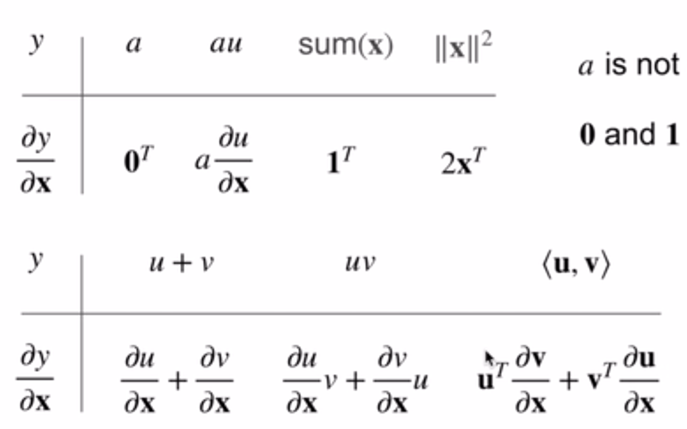

# 矩阵计算与自动求导

## 矩阵计算——矩阵怎么求导？

函数知道如何求导，而且还知道链式法则。但是深度学习中都是矩阵操作，而且同样需要使用梯度进行参数优化。那么如何对参数求导呢？即：如何将导数拓展到向量？

原来都是$\frac{\partial y}{\partial x}$，但是现在x y这两个参数中的任意一个都可以是变成向量：
$$
\frac{\partial \vec y}{\partial \vec x},
\frac{\partial y}{\partial \vec x}, 
\frac{\partial \vec y}{\partial x}
$$
第一种：$\frac{\partial y}{\partial \vec x}$。如果x向量是列向量，那么得到的结果会是横向量。下面图片是一个例子($y=x_1^2+2x_2^2$)：


这种情况还较好理解，主要是列向量变为行向量的变化一开始可能不好理解。我是这么理解的：这个函数y可以泰勒展开，那么就会有导数×（自变量-初始值）这一项，那么这个乘法中后者是列向量，那么前者是行向量的话就能成功得到标量的结果；当然，这种理解是个人且粗糙的。同样，这种类型的导数有一些经典的公式如下：



第二种：$\frac{\partial \vec y}{\partial x}$。这中就比较好理解了，因为可以把y向量中的每一个值都是为一个x相关的函数，因此很容易认同的得到的结果是列向量（如果y是列向量的话）。示意图如下：


最后是$\frac{\partial \vec y}{\partial \vec x}$。在前面两种的介绍之后，就更容易理解和认同了。y向量中的每一个元素都和x向量有关，因此每一个元素得到的导数是一个行向量，那么整个y向量的导数就是一个方形矩阵了。示意图如下：


一下是一些这类导数的样例：


$$
其中，x \in R^n, y \in R^m,
\frac{\partial \vec y}{\partial \vec x} \in R^{m×n}
\\
a, \mathbf{a}, \mathbf{A} \ are \ not \ functions \ of \ \vec x
$$

## 自动求导

x y都是标量的情况中的链式法则已经很熟悉了，那么向量中依然有这种链式法则，但是关键在于要把形状理清楚。矩阵求导的链式法则的几个例子如下：


大致了解了矩阵的链式法则之后，pytorch中是如何实现自动求导的呢？pytorch会把代码分解成操作子，并且把计算过程表示成一个无环图，那么链式法则对目标求导的时候就能按图索骥了。链式法则可以分为正向和反向，如下图所示：


在反向拿到表达式之后，仍需要代入值进入，这个值哪里来呢？那么就是一开始在构建完图之后就可以执行一遍图，把中间参数的结果都算出来并保存，然后反向计算导数的表达式，把之前正向执行得到的结果代入。那么在反向传播的过程中，一个很大的GPU内存开销就是用来储存这些中间结果，因为如果n是操作子个数，那么计算复杂度就是`O(n)`。


那么pytorch中是如何通过代码进行自动求导的呢？值得注意的是：Pytorch中操作无环图的构造是隐式的。实例代码如下：(假设我们想对函数$y=2\mathbf{x}^{\top}\mathbf{x}$关于列向量$\mathbf{x}$求导)

````python
import torch
x = torch.arange(4.0)
x.requires_grad_(True)  # 等价于x=torch.arange(4.0,requires_grad=True)
# require了grad之后，就可以通过 x.grad来访问它的梯度值了
y = 2 * torch.dot(x, x)
y.backward()
x.grad
# 为什么是x这里获取梯度值呢？因为x归根到底是自变量，而且深度学习中更新的参数是x
# tensor([ 0.,  4.,  8., 12.])
x.grad == 4 * x
# tensor([True, True, True, True])
# 现在计算另一个函数
# 在默认情况下，PyTorch会累积梯度，我们需要清除之前的值
x.grad.zero_()
y = x.sum()
y.backward()
x.grad # tensor([1., 1., 1., 1.])
````

***在默认情况下，PyTorch会累积梯度，我们需要清除之前的值***

同样，pytorch可以手动控制哪些参加链式法则：这里可以分离`y`来返回一个新变量`u`，该变量与`y`具有相同的值，但丢弃计算图中如何计算`y`的任何信息。换句话说，梯度不会向后流经`u`到`x`。因此，下面的反向传播函数计算`z=u*x`关于`x`的偏导数，同时将`u`作为常数处理，而不是`z=x*x*x`关于`x`的偏导数。

````python
x.grad.zero_()
y = x * x
u = y.detach()
z = u * x
z.sum().backward()
x.grad == u # tensor([True, True, True, True])
````

使用自动微分的一个好处是：**即使构建函数的计算图需要通过Python控制流（例如，条件、循环或任意函数调用），我们仍然可以计算得到的变量的梯度**。