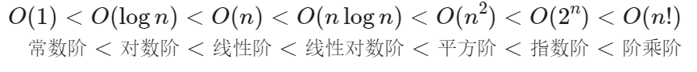

# 基本结构与算法分析

数组，链表，栈，队列，渐近符号

## 数据结构算法复杂度介绍 

数据结构: 相互之间存在一种或者多种特定关系的数据元素的集合. 在逻辑上可以分为线性结构, 散列结构, 树形结构, 图形结构等等

算法: 求解具体问题的步骤描述, 代码上表现出来是解决特定问题的一组有限的指令序列

算法复杂度: 时间和空间复杂度, 衡量算法效率, 算法在执行过程中, 随着数据规模n的增长, 算法执行所花费的时间和空间的增长速度. 

常见的时间复杂度关系: 

常见的时间复杂度: 

