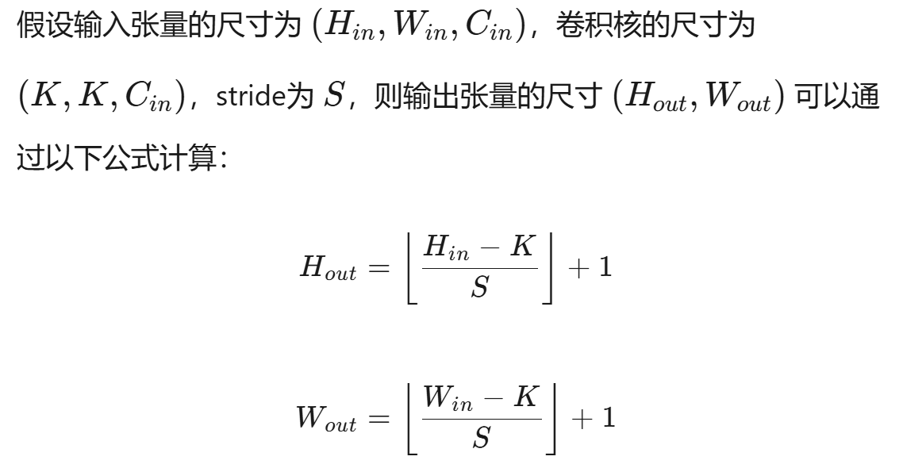
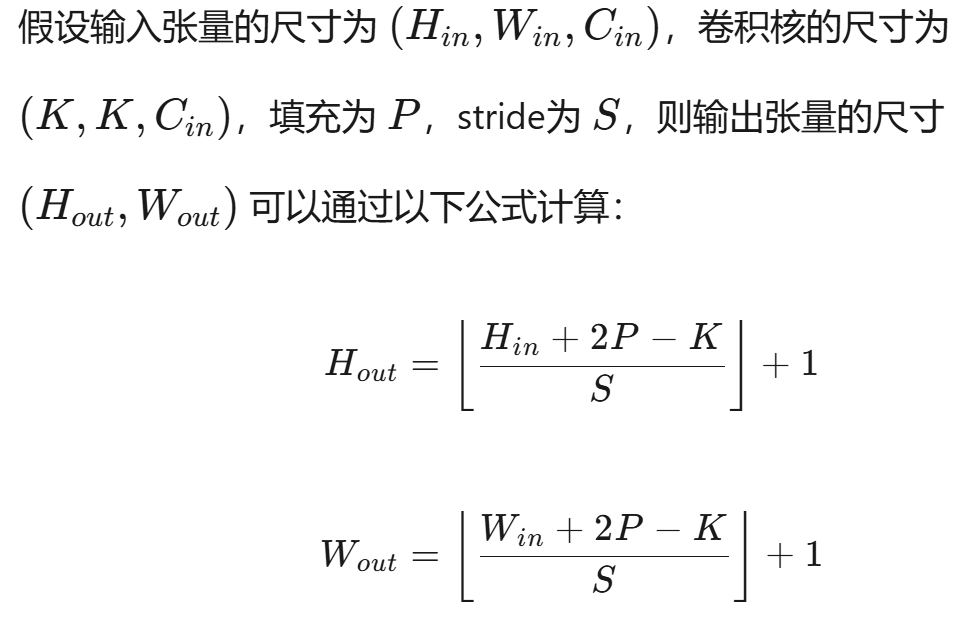
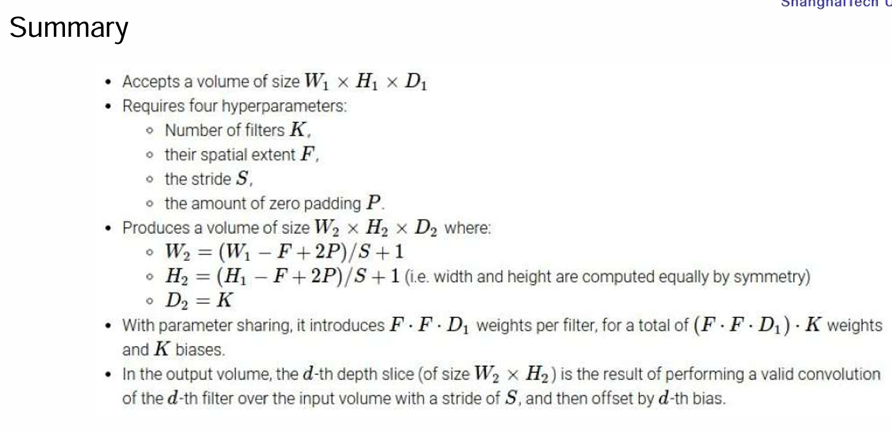
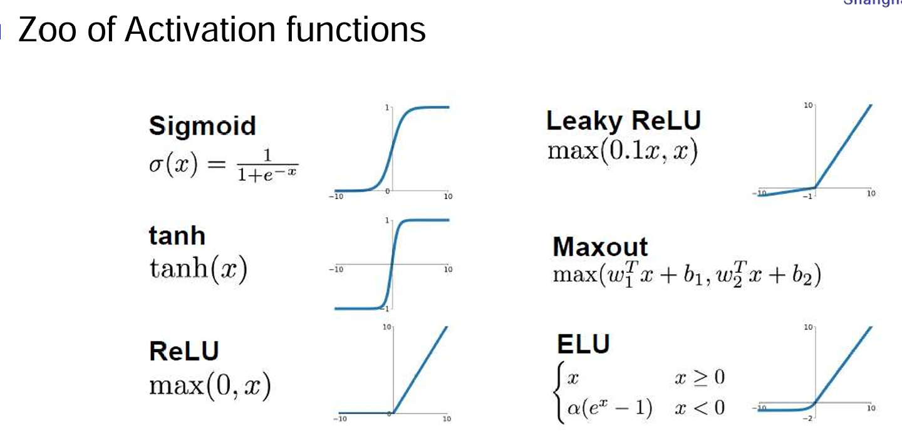
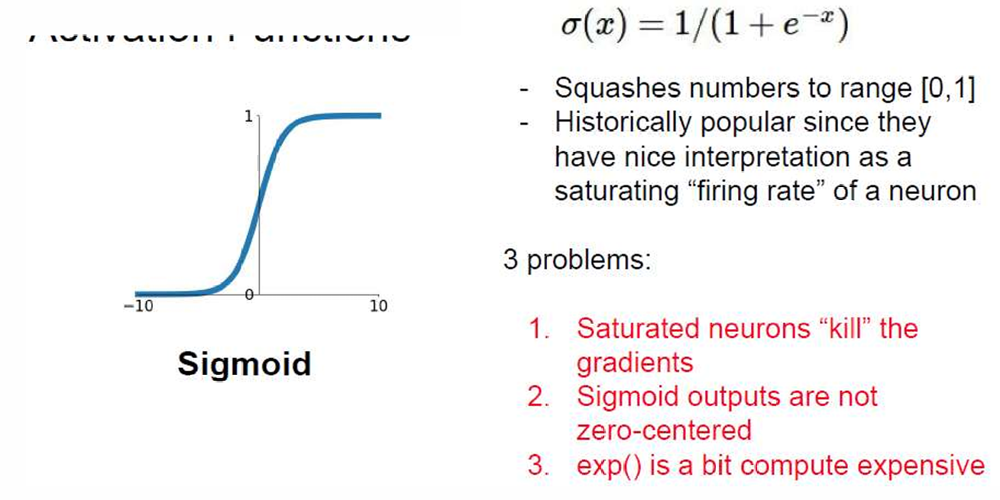
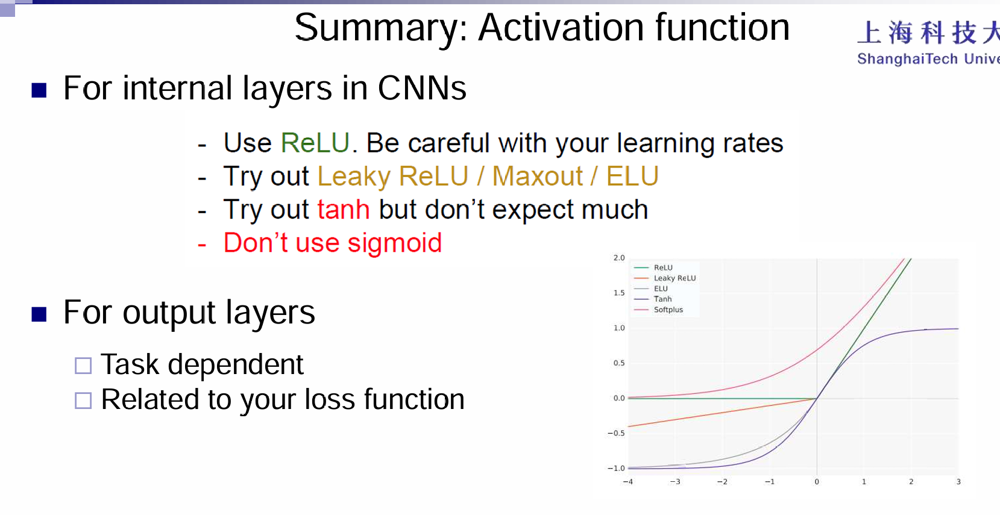
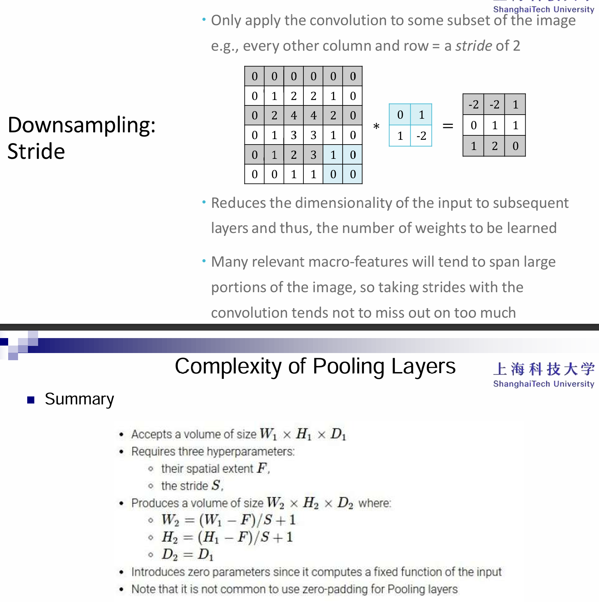

# CNN

## Innovation

假设一个visual recognition的任务，输入是200*200的RGB照片，那么考虑一个简单的全连接层，那么可想而知参数量非常的恐怖。同时：假设图片中的目标物体便宜了一小点，那么可想而知的是应该识别出的物体类别依然是一样的，这意味着目标物体在图像中应该有一种特殊的2D拓扑性质。

所以直觉上，我们希望一个新的神经网络来：

- 处理高维输入
- 充分利用图像中像素的2D拓扑性质
- 能够不收图像微小变化的影响（如微小的平移、变形等）

于是CNN就很好的利用了这些思想：注重于：

- local connectivity
- parameter sharing
- pooling/subsampling hidden units

## Overview

First idea: Use a local connectivity of hidden units

Second idea: Share weights across certain units

Third idea: pool hidden units in the same neighborhood

> Robust toward small deformations in object shapes by ignoring details

Fourth idea: Interleaving feature extraction and pooling operations

> Extracting abstract, compositional features for representing semantic object classes

## Methodology

Kernel是CNN的主角：一个kernel里面参数的和应该是1，这个卷积核会和图像进行卷积操作。一个平均数填充的卷积核所处理的结果是模糊化，仅是中间为1的卷积核的处理结果就是图像本身。

> 细节：卷积结果中计算完了所有的点积之后，还有偏置项

一个卷积核的大小是三维的，通常表示为（高度，宽度，通道数）。其中，高度和宽度是卷积核在空间上的尺寸，而通道数必须与输入张量的通道数相匹配。

有多少种这样的卷积核，输出的张量的通道数量就是多少。每个卷积核都会在输入张量上滑动并计算点积，产生一个输出通道。因此，如果有多个卷积核，每个卷积核都会产生一个独立的输出通道，这些输出通道组合在一起形成输出张量。

例如，如果输入张量的大小是（32, 32, 3），即32x32的图像有3个通道，而我们使用了16个卷积核，每个卷积核的大小是（5, 5, 3），那么输出张量的大小将是（28, 28, 16），其中28x28是输出图像的空间尺寸（取决于卷积核的大小和步长），16是输出通道的数量，对应于16个卷积核。

滑动（stride）与padding也是CNN中重要的概念：

滑动（stride）是指卷积核在输入张量上移动的步长。具体来说，它决定了卷积核每次移动的像素数。例如，如果stride为1，则卷积核每次移动一个像素；如果stride为2，则卷积核每次移动两个像素。

- **控制输出尺寸**：stride越大，输出张量的空间尺寸（高度和宽度）越小。
- **控制特征提取的密度**：stride越小，特征提取越密集；stride越大，特征提取越稀疏。

填充（padding）是指在输入张量的边缘添加额外的像素（通常是零）。填充的目的是控制卷积操作的输出尺寸，或者保持输入和输出的尺寸一致。

- **保持尺寸**：通过添加填充，可以使输出张量的尺寸与输入张量的尺寸相同，或者接近输入张量的尺寸。
- **增加边界信息**：填充可以减少边界像素的丢失，使卷积操作能够更好地处理图像的边缘信息。

感受野：其实就是卷积核的size

## Closer look at activation function

一些常见的激活函数有：

这些激活函数都能起到引入非线性性的作用。那么激活函数之间亦有差异吗？答案是肯定的。

sigmoid是最为著名的，最终的输出值范围在0-1之间。历史上非常流行，因为它的输出可以被解释为神经元的激活概率或“发射率”（firing rate）。

**缺点**：

- **梯度消失问题**：当输入值非常大或非常小时，函数的梯度接近于0，这会导致在反向传播过程中梯度消失，影响网络的训练效率。
- **非零中心化输出**：Sigmoid 函数的输出不是以0为中心的，这可能会影响网络的训练速度和效果。、

tanh输出范围是-1到1，而且是中心对称的，这很好，但是依然在输入值很大或很小的时候，梯度非常的小。

ReLU函数避免了梯度消失的问题，而且计算效率非常高，在实践中收敛速度更快，并且在生物学角度上是更有可能的。但是也有缺点。首先是非零点中心化输出，其次就是输入如果小于0，那么意味着这些神经元不会被激活，那么就是死亡ReLU的问题。

Leaky ReLU就是为了防止死亡ReLU的现象，让负数阶段也有斜率，并且继承了ReLU的优点。

## Pooling Layer

Reducing the spatial size of the feature maps:

- Smaller representations 

- On each activation map independently  

- Low resolution means fewer details

## Math Properties of CNN

首先是equivariance：**等变性**指的是当输入经过某个变换后，输出会以相应的方式变换，保持变换的一致性。具体来说，**如果输入经过一个变换 g，那么输出应该是与变换相对应的输出变换**。

数学表达式：对于每个输入 x，如果应用变换 g 到输入上，那么输出 $\phi(gx)$ 应该等同于将变换 ggg 应用到输出上，即：
$$
\exists M_g : \mathbb{R}^d \to \mathbb{R}^d \quad \text{such that} \quad \forall x \in \mathcal{X}: \phi(gx) \approx M_g \phi(x)
$$
卷积操作本身就具有等变性。具体来说，卷积操作对于输入的平移具有等变性。如果输入图像中的某个特征（例如物体）平移了，那么卷积操作的输出也会相应地平移。也就是说，卷积对输入图像的平移不会改变其特征，只是位置发生了变化。

其次是不变性：**不变性**指的是当输入经过某个变换时，输出**不会发生变化**。也就是说，变换对输出没有任何影响。

数学表达式：对于每个输入 x，如果应用变换 g 到输入上，那么输出$\phi(gx)$ 应该等于 $\phi(x)$，即输出保持不变：
$$
\forall x \in \mathcal{X}: \phi(gx) \approx \phi(x)
$$
卷积神经网络中的卷积层、池化层以及全连接层能够处理平移不变性。无论输入图像如何平移，网络的输出（如分类结果）保持不变。平移不变性意味着即使图像中的物体发生平移，网络依然能识别出相同的物体。
$$

$$
