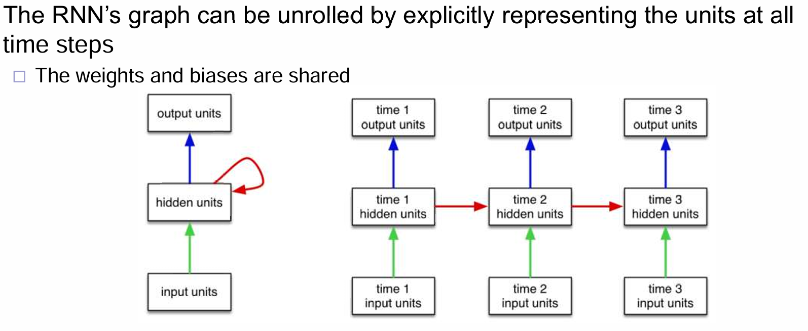
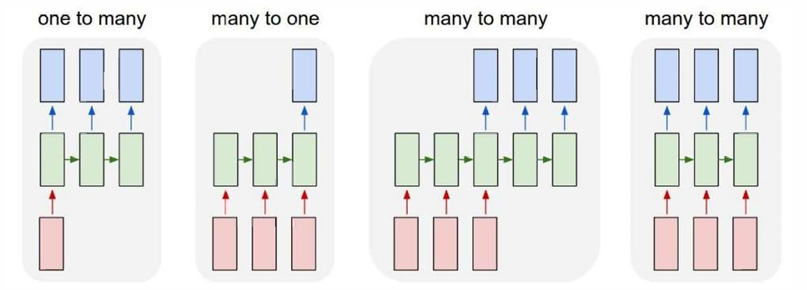
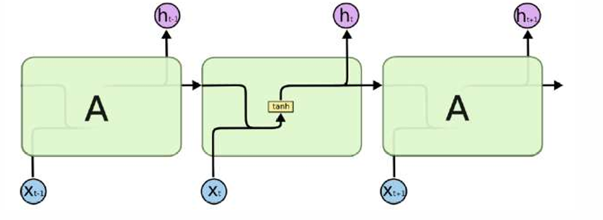
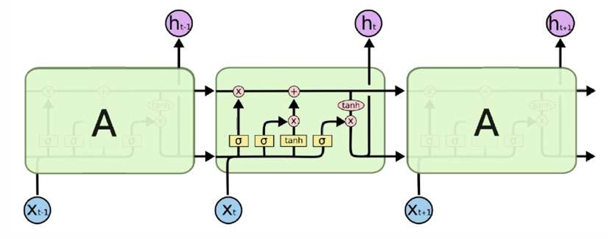
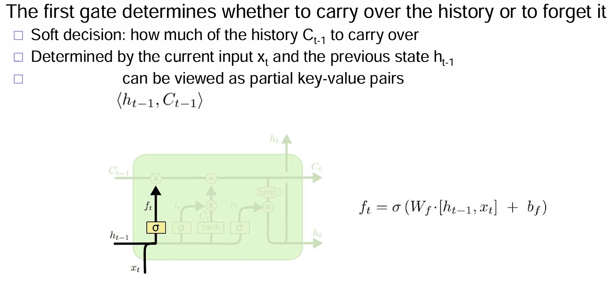
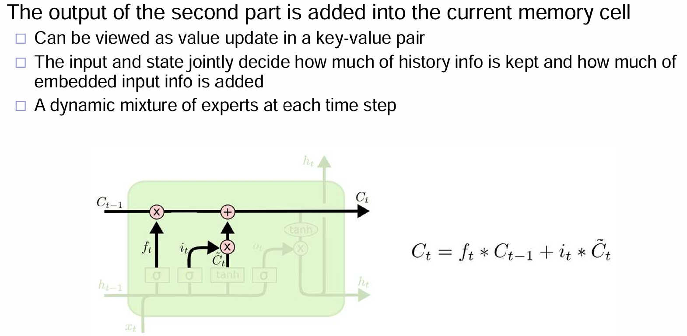
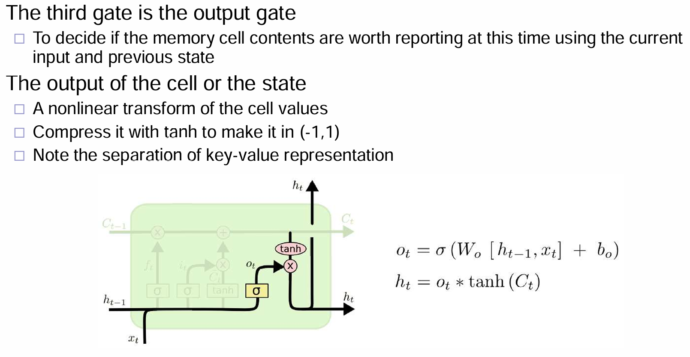
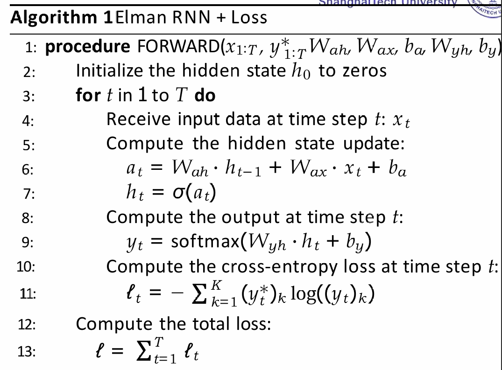
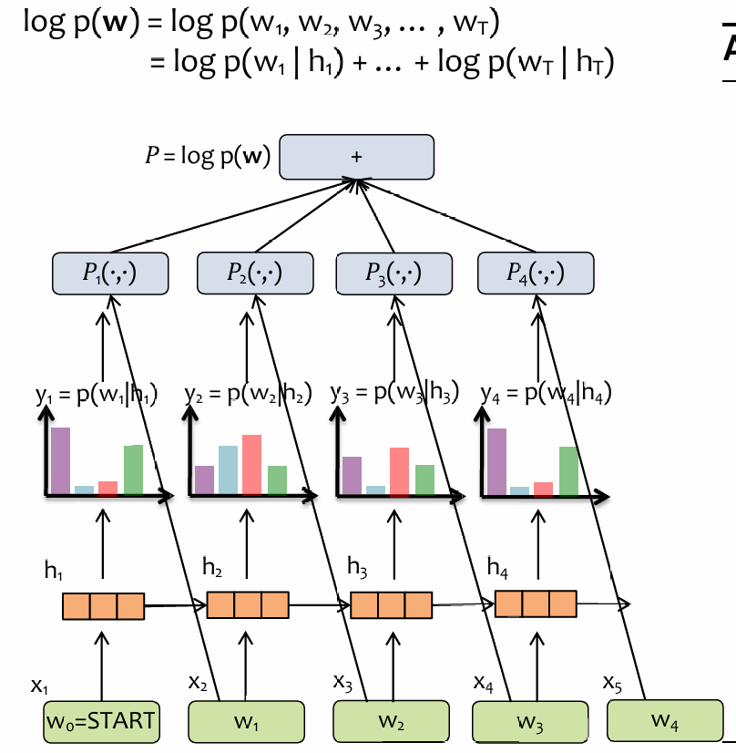

# RNN

> RNN，Recurrent Neural Network，is a dynamical system with one set of hidden  units feeding into themselves

## Vanilla RNN

一般来说，隐藏层的张量$h_t$与输入的$x_t$和$h_{t-1}$有关：
$$
h_t = f_{W}(h_{t-1}, x_t)
$$
这个式子意味着：每一个时间步骤的hidden state与上一个时间步的hidden state有关且与当前的输入有关，很明显和一阶马尔科夫有着很浓的相似味道。在vanilla RNN中，这个关系为：
$$
h_t = tanh(W_{hh}h_{t-1} + W_{xh}x_t),
y_t = W_{hy}h_t
$$
关于$y_t$的输出，更有马尔科夫模型的emission model的味道了。

在我们传统印象中，RNN模型中就是一个时间点一个输入一个输出，并且接受上一个时间步的hidden state的输入。那么其实，通过调整输入和输出的模型，我们能够运用于不同的下游任务：

例如上面的四种模式，就可以运用到不同的downstreaming task中：第一个可以是image captioning，第二个可以是classification，第三个可以是machine translation，第四个可以是video classification on frame level。通过修改输入和输出的模式，可以运用到不同的任务！

## Standard RNN

Recall：在原始的RNN中，流程如下：

可以看到，流程是十分的简单的，而且强烈地收到一阶马尔科夫的先验影响：在一个时间步下，很难受到很远时间步的影响。也就是说，short term的信号能够收到，那么如何同时收到long term呢？LSTM应运而生：

上述途中一个很核心的组件就是：上面这一行箭头的信息流，代表这remembered cell state。没错，相比于传统RNN，这里每一个时间步有$h_t$以及$C_{t}$。下面将一一介绍图片中的很多操作：

首先是下图中，$f_t$：根据输入的x和上一个h，来决定这一节点将忘掉多少的C！很多时候，都是根据先验来设计模型，因此C是如何代表remembered cell state的，是不用先管他的。

其次就是$i_t$这一部分了：

最后就是输出$h_t$的部分了：

进行vectorization，计算流程如下：

理解LSTM（长短期记忆，Long Short-Term Memory）模型设计的先验需要从其背景和工作原理入手。LSTM 是一种用于处理和预测时序数据的循环神经网络（RNN）的变种，特别是在长序列数据中的表现尤为突出。它的设计先验基于如何有效地捕捉序列数据中的长期依赖性和避免常规 RNN 中的梯度消失问题。以下是一些关键点，帮助你理解 LSTM 的设计先验：

1. **序列数据中的长短期依赖**

LSTM 的设计最初是为了克服标准 RNN 中的梯度消失问题。传统的 RNN 在处理长序列时，随着时间步的增加，模型在梯度传播过程中可能会丢失重要的信息。LSTM 引入了“记忆单元”和“门控机制”来保持长期依赖性，使得模型能记住较早时间步的信息并避免梯度消失的问题。

2. **门控机制（Gates）**

LSTM 的设计先验之一就是使用门控机制来控制信息的流动。具体来说，LSTM 通过三种门（输入门、遗忘门和输出门）来决定哪些信息应该被保留，哪些应该被忘记，哪些应该被输出：

- **遗忘门**：控制模型应该“忘记”多少先前的记忆。
- **输入门**：决定当前输入应该更新多少记忆。
- **输出门**：决定当前记忆是否对模型输出有贡献。

这些门使得 LSTM 能够有效地管理长期和短期的信息，避免了传统 RNN 中的记忆瓶颈。

3. **记忆单元（Cell State）**

LSTM 引入了记忆单元（cell state）来保存长期的信息。这一设计先验的核心是，记忆单元沿着时间序列传播，且只有少量的线性操作，这帮助它保留了长期依赖信息。记忆单元的状态并不会随着每个时间步的运算而消失，而是通过门控机制进行增删修正。

4. **梯度消失问题的解决**

在传统的 RNN 中，长时间序列的反向传播会导致梯度消失或爆炸，而 LSTM 通过其门控机制解决了这个问题。尤其是通过引入记忆单元，LSTM 可以在更长的时间步中传播有效梯度，保持重要信息，从而训练深度网络。

5. **平衡短期与长期记忆**

LSTM 的设计先验还体现在其如何平衡短期和长期记忆。通过不同的门，LSTM 可以在特定的时间点选择保留较为重要的长期记忆，忽略不那么重要的短期记忆。这种平衡是序列建模的一个重要挑战，LSTM 的设计先验正是围绕这一目标展开。

6. **参数共享**

LSTM 中的门控操作是参数共享的，意味着模型的不同时间步会共享相同的权重，这对于处理序列数据是至关重要的。通过这种方式，LSTM 能够在多个时间步中学习到相同的参数，这提高了模型的泛化能力。

## Learning RNN

假设一个时间步，一个输入一个输出，输出有gt。那么训练流程就如下：（注意RNN这里不是用于训练language model）

如果是RNN用于训练语言模型呢？首先我们应该了解RNN用于LM是如何implement的：

每一次，RNN都尝试先预测单词，然后下一个时间点，输入RNN刚刚尝试预测的真正的单词，然后RNN尝试预测下一个单词，依次类推，可见这里有probability chain rule的现象，而目标就是优化每一个输出单词概率分布的交叉熵；由于链式法则，那么就是优化所有的交叉熵的和。

