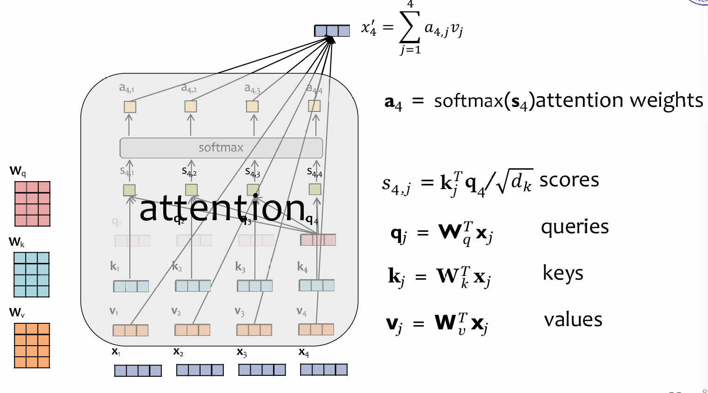
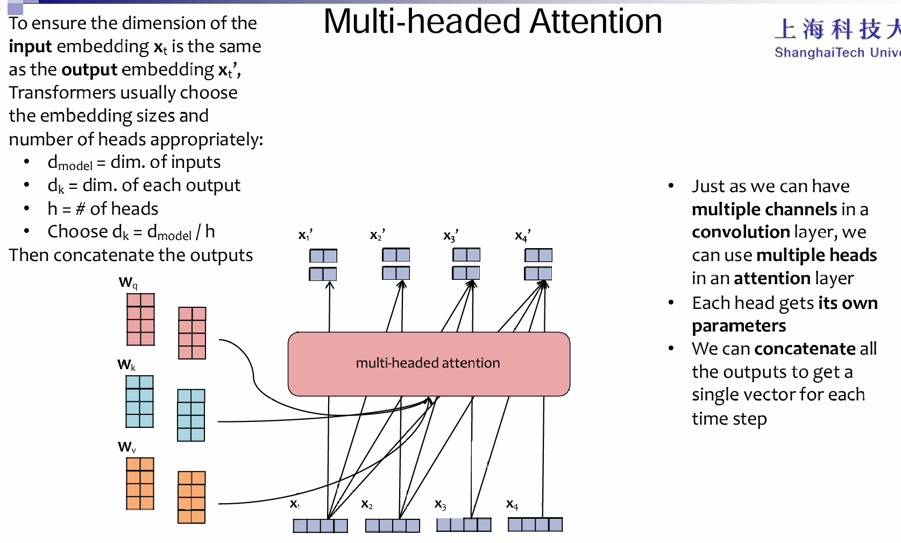
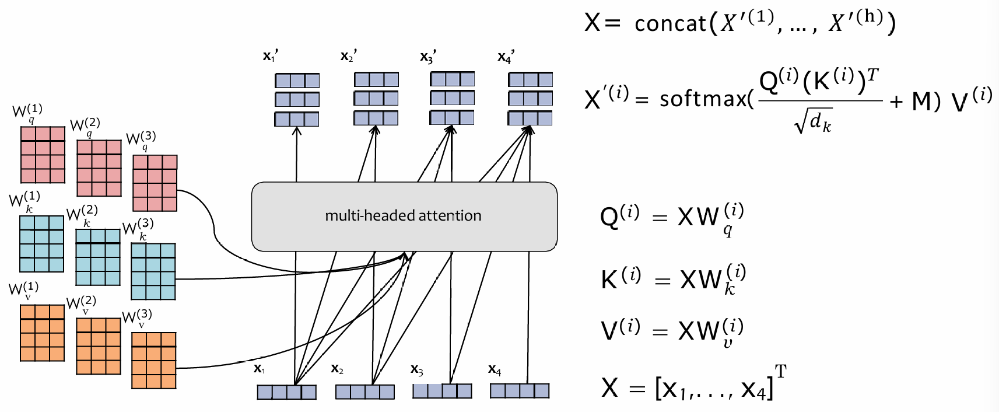
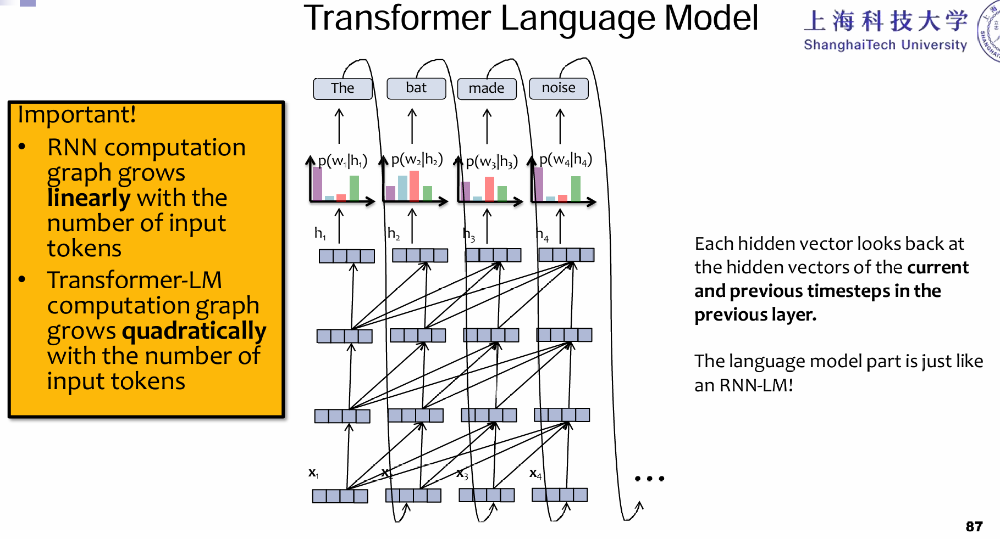
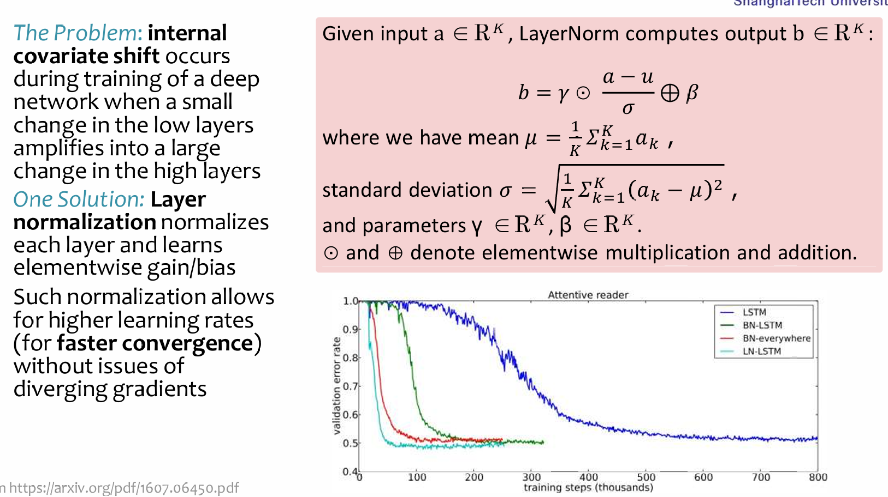
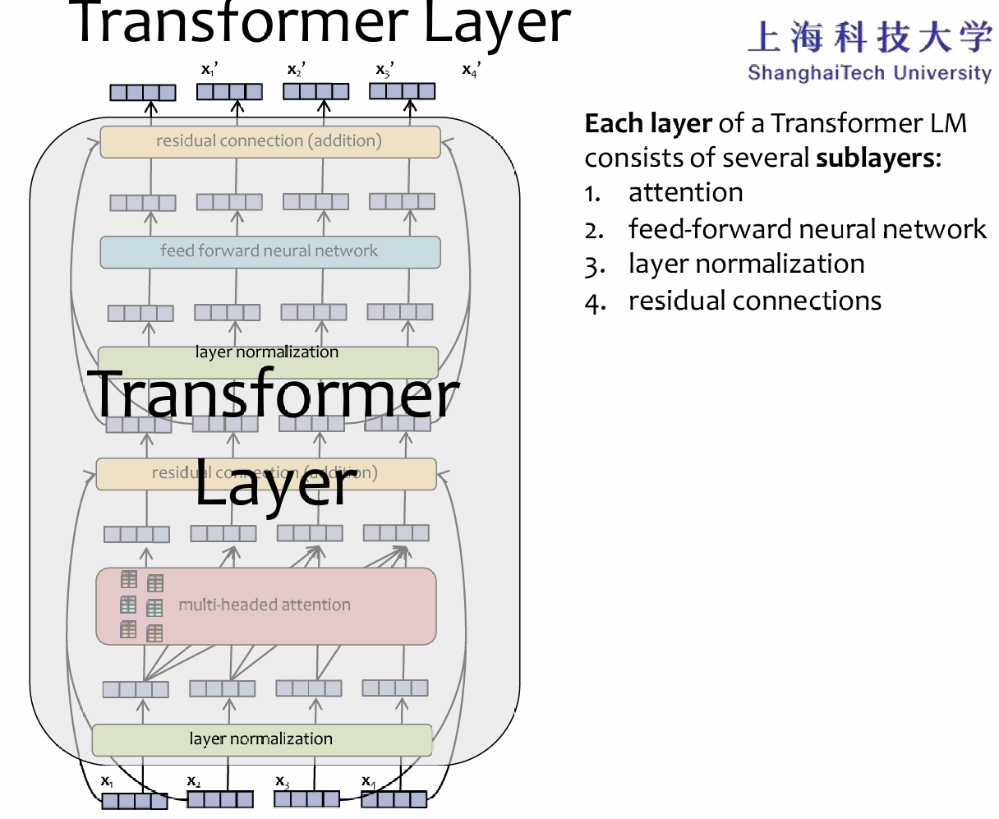
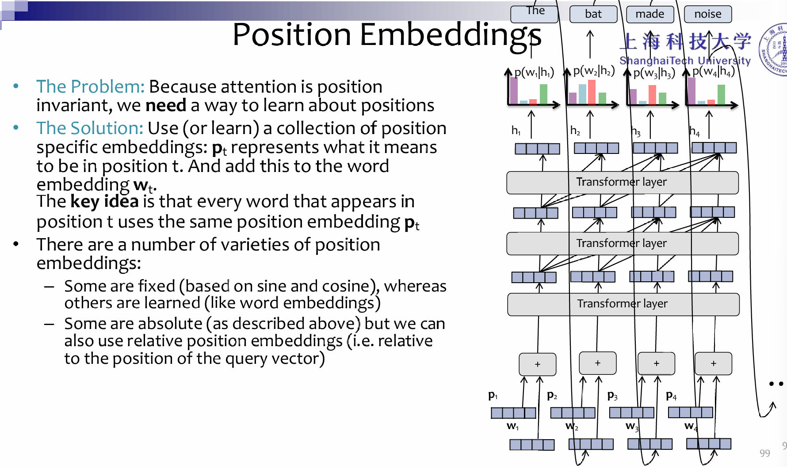
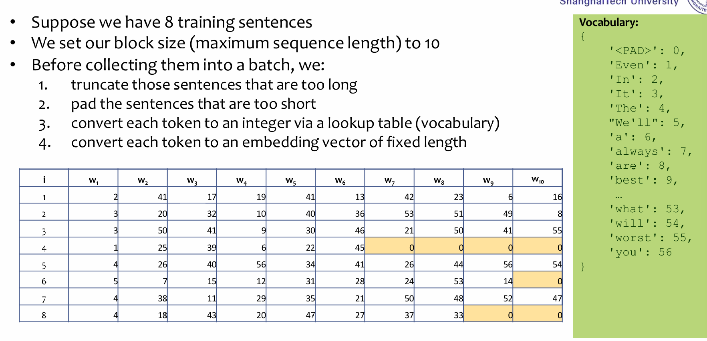

# Transformer

## Attention

Transformer中的attention机制自然是关键，如下图：

所有的输入x，通过$W_{q/k/j}$映射成query, keys and values，然后根据$k^Tq / \sqrt{d_k}$这个公式计算一个时间点的query对其他时间点的key的vanilla attention list，对这个list进行softmax，然后得出的结果就是对每一个时间点的value的attention score，乘起来相加。

而至于multihead-attention：

The vectorization version:

## For predicting the next token

Transformer是如何用于语言的呢？预测出来第一个，然后当做新的第二个输入，和第一个一起输入，输出预测的第二个单词，以此类推。注意这里的计算量是平方的关系，因为新输入的token，将会和前面所有的token都做注意力的计算，但是RNN中只会关心上一个时间点的$h_t$和这一个时间点的输入。没错，一阶马尔科夫的味道简化了计算复杂度。

## Layer Normalization

In transformer，使用的是LN而不是BN。Transformer模型中的层归一化。是对每个输入向量单独进行的，即对每一个输入都进行LN。

## Residual Connection

过了attention block，经过层归一化后，将会进入FFN。但是值得注意的是，这里都使用了残差链接的设计：

## Positional Embedding

## More detail

