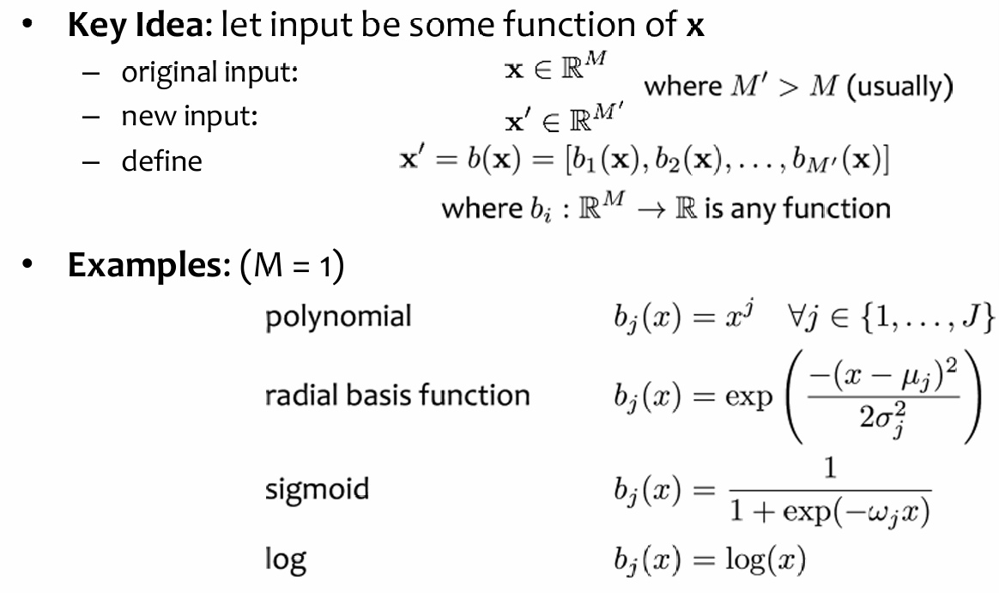
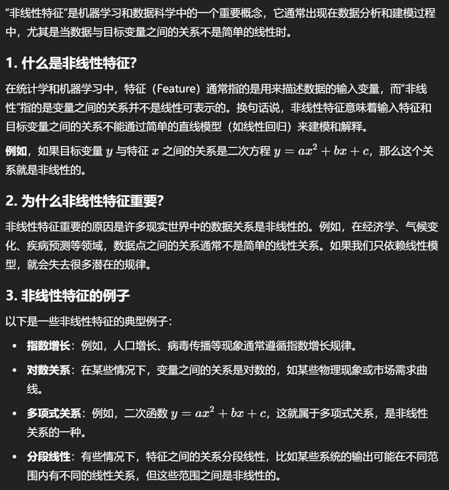
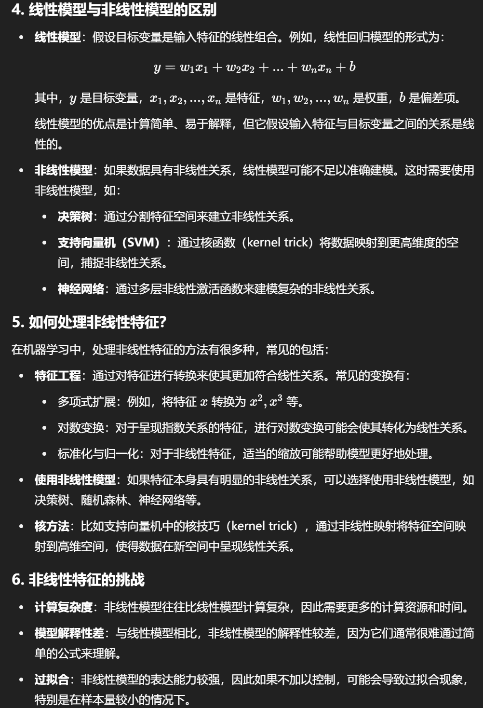
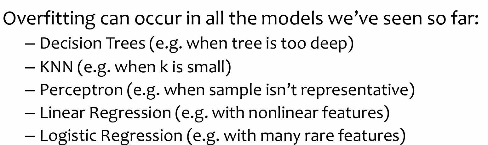
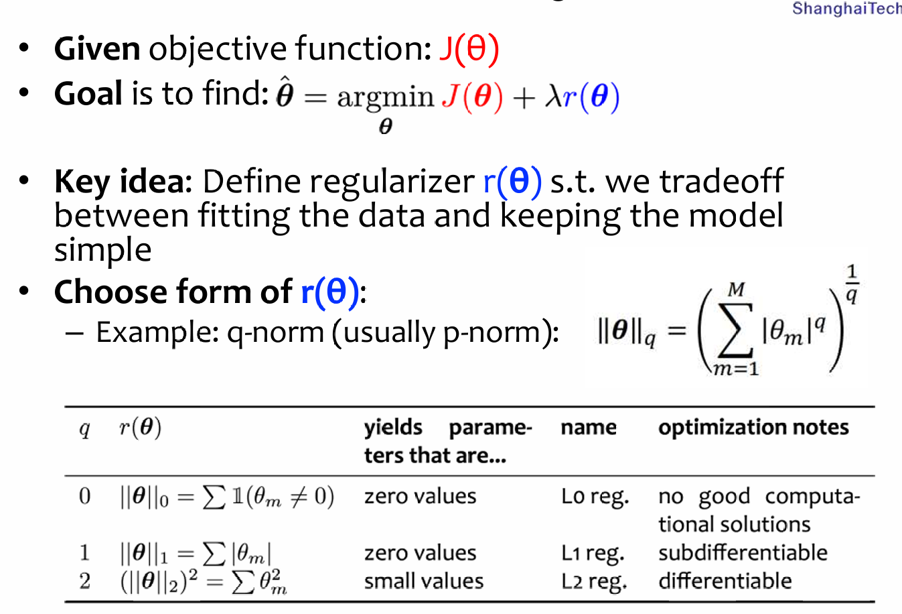
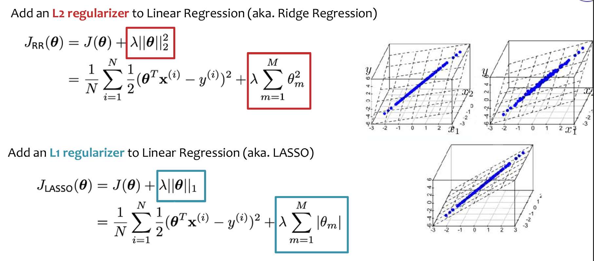
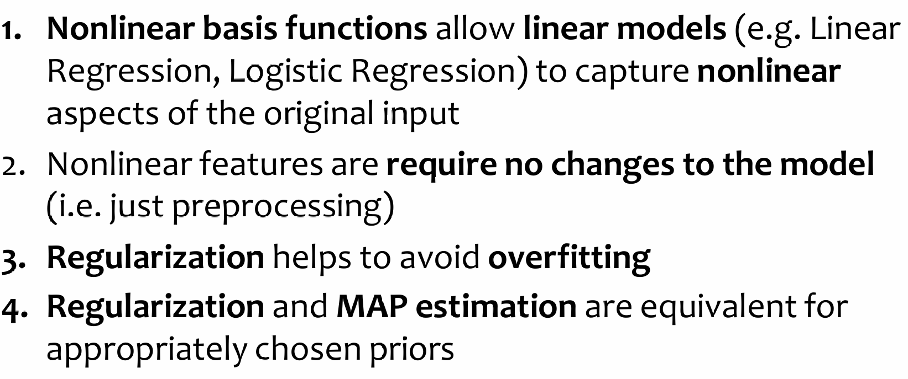

# Feature Engineering Regularization

## Feature Engineering

### Word Embedding

特征表示是神经网络中十分重要的部分，一方面是需要对研究的对象进行参数化，另一方面参数化的数据背后又和对象本身有着某种重要的关联，否则无意义的参数化是无意义的。因此，特征工程是十分重要的。

2013年，word embedding横空出世，潜空间的定义让离散的单词token可以以潜空间的向量进行表示，而潜空间的每一维度又能赋予语义意义。这样一来，参数化与特征表达都同时实现了。在word embedding中，语义相似的单词，它们的潜空间向量越接近。其中，这样单词映射到潜空间向量的映射关系是通过非监督方式学习出来的。

上述的是语言，单词的特征工程，图片的特征工程要比它早一点，而这些工程技巧也被借鉴于NLP。如CNN以及Recursive autoencoder，它们都是尝试脱离单词的基本单元，而是进行某种意义上的string embedding。后续还有tree embedding等进阶的方法。

一开始，也是最直觉上想到的，是对每一个单词分配一个离散化的标签，也就是独热编码。这样的方法确实很直接地实现了参数化，但是并没有很好地进行特征的表达。于是有了后来的word embedding，通过给维度以语义信息的Inductive Bias（实际上没有先验式地分配维度语义信息，而是建模上引入了相关的归纳偏置），并且通过向量的内积来‘定义了’单词之间在潜空间上的关系。

### Computer Vision

照片如果是灰度图，那么每一个像素都是0-255之间的一个数字；而对于一个正常的照片来说，一般是RGB三个通道，然后每一个通道都是0-255的数字。

## Non-Linear Features

也被称为nonlinear basis functions。Key idea is:

但是公式不是维度越高越好：假设一个数据集里面的二维平面点呈线性关系，但是拟合的函数对每一个x都进行了幂操作。指数越高，越过拟合；同时需要注意的是，如果加大了数据集的样本量，依然能够很好的降低过拟合。

> Takeaway: more data helps prevent overfitting

## Regularization

过拟合指的是模型总是尝试capture noise rather than the underlying structure and patterns。目前来说，在传统派算法中，也有可能在相对应的情况下发生过拟合的现象。

根据奥卡姆剃刀原理：我们希望我们的归纳偏置越简单越好，那么如何定义简单？首先是feature数量少，其次就是参数量尽可能的少。于是我们希望我们的网络参数不要过大，因此在优化目标函数的时候，我们也希望一并地希望参数大小尽可能不要过大：

比较常见的有L2 L1正则化：

需要注意的是：***我们不应该对bias参数进行正则化***！否则，学习算法将无法对 **y 值** 的平移保持不变

> 这实际上是对 **bias** 参数作用的一个解释，尤其是在 **机器学习算法** 中，尤其是 **线性模型** 或 **神经网络** 等模型中，**bias** 允许模型对 **y 值** 进行平移，使得模型对数据的预测结果具有一定的灵活性。

## Takeaway

