# Practical Aspects

在这一章节中将介绍一些机器学习中实战的技巧！

应用机器学习是一个高度程序化的研究过程：首先是有想法，然后代码实现，最后做实验论证想法。大致方向是如此，但是依然有许多的细节：比如说多少层？数据集的划分？模型表现如何，是过拟合了还是欠拟合了？每一层神经元的数量是多少？学习率是多少？激活函数如何选择等等。

## Dataset

首先介绍数据集的划分规则：总的来说：当数据集很小或者很大的时候，训练-验证-测试集的大小比例如下：

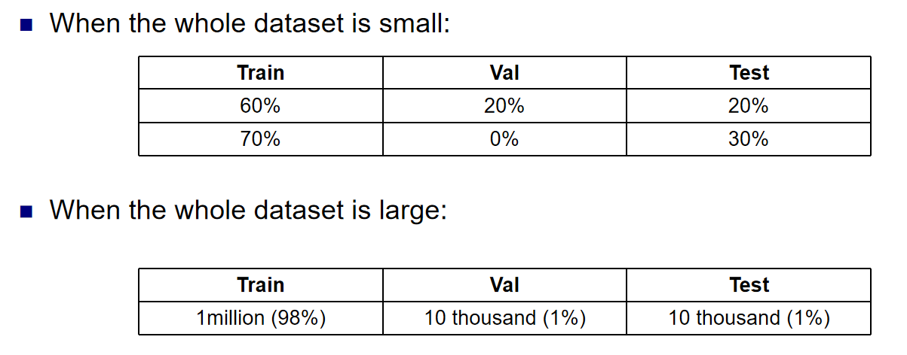

同时：在深度学习（以及机器学习）中，**偏差（Bias）**和**方差（Variance）**是衡量模型性能的两个重要概念，它们分别描述了模型在训练数据和测试数据上的拟合能力。理解它们的含义和区别对于模型调优和避免过拟合或欠拟合非常重要。

1. 偏差（Bias）

**定义**：偏差是指模型预测值与真实值之间的差异。它反映了模型对数据的拟合能力，通常与模型的复杂度有关。

- **高偏差（High Bias）**：模型对训练数据的拟合能力很差，通常是因为模型过于简单，无法捕捉到数据中的规律。这种情况下，模型在训练集和测试集上的表现都很差，称为**欠拟合（Underfitting）**。
- **低偏差（Low Bias）**：模型对训练数据的拟合能力很强，能够很好地捕捉到数据中的规律。

2. 方差（Variance）

**定义**：方差是指模型在不同训练数据上的预测值之间的差异。它反映了模型对训练数据的敏感程度，通常与模型的复杂度有关。

- **高方差（High Variance）**：模型对训练数据的拟合能力很强，但对测试数据的泛化能力很差。这是因为模型过于复杂，捕捉到了训练数据中的噪声，而不是真正的规律。这种情况下，模型在训练集上表现很好，但在测试集上表现很差，称为**过拟合（Overfitting）**。
- **低方差（Low Variance）**：模型对训练数据的拟合能力适中，对测试数据的泛化能力也很好。

训练和测试，我们将获得training error and test error。那么如何通过这两个数据看出我们的模型的方差和偏差是高还是低？示意图如下：总的来说还是很容易认同的：

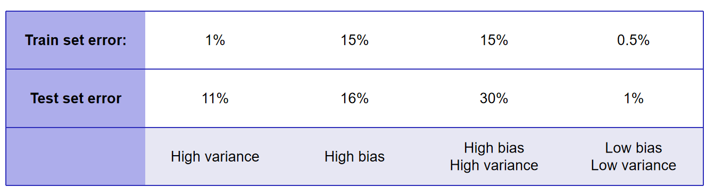

我们都希望训练出来的模型都是low bias and variance的，但是很多情况下并不这样：那么在不同的麻烦下，我们应该如何操作呢？示意图如下：

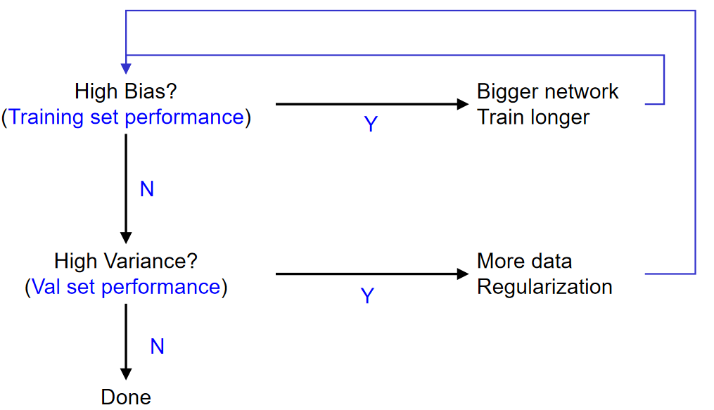

## Training

训练的两大核心是：最优化与泛化能力。在CNN的训练演示习题中，流程是：数据预处理-权重初始化-参数更新-批次归一化。以及为了防止过拟合，可以使用regularization正则化的技巧。

当然训练也分为监督和非监督训练，监督训练的流程更具体地：

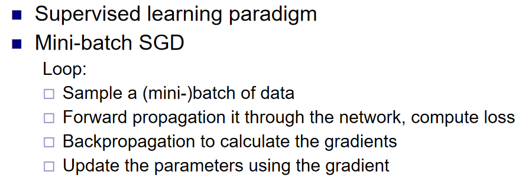

### Data Preprocessing

数据预处理中，最重要也是最常见的可能就是归一化了。为什么要归一化？一方面，考虑sigmoid function作为激活函数，如果输入的x值都是整数的话（这在现实世界中相当有可能！），倒数一定是正数，而x又是正数，那么这时候就出现了梯度更新符号的一致化！

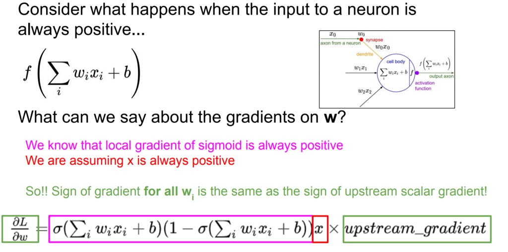

所以说我们想要均值为0的数据；另一方面，现实世界中的数据可能数量级之间都差很大；最后，归一化数据集能够支持很好的泛化能力。

综上所述，归一化，i.e.，均值为1方差为0的操作是非常好的操作！

当然，不是所有的训练，都是对数据进行归一化的操作的，比如说视觉分类任务，那么就是简单的image centering而已。

### Weight Initialization

初始化是非常重要的一环！可以大胆猜想，如果随机初始化出来的参数，恰好就是使得损失函数达到最低的参数，那么这样岂不是很爽？通过这个极限的例子就能看出初始化的重要性。

我们知道：在深度学习的损失函数架构中，损失函数往往都是非凸的，在这种情况下：神经网络其实有对称性这个性质：就是在一个隐藏层中任意交换神经元，那么最终都会获得一个等效的solution。如果我们进行0初始化，那么所有的输入都是0, 梯度也都是一样的！那么就没有打破对称性的性质。

那么如何合理的初始化呢？最开始的想法可是所有的参数都从均值为0，方差很小的高斯分布中随机取值。这样的操作对小模型来说比较work，但是对于很大很深的模型来说就不起什么作用了，将会观察到的是：越深的地方，梯度越接近0.

为了解决这种情况，可以考虑越深的地方，初始化的分布的方差越大。而有学者研究出了一种Xavier初始化：全连接层的参数的分布方差设置为了每一层输入维度分之一的开根号；对于卷积层来说，输入维度等于$filter\_size^2 *input\_channels$。这种初始化的合理性的数学推导如下：

> In this way, activations are nicely scaled for all layers

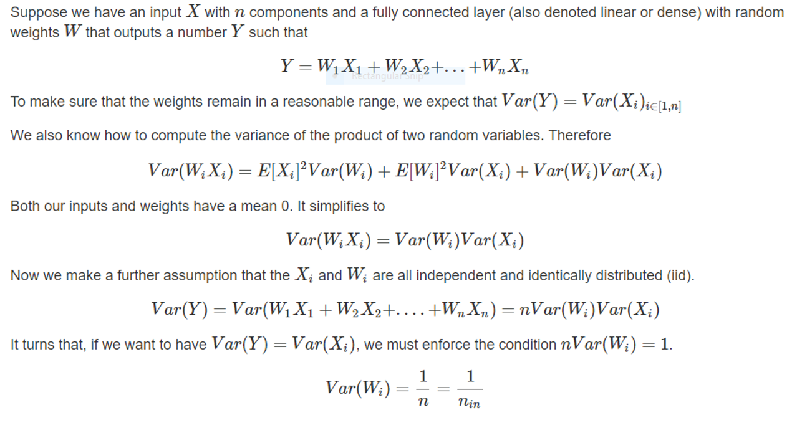

Xavier初始化的一个重要假设是：激活函数是zero-centered，但是明显，ReLU不是。于是何凯明的论文中指出，对于ReLU激活函数的情况，方差应该更改为：输入维度分之***二***的开根号

这里介绍了十分著名的Xavier初始化，当然后续陆续还有很多关于初始化的论文研究！

### Parameter Update

计算出来了梯度，那么就要更新参数了，那么首当其冲的就是学习率这个超参数的选择。同时：选择SGD，还是其他更好的梯度更新方式，也是一种问题（比如说mini-batch等）。

SGD的问题在于：由于每次更新的方向都是收到一个样本的影响，所以更新的过程中，梯度下降的路线将会十分的陡峭！而且如果损失函数有马鞍点或者是局部极小值点，那么此时的梯度就会是0，那么梯度下降将会停止。但是现实是：在高维空间中，马鞍点比我们想象中的更常见。

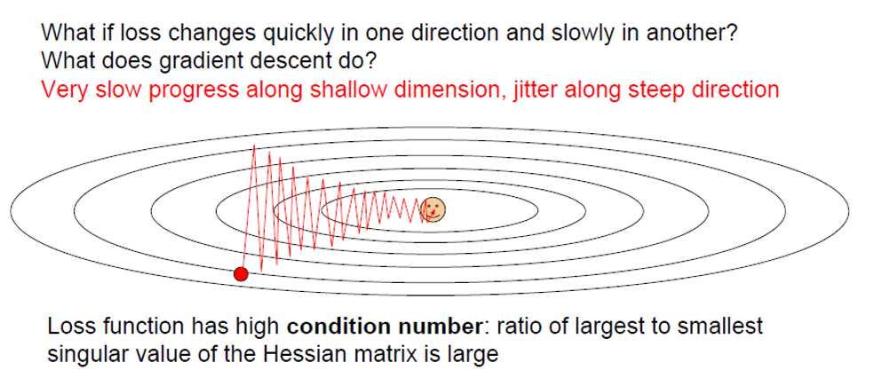

于是后人做了改进：SGD+Momentum。这种方式使得梯度下降路线更为的丝滑，并且收敛更快。

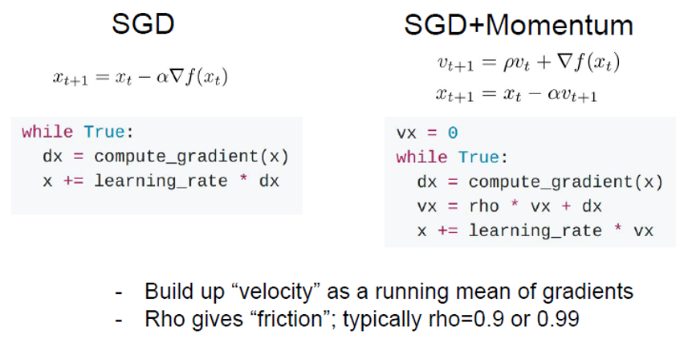

还有一种AdaGrad方式，以及其改进而来的RMSProp：

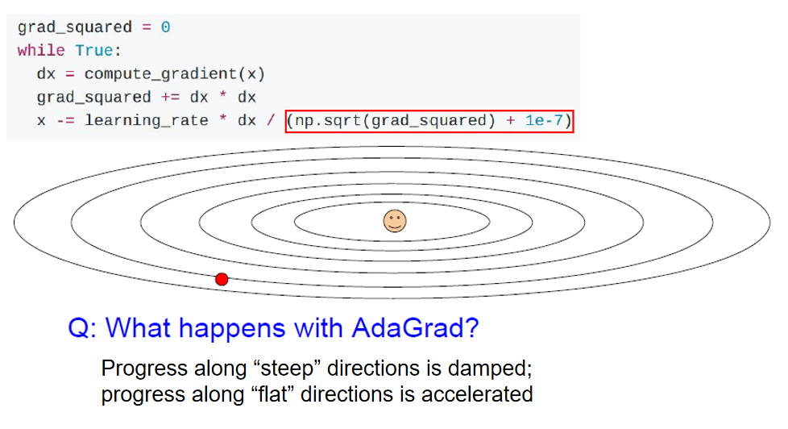

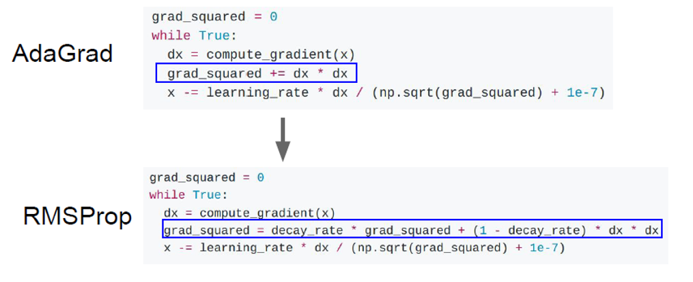

最后就是最经典的Adam方式了：

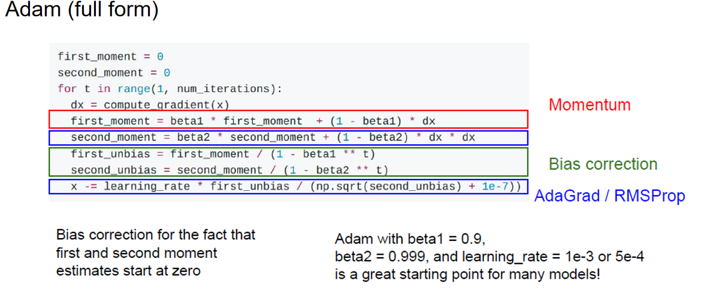

上述都是在集中讲述梯度更新的方式，但是上述的方法中都有一个十分重要的超参数：学习率。对于学习率，一般采用的都是learning rate decay的方式：

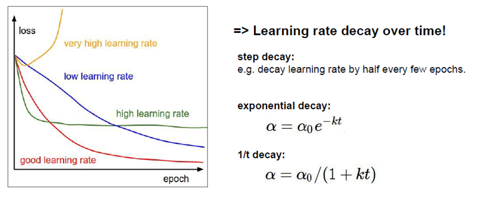

当然，decay的方式也可以有多种：

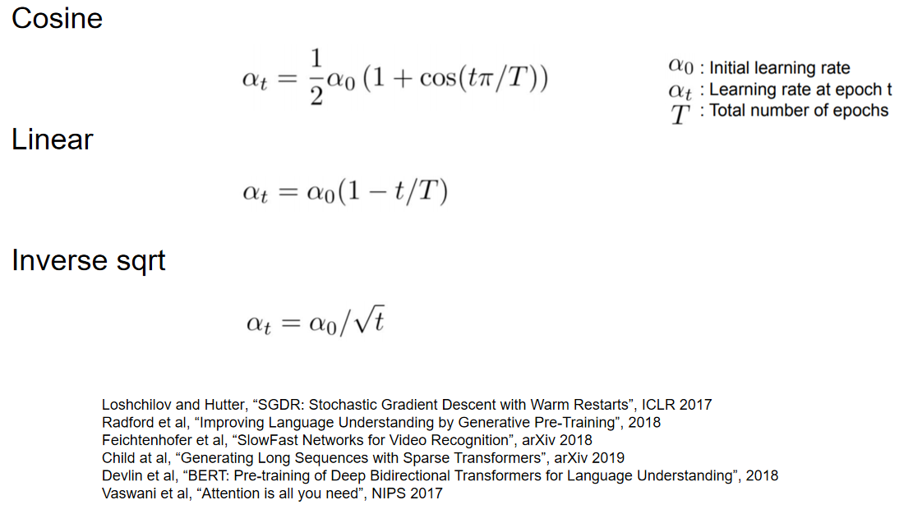

### Batch Normalization

在深度学习中的每一层网络输出，其分布都是各不相同的，这对于泛化能力剔除了挑战。对于一层来说，学会了‘接受这个分布，输出那个分布’可不是一件好事情。因此考虑对每一层的输入都应用归一化，转换到标准高斯分布。

当然可以引入可学习参数，将转化成高斯分布的数据线性偏移至另一高斯分布。这样的好处就是：很有可能方便一层网络进行学习：

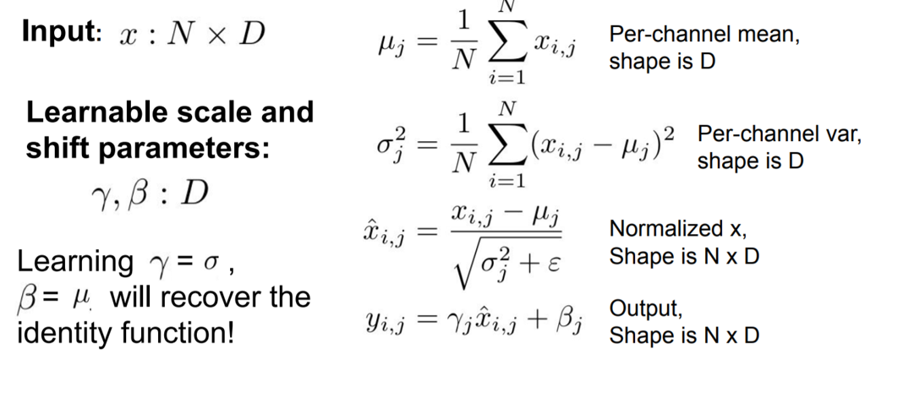

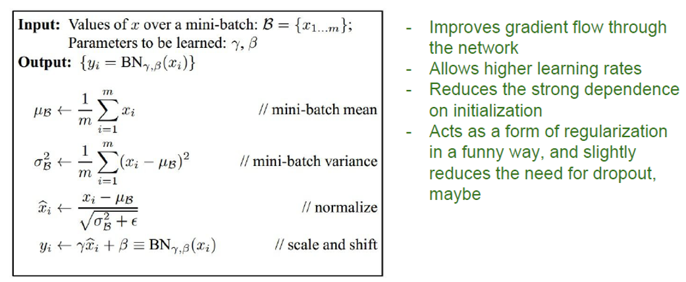

通常来说，BN都会在全连接层之后、非线性层之前插入！

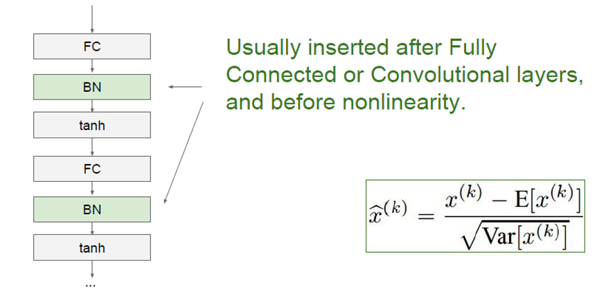

好处如下：

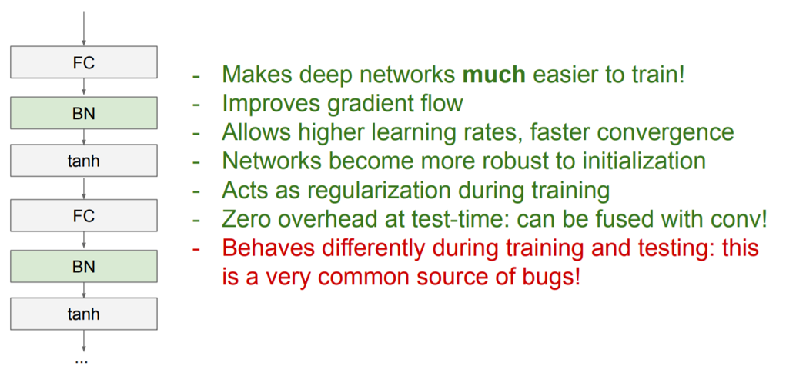

有Batch Norm的同时，还有Layer Norm，处理的是输入特征维度上的归一化：

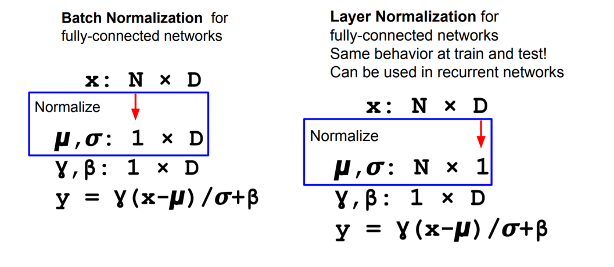

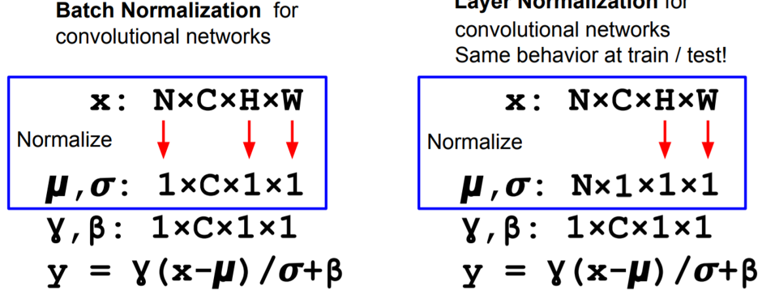

## Avoid Overfitting

为了防止过拟合，下面将介绍一些方法来缓解这个问题。其中后四者的介绍是在CNN的情境下介绍的。

### Early Stopping

***Early stopping: monitor performance on a validation set, stop training when the validation error starts going up.***

当然，由于随机性的影响，可能validation error虽然是波动的，但是是在整体下降的。对于这种情况，那么对于判断validation error什么时候真正level off是一件非常棘手的事情。那么可以考虑temporal smoothing。

### Data Augmentation

在图像识别分类的任务中，对照片进行适度的操作，比如说拉伸翻转裁剪等，那么最终输出的结果都应该是同一个class。更细节的一些改变可以是color jitter, PCA algorithm等。这样一来可以扩建数据集，数据集一大，那么一般认为过拟合可以得到一定的缓和。

总结如下：

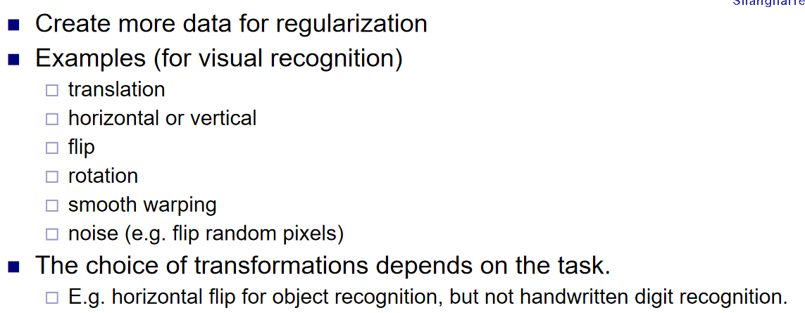

### Weight Regularization and Transfer Learning

首先，参数过多，支持模型可以更为的复杂，那么也意味着支持模型过拟合出一个复杂的模型。因此：减少每一层参数的数量也是技巧之一：那么bottleneck就是其中的一个技巧

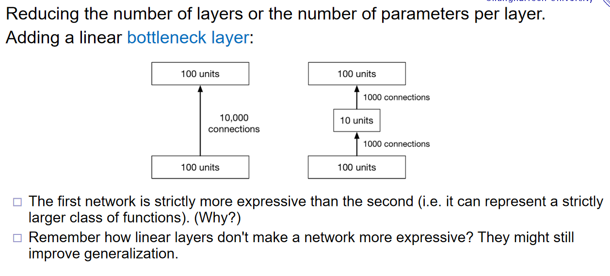

其次，是参数数值的绝对值小一点，也可以缓解过拟合，因为线性操作将会相比之下更为的保守。那么L2 L1正则化就是经常见的技巧了，通过加一个项在损失函数里面来实现上述的目标。关于L2的总结图如下：

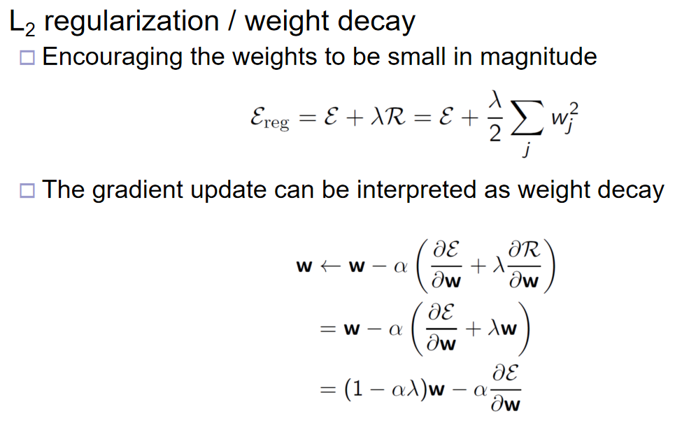

最后介绍额外介绍一下迁移学习。也许训练一个模型的很多参数，能够很好的提取出输入的高位特征了，那么虽然下游任务是不一样的，但是可以将前面提取特征层全部提取出来并freeze，通过训练新的downstreaming head就能够很好的迁移之前学习到的参数。这个概念有点像LLM中的fintuning：

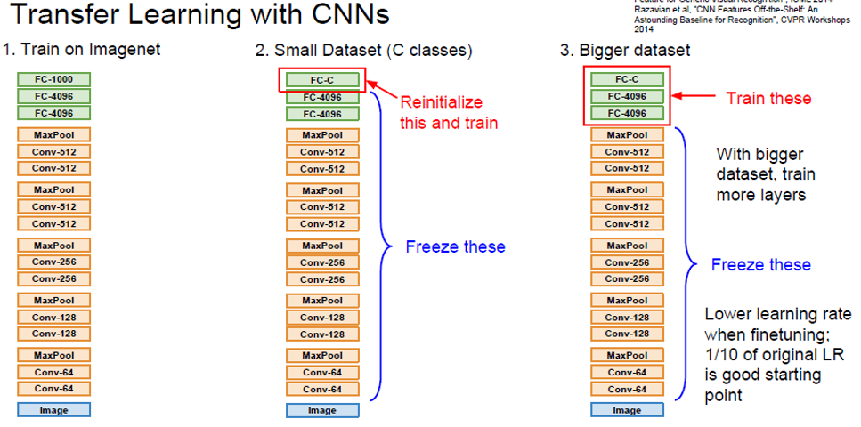

关于冻住那些部分，换而言之，重新训练哪些部分，在下图中按照情况做了总结：

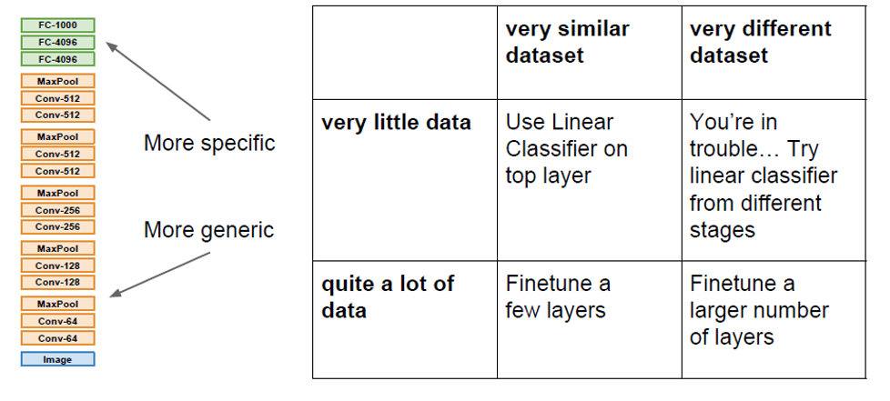

### Stochastic Regularization

如果想要过拟合，那么意味着网络图中的计算应该十分的准确。那么如果在计算图中加入噪声，就可以缓解过拟合，因为计算不是那么精确，有一种‘朦胧的美’。为了营造这种噪声，Dropout就是一个很好的策略：

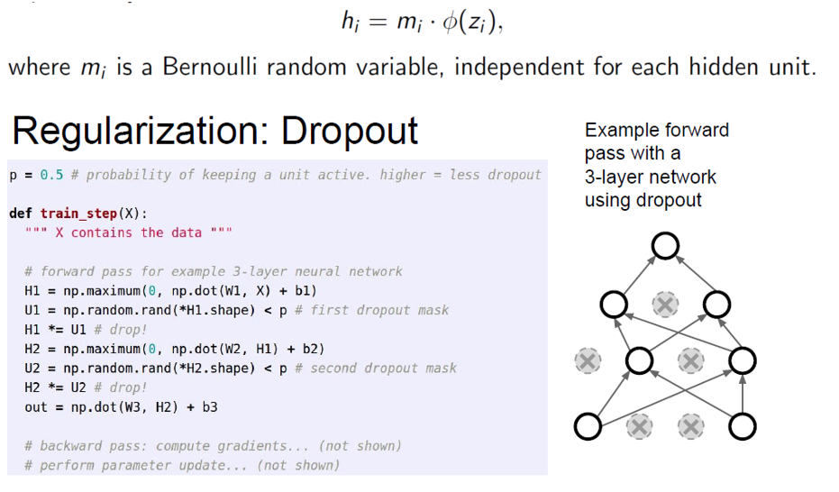

注意在**在测试阶段，神经元不会失活**。除了最传统的dropout，还有其他方法被开发了出来：如DropConnect（与它的区别是：前者是神经元，即激活函数失活，后者是输入激活函数前的线性操作中，部分的w向量中的参数失活，即断开连接），Fractional Pooling，Cutout，Mixup等。

### Hyper-parameter optimization

之前学过cross-validation strategy。在此基础之上，还有另外一个技巧：coarse to fine。可以跑较少的epoch，然后理清楚哪些***超参作用很大***以及***超参的合适范围***，然后再跑多一点的epoch来找最好的超参选择。在合适的范围内，可以选择等间隔的寻找，即grid layout，也可以是范围内随机采样，即Random Layout：

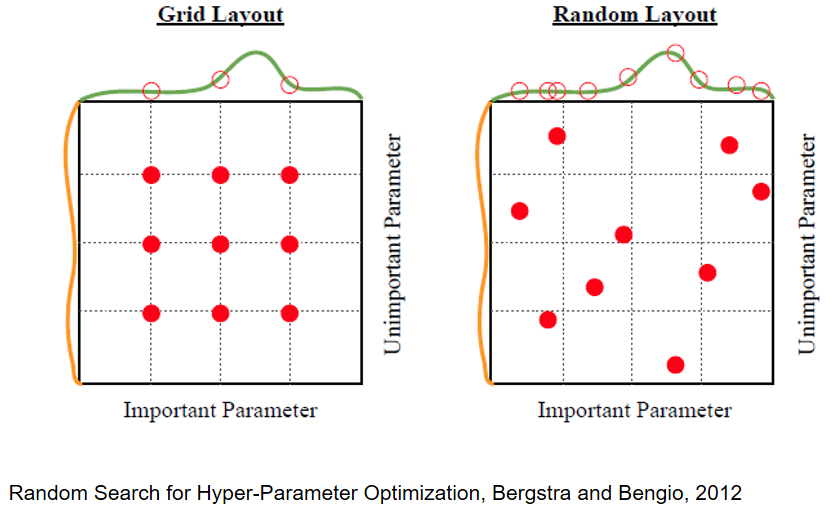