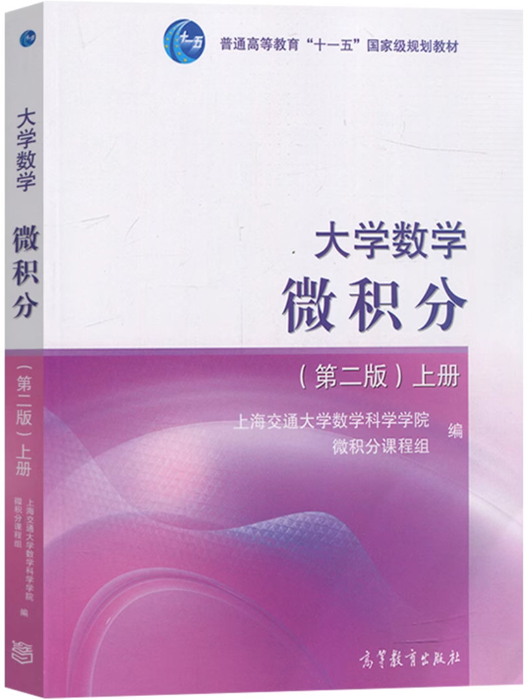
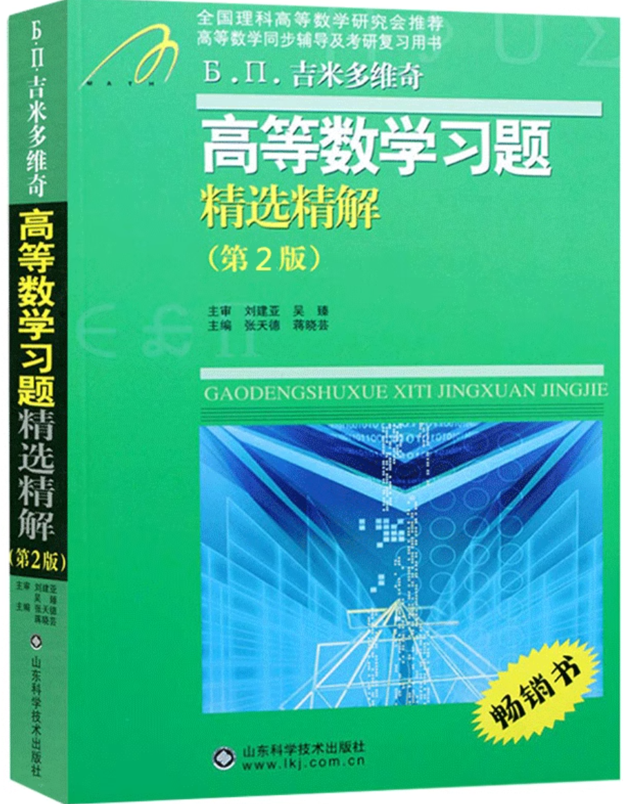
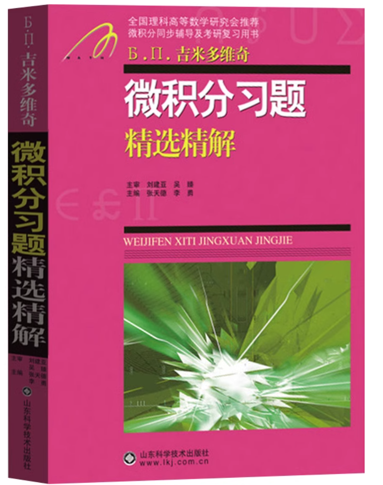
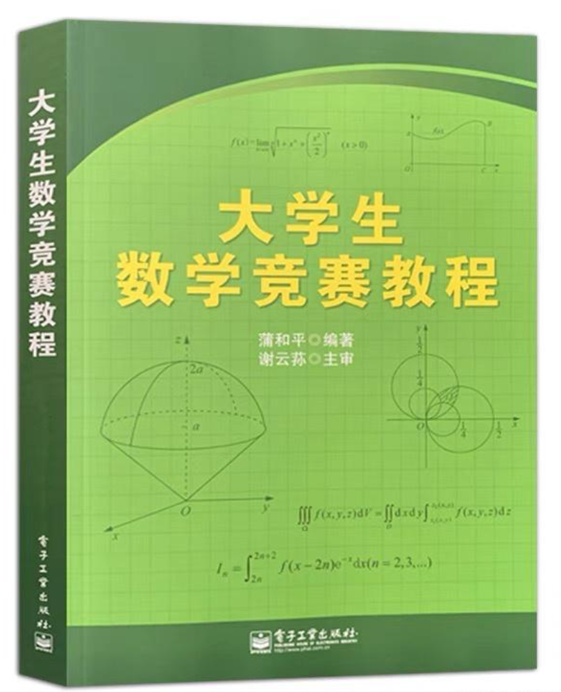

# 高数上

> Final Grade: A+(first semester)；A+(second semester)

关于高等数学的学习历程：课本是上海交通大学版本的微积分: 

这本课本特殊之处在于: 上册第一章中, 加上了一定的数学分析第一章中的知识点(但是考试几乎不涉及(但是不排除quiz会涉及)); 下册有曲线积分和曲面积分这一章节, 以及级数里面介绍了Fourier级数(但是内容并不如数分深入). 如果想在假期间进行一定程度的预习, 可以买入or在上科大图书馆里面借这本书(想借的话, 要提早入手, 因为很多人都会很想借). 这本课本的讲解还是较为详细的. 非常难受的是, 这本书作业答案没有过程, 因此小猿搜题和大学搜题酱可能是你的好帮手(至少对我来说是很好的帮手). 

(tip: 对于有很多道小题的大题, 不要拍一整个大题, 试着一道一道搜; 搜题成功率: 小猿搜题>大学搜题酱)

考试和作业之间还是有一小点差距的, 平均分大约在60-75范围内, 主要取决于难度. 如果作业认真完成, 并且真正理解知识点的话, 可以拿到打底B, B+的成绩. 但是如果你想享受飞一样地感觉, 刷题并且总结是有必要的.

首先是大概率帮助你取得A-的教辅: 吉米多维奇的微积分. 虽然吉米多维奇系列里面有高等数学, 但是我觉得两本可能差距并不会很大, 虽然高等数学那本书比微积分厚. 因此我使用的是吉米多维奇微积分

然后就是非常具有挑战性, 能够帮助你拿到A乃至A+的教辅: 大学生数学竞赛教程. 这本书根据***大学生数学竞赛(非数学类)大纲***编写, 难度十分管饱. 但是使用的时候一定要注意取舍: 超纲的, 过程很难看懂的(没错, 书上有一些步骤看都看不懂), 千万不能过分纠结, 一定要注意高效地汲取精华. 另外这本书答案没有过程, 因此推荐B站大学上的视频:

https://www.bilibili.com/video/BV1ui4y127W4

在考试前, 如果想做几套卷子考察下自己的熟练程度, 或者说练手, 那么建议可以到夸克学习上面大伙合资凑个会员, 选择自己的学校为上海交通大学(蚌)并搜索高数考试试卷. 当然, 很多的时候是没有答案的, 所以说同学之间可以互相讨论.

最后, 总结非常重要. 刷了很多的题, 见了很多的提醒, 自己也或多或少积累了一些"起手式"或者是经验, 那么一定要总结成笔记. 

